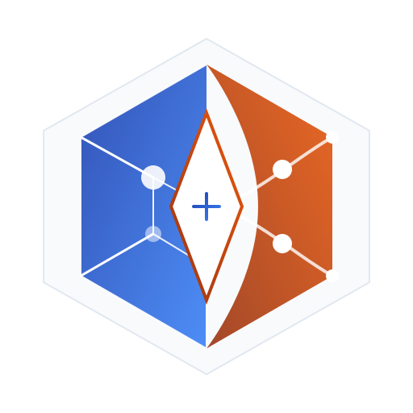
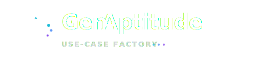

<p align="center">
  
</p>
<h1 align="center">R.A.I.S.E. Engine</h1>

<p align="center">
  <strong>Rationalized Advanced Intelligence System Engine.</strong><br>
  <em>(Moteur de Système d'Intelligence Avancée Rationalisé).</em>
</p>

<p align="left">
  <a href="https://github.com/Condorcet-Continuum/raise/actions/workflows/ci.yml">
    
  </a>
  <a href="LICENSE">
    
  </a>
  <a href="https://www.rust-lang.org/">
    
  </a>
  <a href="https://tauri.app/">
    
  </a>
  <a href="https://webassembly.org/">
    
  </a>
  <a href="https://www.typescriptlang.org/">
    
  </a>
</p>

---

> [!WARNING] > **🚧 PROTOTYPE STATUS: v0.1.0-alpha**
>
> This repository contains a **Functional Prototype** intended for the validation of **Neuro-Symbolic Architecture** and **Traceability concepts**.
> <br>It is currently an engineering sandbox and is **not** a production-ready MVP.
>
> _Ce dépôt contient un prototype fonctionnel destiné à la validation des concepts. Ce n'est pas encore une version de production._

---

**R.A.I.S.E. — Rationalized Advanced Intelligence System Engine.**
_(Moteur de Système d'Intelligence Avancée Rationalisé)._

> **The Workstation-First AI Use-Case Factory for Critical Engineering.** > _(Une Usine de Cas d'Usage IA Souveraine pour l'Ingénierie Critique)._

---

## 🚀 Quick Start / Démarrage Rapide

### Prerequisites / Prérequis

- **Rust** (latest stable)
- **Node.js** & npm/pnpm
- **Tauri CLI** environment

### Installation & Run

```bash
# 1. Clone the repository
git clone [https://github.com/Condorcet-Continuum/raise.git](https://github.com/Condorcet-Continuum/raise.git)
cd raise

# 2. Install dependencies
npm install

# 3. Run in Development Mode
npm run tauri dev
```

---

## 🏗️ Architecture Overview

RAISE is designed as a **Local-First** system, ensuring that sensitive engineering data never leaves the workstation without explicit consent.

<p align="center">  </p>

### Key Architectural Pillars

1. **Workstation-First:** The diagram clearly shows the air-gapped boundary.
2. **3-Layer Backend:**

- **Decision (Row 1):** Neuro (AI), Orchestration, Symbolic.
- **Execution (Row 2):** Genetics, Generation, Traceability.

3. **WASM Accelerator:** Frontend intelligence for immediate feedback.
4. **Sovereign Infrastructure:** Local-first storage (JSON_DB, Blockchain, Traceability).

---

## 🇪🇺 European Union Sovereignty / Souveraineté Européenne

RAISE is built to serve the critical industrial needs of the European Union, guaranteeing **Data Sovereignty**, **Offline Capability**, and **Engineering Precision**.

### Available Documentation / Documentation Disponible

| Language                             | Description                                          | Status           |
| :----------------------------------- | :--------------------------------------------------- | :--------------- |
| [🇺🇸 **English**](docs/en/README.md)  | **Global Reference.** (Code & Architecture).         | ✅ Active        |
| [🇫🇷 **Français**](docs/fr/README.md) | **Documentation Principale.** (Métier & Sémantique). | ✅ Active        |
| [🇩🇪 **Deutsch**](docs/de/README.md)  | Technische Dokumentation.                            | 🚧 _Coming Soon_ |
| [🇪🇸 **Español**](docs/es/README.md)  | Documentación técnica.                               | 🚧 _Coming Soon_ |

### Target Markets (EU-27)

We aim to support engineering standards across all EU member states:

<p align="center">


</p>

---

<p align="center">

</p>
