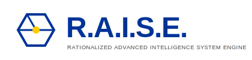

<p align="center"></p>

# GenAptitude · Workstation-First AI Use-Case Factory

Turn repeatable business tasks into **local, auditable, and explainable** assistants.  
This repository contains the **desktop app (Tauri v2 + Rust)**, the **frontend (Vite + React + TypeScript)**, and a **Rust→WASM** demo.

## Why MBAIE (Model‑based AI Neuro‑Symbolic Engineering)?

GenAptitude embraces **MBAIE** to combine the strengths of **neural** (LLMs, embeddings, vector search) and **symbolic** AI (ontologies, rule engines, deterministic solvers) within a **model‑based** backbone. Business knowledge is modeled explicitly (Arcadia/Capella mindset; JSON/JSON‑LD schemas, typed events, contracts), then executed by a pipeline where:

- **(1)** retrieval and LLMs generate hypotheses;
- **(2)** **rules/constraints** check compliance and fill gaps;
- **(3)** **explanations** and **evidence** (sources, rule traces) are attached to each output;
- **(4)** artifacts are **versioned and auditable** end‑to‑end. This neuro‑symbolic approach yields **consistency, controllability, and trust**, while remaining **workstation‑first** (privacy, cost, energy) and ready for \*\*continuous improvement\*\* (LoRA/QLoRA fine‑tuning against model‑based test suites).

---

## Overview

- **Workstation-first & sovereign**: runs locally; no cloud lock-in.
- **Tauri v2 desktop**: tiny footprint, native packaging.
- **Frontend**: Vite + React (TS). Vite root is `src/`; static assets in `public/`.
- **WASM demo**: `ga_wasm.wasm` served from `public/wasm/`.
- **Local API (invoke)**: sample commands to register/read JSON Schemas (persisted in the app’s user-data directory).
- **CI (GitLab)**: builds web artifacts, compiles WASM, bundles Linux installers (AppImage / .deb / .rpm).

---

## Repository Layout

```
.
├─ src/                         # Vite root (frontend)
│  ├─ index.html
│  ├─ main.tsx / App.tsx
│  └─ pages/
│     └─ dark-mode-demo.html    # Static demo (light/dark)
├─ public/                      # Copied as-is → dist/
│  └─ wasm/ga_wasm.wasm
├─ dist/                        # Frontend build output (generated)
├─ src-tauri/                   # Tauri v2 (Rust)
│  ├─ src/main.rs               # invoke commands + local persistence
│  └─ tauri.conf.json           # "frontendDist": "../dist"
├─ src-wasm/                    # Rust crate compiled to WASM (wasip1/unknown)
└─ .gitlab-ci.yml               # GitLab pipeline (web, wasm, tauri bundle)
```

---

## Prerequisites

- **Node 20+** and a package manager (npm / pnpm / yarn)
- **Rust 1.88+** with `rustup`
- WASM targets:
  ```bash
  rustup target add wasm32-unknown-unknown wasm32-wasip1
  ```
- (Optional for local packaging) WebKitGTK/JavaScriptCore/GTK dev libs (CI already bundles installers).

---

## Quick Start

### Frontend (browser dev)

```bash
npm install
npm run dev
# Open http://localhost:1420
```

### Desktop (Tauri dev)

Runs Vite for you via `beforeDevCommand`:

```bash
cargo tauri dev
```

### Production Build

```bash
# 1) Build the frontend → ./dist
npm run build

# 2) Bundle the desktop app → ./target/release/bundle/**
cargo tauri build
# Produces AppImage, .deb, .rpm under target/release/bundle/
```

---

## WASM Integration (demo)

`ga_wasm.wasm` is served from `public/wasm/` (copied to `dist/wasm/...` at build time).

Quick console test (dev or desktop DevTools):

```js
(async () => {
  const { instance } = await WebAssembly.instantiateStreaming(fetch('/wasm/ga_wasm.wasm'));
  console.log('ga_add(2,2)=', instance.exports.ga_add(2, 2)); // → 4
})();
```

---

## Local API (Tauri invoke)

Two example commands in `src-tauri/src/main.rs`:

- `register_schema(schemaId: String, schema_json: String)`
- `get_schema(schemaId: String)`

They persist files in the **app user-data directory**, not in `src-tauri/`, to avoid dev rebuild loops.

Frontend usage:

```ts
import { invoke } from '@tauri-apps/api/core';

await invoke('register_schema', {
  schemaId: 'demo',
  schemaJson: JSON.stringify({ $id: 'demo', type: 'object' }, null, 2),
});
const text = await invoke<string>('get_schema', { schemaId: 'demo' });
console.log('schema demo =', JSON.parse(text));
```

---

## CI/CD (GitLab)

Stages: **lint → build → test**.

- **web:build** — Vite build; publishes `dist/` as artifact.
- **wasm:build** — builds `src-wasm` for `wasm32-unknown-unknown` and `wasm32-wasip1`.
- **rust:test** — runs tests for the WASM crate.
- **tauri:bundle** — installs Debian 12 (bookworm) deps incl. backports for WebKitGTK/JSCore **4.1** (`libwebkit2gtk-4.1-dev`, `libjavascriptcoregtk-4.1-dev`, `libsoup-3.0-dev`), then `cargo tauri build`.  
  Artifacts:
  - `target/release/bundle/appimage/GenAptitude_*.AppImage`
  - `target/release/bundle/deb/GenAptitude_*.deb`
  - `target/release/bundle/rpm/GenAptitude-*.rpm`

---

## Static Pages

- `src/pages/dark-mode-demo.html` is emitted to `/dist/pages/dark-mode-demo.html`.  
  Link to it from your app:
  ```tsx
  <a href="/pages/dark-mode-demo.html">Dark Mode Demo</a>
  ```
- For simple legal/FAQ pages without React, you can also drop HTML files under `public/pages/` and link them with absolute paths (e.g., `/pages/faq.html`).

---

## Troubleshooting

- **Endless rebuild in `cargo tauri dev`**: don’t write files under `src-tauri/` from the frontend. The provided commands store data in the OS user-data dir.
- **White screen in desktop**: ensure `npm run build` was run and `tauri.conf.json` uses `"frontendDist": "../dist"`.
- **WASM 404**: ensure `public/wasm/ga_wasm.wasm` exists before building; it will appear in `dist/wasm/`.
- **Port in use**: change Vite `server.port` (and `devUrl` in `tauri.conf.json`) or stop the previous dev server.

---

## Scripts

`package.json`:

- `dev` — Vite dev server
- `build` — Vite production build → `dist/`
- `tauri:dev` — `tauri dev`
- `tauri:build` — `tauri build`

---

## License

TBD.

---

## Contact

**GenAptitude — Workstation-First AI Use-Case Factory**  
Contact: **zair@bezghiche.com**
