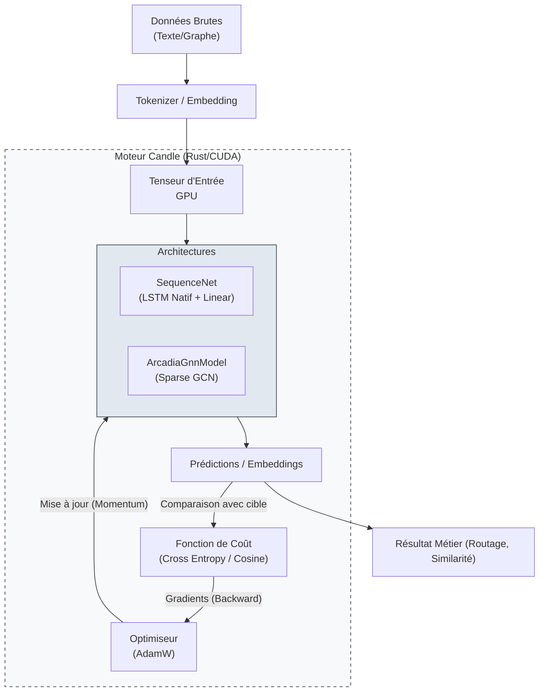

# Module Deep Learning (`src-tauri/src/ai/deep_learning`)

Ce module fournit une implémentation native, hautement optimisée (accélération GPU/CUDA) de réseaux de neurones, écrite entièrement en Rust. Basé sur le moteur `candle` de HuggingFace, il permet à **Raise** d'effectuer un apprentissage continu local (sur la machine de l'utilisateur) pour des tâches avancées d'ingénierie système (MBSE) et de traitement du langage naturel (NLP).

---

## 1. Structure du Module

Le module a été refactorisé pour une approche "Zéro Dette Technique", déléguant les opérations mathématiques de bas niveau aux noyaux C++/CUDA natifs, et se concentrant sur l'architecture.

| Sous-module            | Description                                                                                                                                                             |
| :--------------------- | :---------------------------------------------------------------------------------------------------------------------------------------------------------------------- |
| **`layers/`** | **Briques fondamentales**. Contient nos couches spécialisées comme `GcnLayer` (Graph Convolutional Network avec *Sparse Message Passing*).                              |
| **`models/`** | **Architectures**. Assemble les couches pour former des réseaux complets (`SequenceNet` pour le NLP/Séquences, `ArcadiaGnnModel` pour l'analyse topologique de graphe). |
| **`trainer.rs`** | **Boucle d'apprentissage**. Gère l'optimisation des poids via l'optimiseur accéléré **AdamW** et les fonctions de perte natives (Cross Entropy).                        |
| **`serialization.rs`** | **Persistance**. Gère la sauvegarde et le chargement ultra-rapide des poids au format standard `.safetensors`.                                                          |

---

## 2. Flux de Données (Architecture RNN & GNN)

Le module gère désormais deux paradigmes majeurs : l'analyse séquentielle (RNN/LSTM) et l'analyse topologique (GNN) .



---

## 3. Fondements Théoriques & Optimisations

Nous utilisons `candle-core` comme backend pour la différenciation automatique et l'accélération matérielle.

### Optimiseur AdamW
Contrairement à la descente de gradient stochastique (SGD) basique, nous utilisons **AdamW** qui intègre le *momentum* et la décroissance des poids (weight decay) pour une convergence rapide et stable :
$$W_{t+1} = W_t - \eta \cdot \nabla_W L + \text{Momentum}$$

### Sparse Message Passing (GNN)
Pour analyser l'ontologie Arcadia, notre `ArcadiaGnnModel` utilise des tenseurs creux (Sparse Tensors). Au lieu de multiplier des matrices d'adjacence denses de complexité $O(N^2)$, le modèle propage les messages uniquement le long des arêtes existantes $O(E)$, économisant massivement la VRAM du GPU.

### Fonction de Perte (SequenceNet)
Pour l'entraînement sur des séquences, nous minimisons l'entropie croisée (Cross Entropy) nativement optimisée :
$$L = -\sum_{c=1}^{M} y_{o,c} \log(p_{o,c})$$

---

## 4. Exemple d'Intégration (Rust)

Voici comment instancier et entraîner dynamiquement un réseau en utilisant notre configuration centralisée `AppConfig`.

```rust
use crate::ai::deep_learning::{models::sequence_net::SequenceNet, trainer::Trainer};
use candle_core::{VarBuilder, Device, DType, Tensor};
use candle_nn::VarMap;

pub fn train_custom_model(config: &DeepLearningConfig) -> RaiseResult<()> {
    let device = config.to_device();

    // 1. Création du modèle (Variables et Poids)
    let varmap = VarMap::new();
    let vb = VarBuilder::from_varmap(&varmap, DType::F32, &device);
    
    // Le modèle se base sur la SSOT (Single Source of Truth) de la config
    let model = SequenceNet::new(config.input_size, config.hidden_size, config.output_size, vb)?;

    // 2. Configuration de l'entraîneur (AdamW)
    let mut trainer = Trainer::from_config(&varmap, config)?;

    // 3. Données factices pour l'exemple
    let dummy_input = Tensor::randn(0f32, 1.0, (1, 1, config.input_size), &device)?;
    let dummy_target = Tensor::zeros((1, 1), DType::U32, &device)?; 

    // 4. Lancement de l'entraînement
    let final_loss = trainer.train_step(&model, &dummy_input, &dummy_target)?;
    println!("Perte après 1 pas : {}", final_loss);

    Ok(())
}
```

---

## 5. Roadmap & Statut

- [x] **Architecture Modulaire** (`models/`, `layers/`)
- [x] **Accélération Matérielle** (Remplacement des boucles CPU par le LSTM natif Candle)
- [x] **Modélisation Graphe (MBSE)** (`ArcadiaGnnModel` & Sparse Message Passing)
- [x] **Boucle d'Apprentissage** (`trainer.rs` avec AdamW)
- [x] **Sérialisation/Sauvegarde** (Format `.safetensors` via `serialization.rs`)
- [ ] **Intégration NLP de bout en bout** (Connecter `SequenceNet` aux tokenizers réels BPE).
```

 