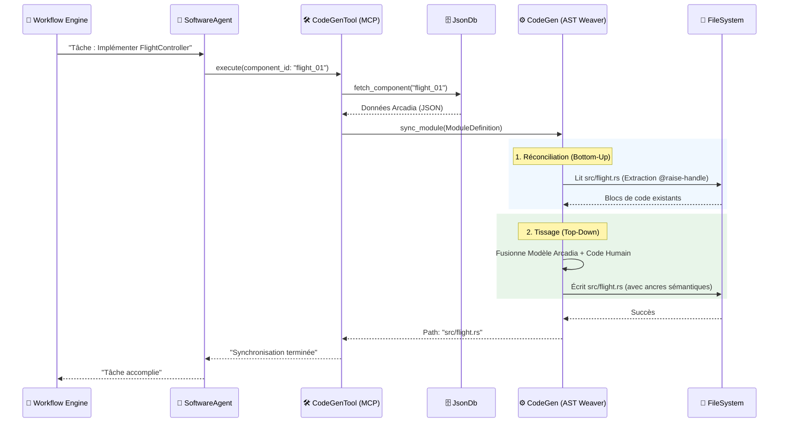

# 🧬 Module `code_generator` — L'Usine Logicielle Sémantique RAISE

## 🎯 Vue d'ensemble

Le module `code_generator` est le moteur de **tissage sémantique** de RAISE. Il assure la synchronisation bidirectionnelle entre le **Jumeau Numérique** (modèles Arcadia/MBSE stockés dans la `json_db`) et le **Code Source Physique**. Contrairement aux approches classiques, il ne se contente pas de générer du texte, il maintient un lien vivant et mathématique entre l'architecture système et l'implémentation.

### Philosophie : Le "Sandwich Neuro-Symbolique" (V2)

RAISE abandonne le templating rigide (type Tera) pour une approche **AST Weaver**.
* **L'Intention (Neuro)** : Le `SoftwareAgent` (IA) apporte la logique métier complexe et les décisions algorithmiques.
* **La Structure (Symbolique)** : Le `CodeGeneratorService` garantit la conformité sémantique, le respect des standards de langage et la préservation de l'intégrité du code humain.

---

## 🏗️ La Chaîne de Responsabilité : Du Workflow au Code

L'exécution n'est pas une simple commande, mais une cascade orchestrée de responsabilités.


### 1. Le Workflow Engine (L'Ordonnanceur)
Le moteur de workflow définit la "Mission" en cours. Il déclenche une tâche de génération lorsqu'un composant Arcadia passe d'un état de "Conception" à "Implémentation".

### 2. Le SoftwareAgent (Le Concepteur)
L'IA reçoit la tâche et analyse le contexte sémantique dans la base de données. Elle ne modifie pas les fichiers elle-même mais prépare une intention de code structurée qu'elle transmet via ses outils.

### 3. Le CodeGenTool (L'Interface MCP)
L'outil `generate_component_code` agit comme le bras articulé de l'IA.
* Il s'interface via le protocole **Model Context Protocol (MCP)**.
* Il récupère les données Arcadia (`pa_components`, `la_components`, `sa_components`).
* Il détermine le langage cible (Rust, C++, etc.) et invoque le service de forge.

### 4. Le CodeGeneratorService (La Forge AST Weaver)
Le service final effectue la synchronisation physique. Il orchestre la réconciliation, le diffing et le tissage final sur le disque dur.

---

## 📊 Diagramme de Séquence Global



---

## 🧱 Architecture Interne du Module

Le module est découpé en sous-systèmes spécialisés garantissant une performance maximale et une maintenance aisée.

* **`models/`** : Définit les types sémantiques (`Module`, `CodeElement`, `Visibility`).
* **`analyzers/`** :
    * `SemanticAnalyzer` : Extrait les dépendances MBSE (allocations fonctionnelles, flux de données).
* **`graph/`** : Moteur de tri topologique gérant l'ordre des définitions dans les fichiers source.
* **`reconciler/`** : Parser de "réalité physique" extrayant le code via les ancres sémantiques.
* **`weaver/`** : La logique de tissage unitaire qui transforme un `CodeElement` en texte valide.
* **`module_weaver/`** : Assembleur final gérant la bannière de gouvernance et l'arborescence des dossiers.

---

## 🛡️ Gouvernance : Les Ancres Sémantiques

La pièce maîtresse de la réconciliation bidirectionnelle est l'**Ancre Sémantique**. Elle permet au système de reconnaître quel morceau de code appartient à quel objet du modèle MBSE.

```rust
// @raise-handle: fn:flight_01:calculate_thrust
pub fn calculate_thrust() {
    // [LOGIQUE IA OU HUMAINE ICI]
    println!("9.81 m/s²");
}
```

> **Règle de Production** : La ligne `// @raise-handle` ne doit jamais être modifiée manuellement. Elle constitue le lien mathématique unique avec le Jumeau Numérique.


---

## 🚀 Standards et Performance

* **Multi-Langage** : Support natif pour Rust (mode Crate), C++ (Header/Source), TypeScript, VHDL et Verilog.
* **Zéro Dépendance Lourde** : Suppression de Tera et Heck pour une compilation rapide et un binaire léger.
* **Intégrité** : Création automatique des arborescences de dossiers (ex: `src/models/generated/`) lors de la synchronisation.
* **Formatage** : Intégration de `rustfmt` pour garantir la propreté du code Rust généré.

---

## 🧪 Tests

La fiabilité est assurée par une suite de tests utilisant la **Sandbox RAISE**.

```bash
# Tests du service (Cœur)
cargo test code_generator

# Tests de l'outil MCP (Agent-Simulation)
cargo test ai::tools::codegen_tool

# Tests d'intégration complets
cargo test --test code_gen_suite
```

---
**Besoin d'aller plus loin ?** Consultez le guide des Squads IA dans `docs/workflow_engineering.md`.

 