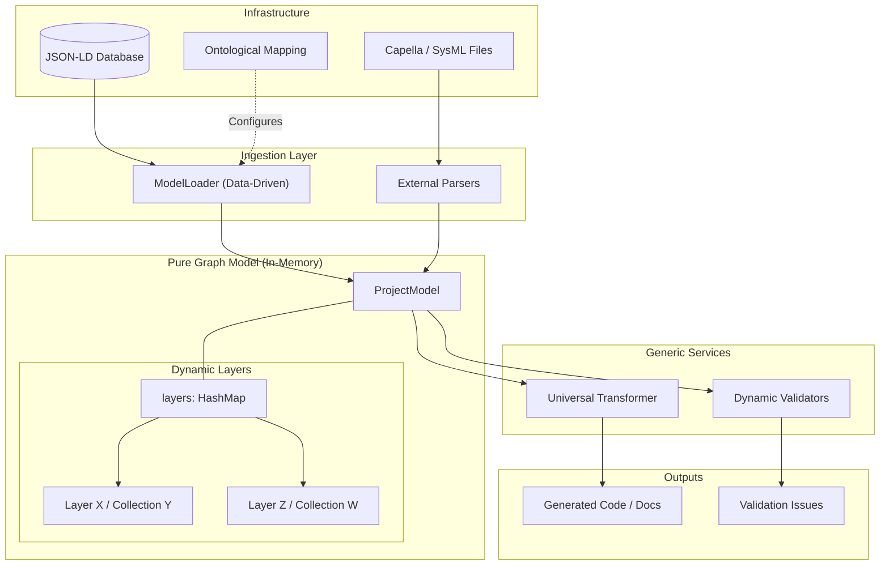

# Model Engine (`src/model_engine`)

Le **Model Engine** est le cœur métier de l'application RAISE. Il encapsule toute la logique d'Ingénierie Système (MBSE) basée sur des ontologies dynamiques (Arcadia, SysML v2, etc.).

Suite à la migration vers l'architecture **"Pure Graph"**, le moteur agit désormais comme un graphe sémantique agnostique et piloté par les données (Data-Driven). Il fait le pont entre la base de données (JSON-LD), les modèles externes (Capella) et les fonctionnalités avancées (Génération de code, IA, Validation).

## 🌍 Vue d'Ensemble Architecturelle

Le moteur orchestre le cycle de vie d'un modèle système en se basant sur un mapping ontologique dynamique défini en base de données.



## 📂 Organisation des Modules

| Module              | Description |
| :--- | :--- |
| **`types.rs`** | **Graphe Sémantique**. Définit le `ProjectModel` global et l'`ArcadiaElement` (nœud générique). Le modèle ne possède plus de champs statiques, mais une map dynamique `layers`. |
| **`loader.rs`** | **Hydratation Data-Driven**. Charge les données depuis la base en interrogeant le document `ontological_mapping` pour savoir quelles collections scanner. |
| **`transformers/`** | **Génération Universelle**. Moteur de transformation centralisé (`UniversalTransformer`) piloté par des configurations (`TransformerConfig`) pour extraire des vues logicielles, matérielles ou systèmes. |
| **`validators/`** | **Qualité Dynamique**. Moteur de règles (Rules Engine) vérifiant la cohérence technique et la conformité sémantique à la volée via des requêtes AST. |
| **`arcadia/`** | **Sémantique**. Contient les constantes, les catégories et les définitions des propriétés canoniques utilisées comme références. |
| **`capella/` & `sysml2/`** | **Interopérabilité**. Parsers spécialisés pour importer et normaliser des modèles externes vers le format de graphe générique. |

## 🔑 Concepts Clés

### 1. L'Architecture "Pure Graph"
Le moteur a abandonné les structures de données strictes (ex: `OaLayer`, `LogicalComponent`) au profit d'un graphe dynamique. Tout élément est un `ArcadiaElement` stocké dans la map `model.layers`. 
Cela permet au moteur d'absorber de nouvelles ontologies (comme SysML v2 ou des frameworks de cybersécurité) sans **aucune recompilation du code Rust**.

### 2. Le Pilotage par les Données (Data-Driven)
* **Le Loader** ne devine plus où sont les données. Il lit la configuration système (`ontological_mapping`) pour découvrir les espaces de recherche.
* **Les Transformers** ne sont plus codés en dur par domaine. Un seul `UniversalTransformer` applique des règles de filtrage (ex: "suivre les liens `ownedPhysicalPorts`") selon le contexte demandé.

## 🚀 Guide d'Utilisation Rapide

### Chargement d'un projet complet (Async)

```rust
use crate::model_engine::loader::ModelLoader;

// Initialisation du loader (pointant vers la DB et le Workspace)
let loader = ModelLoader::new(&storage, "my_space", "my_project");

// L'indexation et le chargement sont gérés par le mapping ontologique
let model = loader.load_full_model().await?;

println!("Graphe chargé : {} éléments", model.meta.element_count);
```

### Validation via Règles Dynamiques

```rust
use crate::model_engine::validators::{DynamicValidator, Rule, Expr};

// Définition d'une règle (ex: "La description est obligatoire")
let validator = DynamicValidator::new(vec![my_rule_from_db]);

// Validation sur l'ensemble du graphe dynamique
let issues = validator.validate_full(&loader).await;

if !issues.is_empty() {
    println!("Attention, {} violations de règles détectées !", issues.len());
}
```

### Transformation Sémantique (Avec Contexte)

```rust
use crate::model_engine::transformers::{get_transformer, TransformationDomain};

// Récupération de l'élément cible dans le graphe
let element = model.find_element("COMP-UUID").unwrap();

// Instanciation du Transformer Universel configuré pour le Software
let generator = get_transformer(TransformationDomain::Software);

// Transformation en utilisant l'intelligence du graphe complet
let output = generator.transform_with_context(element, &model)?;

println!("Entité logicielle générée : {}", output["entity"]["name"]);
```

## ⚠️ Conventions de Développement

1. **Agilité Sémantique** : Ne créez **jamais** de structs Rust fixes pour représenter des concepts métier (ex: pas de `struct Actor`). Utilisez toujours les propriétés dynamiques de `ArcadiaElement`.
2. **Fonctions Asynchrones** : Le moteur dialogue en temps réel avec la couche de persistance. Toutes les entrées/sorties doivent utiliser `.await`.
3. **Accès au Modèle** : Préférez toujours les helpers de navigation (`model.get_collection()`, `model.find_element()`) plutôt que de parcourir manuellement les `HashMaps` internes.
```

 
 