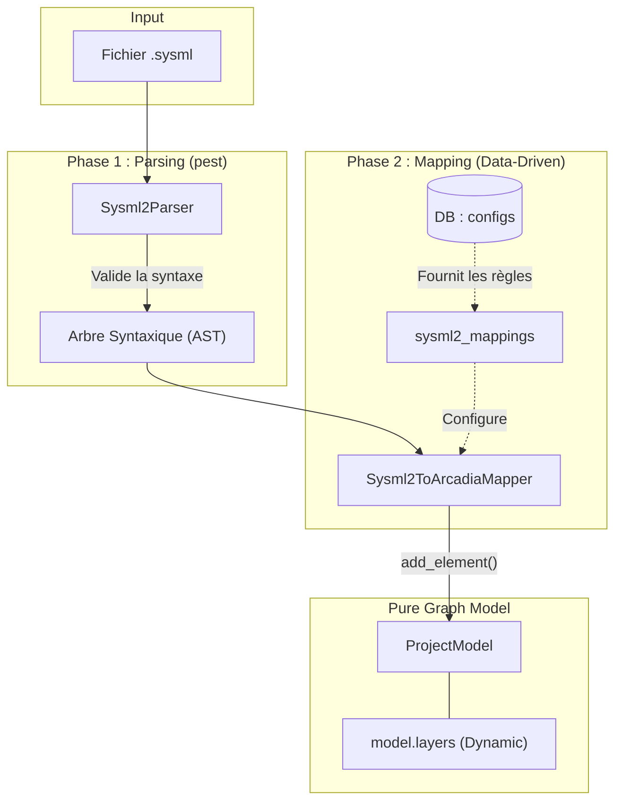

# SysML v2 Parser & Mapper (`src/model_engine/sysml2`)

Ce module est la passerelle d'interopérabilité entre le monde textuel standardisé **SysML v2** et le **Graphe Sémantique** interne de RAISE. 

Suite à la migration vers l'architecture **Data-Driven**, ce module ne convertit plus aveuglément des concepts SysML vers des structures statiques Arcadia. Il agit comme un moteur de traduction dynamique, piloté par un dictionnaire de mapping stocké en base de données.

## 🎯 Objectifs

1. **Parsing Textuel Rapide** : Analyser la syntaxe textuelle SysML v2 (`.sysml`) à l'aide d'une grammaire formelle (`Pest`).
2. **Interopérabilité Agnostique** : Transformer l'Arbre Syntaxique Abstrait (AST) en nœuds génériques `ArcadiaElement`.
3. **Pilotage par les Données (Data-Driven)** : Utiliser le document `ontological_mapping` de la base système pour savoir dans quelles couches (`layers`) et collections ranger les concepts SysML parsés (ex: `part def` devient-il un composant logique ou physique ?).

## 📊 Architecture et Flux de Données

Le processus d'ingestion se déroule en deux grandes étapes : le *Parsing* (Syntaxe) et le *Mapping* (Sémantique).



## 📂 Structure du Module

```text
src/model_engine/sysml2/
├── mod.rs          # Façade du module (exporte Parser et Mapper)
├── parser.rs       # Moteur d'analyse syntaxique (basé sur le crate `pest`)
├── mapper.rs       # 🎯 Moteur de traduction dynamique (AST -> Pure Graph)
└── sysml2.pest     # (Fichier de grammaire) Définition des règles SysML v2
```

## 🧠 Le Mapping Ontologique Dynamique

Historiquement, un `part def` SysML était converti en dur en `LogicalComponent`. Désormais, le `Sysml2ToArcadiaMapper` interroge la base de données système pour connaître les règles du projet courant.

Exemple de configuration JSON lue par le mapper :
```json
{
  "_id": "ref:configs:handle:ontological_mapping",
  "sysml2_mappings": {
    "part_def": {
      "SystemAnalysis": { "layer": "sa", "col": "components", "kind": "SystemComponent" },
      "LogicalArchitecture": { "layer": "la", "col": "components", "kind": "LogicalComponent" },
      "default": { "layer": "oa", "col": "entities", "kind": "OperationalEntity" }
    },
    "requirement_def": {
      "default": { "layer": "transverse", "col": "requirements", "kind": "Requirement" }
    }
  }
}
```

**L'avantage majeur** : Si vous souhaitez utiliser SysML v2 pour modéliser une architecture cloud, il suffit de modifier ce JSON en base. Le mapper rangera automatiquement les `part def` dans `layer: "cloud"`, `col: "services"` sans toucher à une seule ligne de code Rust !

## 🚀 Utilisation (Async & Contextuelle)

Voici comment transformer un texte SysML v2 en un graphe métier complet :

```rust
use crate::model_engine::sysml2::Sysml2ToArcadiaMapper;
use crate::json_db::collections::manager::CollectionsManager;

async fn import_sysml_model(sysml_text: &str, manager: &CollectionsManager<'_>) {
    // 1. Instanciation du mapper
    let mapper = Sysml2ToArcadiaMapper::new();

    // 2. Exécution de la transformation (Parsing + Mapping)
    // Le manager est passé pour permettre au mapper de lire les configs dynamiques
    let model = mapper.transform(sysml_text, manager).await.expect("Erreur de parsing SysML");

    // 3. Navigation dans le graphe généré
    let components = model.get_collection("la", "components");
    println!("{} composants logiques importés depuis le SysML !", components.len());
}
```

## ⚠️ Conventions d'Évolution

1. **La grammaire d'abord** : Si SysML v2 introduit un nouveau mot-clé (ex: `action def`), ajoutez-le d'abord dans le fichier `sysml2.pest`.
2. **Toujours générique** : Dans `mapper.rs`, lors de la création d'un `ArcadiaElement`, ne supposez jamais sa couche de destination. Lisez toujours la section `sysml2_mappings` du document de configuration. S'il n'est pas configuré, utilisez le fallback `"others"` dans la couche `"oa"`.
```

 