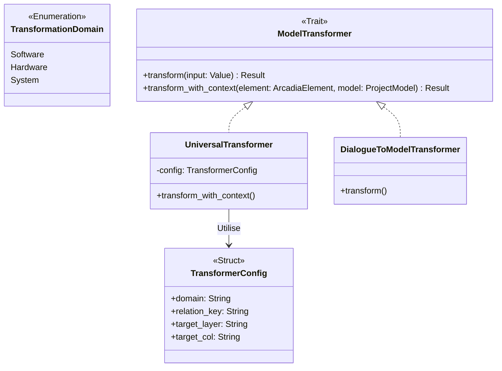

# Model Transformers (`src/model_engine/transformers`)

Ce module gère la **transformation d'artefacts** à partir du modèle système global (`ProjectModel`) ou la conversion de données externes (ex: IA/LLM) vers le modèle.

Suite à la migration vers l'architecture **"Pure Graph"**, ce module a été entièrement repensé pour devenir **Data-Driven**. Il ne repose plus sur du code Rust statique pour chaque domaine, mais utilise un moteur sémantique générique capable de naviguer intelligemment dans le graphe des données.

## 🎯 Objectifs

1.  **Génération Contextuelle (Graph-to-Text)** : Extraire des vues spécifiques (Logiciel, Matériel, Système) en naviguant dans les relations sémantiques du `ProjectModel` (ex: allocations fonctionnelles, liens physiques).
2.  **Transformation Pilotée par les Données** : Utiliser un `UniversalTransformer` unique configuré par des règles de mapping, évitant la duplication de code pour chaque nouveau domaine d'ingénierie.
3.  **Text-to-Model (IA)** : Convertir des intentions textuelles (LLM) en objets JSON (`ArcadiaElement`) valides pour insertion dans le graphe (via `DialogueToModel`).

## 📊 Architecture (Universal Pattern)

Le système utilise toujours une Factory, mais au lieu de retourner des classes différentes, elle configure une instance générique avec un `TransformerConfig` qui dicte quelles couches et quelles relations suivre dans le graphe.



## 📂 Structure du Module

Le code a été drastiquement factorisé pour une maintenance minimale et une évolutivité maximale :

```text
src/model_engine/transformers/
├── mod.rs                  # Cœur du moteur : Trait, UniversalTransformer et Factory
└── dialogue_to_model.rs    # Plugin spécifique : NLP/LLM vers graphe Arcadia
```
*(Note : Les anciens fichiers `software.rs`, `hardware.rs` et `system.rs` ont été fusionnés dans le moteur universel).*

## 🛠️ Le Trait `ModelTransformer`

Le trait expose désormais deux méthodes. La méthode phare est `transform_with_context`, qui donne au transformateur une vision complète du graphe en mémoire.

```rust
pub trait ModelTransformer: Send + Sync {
    /// Transformation simple (Legacy ou NLP)
    fn transform(&self, element: &JsonValue) -> RaiseResult<JsonValue>;

    /// 🎯 Transformation Sémantique (Pure Graph)
    /// Permet de générer du code en analysant les relations de l'élément avec le reste du modèle.
    fn transform_with_context(
        &self,
        element: &ArcadiaElement,
        model: &ProjectModel,
    ) -> RaiseResult<JsonValue>;
}
```

## 🚀 Utilisation

### 1. Génération de Code (Avec Contexte du Graphe)

Exemple d'extraction d'une vue logicielle pour un composant, en laissant le moteur chercher automatiquement ses fonctions allouées.

```rust
use crate::model_engine::transformers::{get_transformer, TransformationDomain};

async fn generate_software_view(model: &ProjectModel, element_id: &str) {
    // 1. Localiser l'élément source dans le graphe dynamique
    let element = model.find_element(element_id).expect("Élément introuvable");

    // 2. Instancier le transformateur configuré pour le domaine Logiciel
    let transformer = get_transformer(TransformationDomain::Software);

    // 3. Exécuter la transformation en fournissant le graphe complet (modèle)
    let result = transformer.transform_with_context(element, model).unwrap();

    println!("Domaine : {}", result["domain"]);
    println!("Entité et relations extraites : {}", result["entity"]);
}
```

### 2. Ajout d'un Nouveau Domaine d'Ingénierie

Pour ajouter un nouveau domaine (ex: `Network`), **il n'est plus nécessaire de créer un nouveau fichier Rust**. 
Il suffit d'ajouter sa configuration dans la Factory (ou directement en base de données) :

```rust
TransformerConfig {
    domain: "network".into(),
    relation_key: "ownedCommunicationLinks".into(),
    target_layer: "pa".into(),
    target_col: "networks".into(),
}
```

## ⚠️ Règles d'Implémentation

1. **Aucun typage dur** : Ne référencez jamais des structures statiques (`SoftwareComponent`, etc.). Naviguez toujours via les propriétés JSON dynamiques (`element.properties.get(...)`) et les helpers du modèle (`model.get_collection(...)`).
2. **Extensions** : Si une transformation nécessite un algorithme lourd et non générique (ex: génération d'images, parsing LLM), créez un nouveau fichier dédié dans ce dossier (comme `dialogue_to_model.rs`) et implémentez le trait `ModelTransformer`.
```

