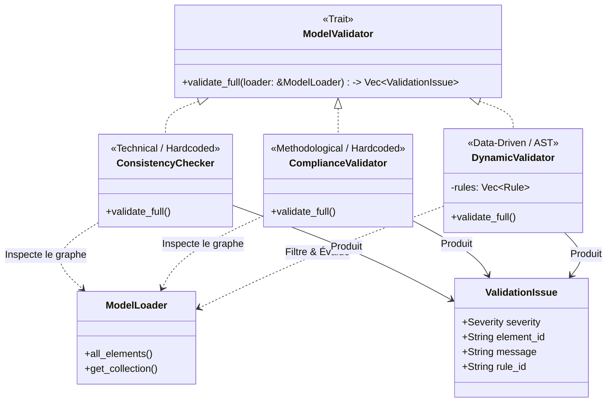

# Model Validators (`src/model_engine/validators`)

Ce module est le **Garde-fou** de l'application RAISE. Il est responsable de la vérification de la qualité, de l'intégrité et de la conformité du modèle système.

Suite au passage à l'architecture **"Pure Graph"**, le module a évolué pour devenir **Data-Driven**. S'il conserve des règles techniques codées en dur pour l'intégrité de base, il intègre désormais un **moteur de règles dynamiques** permettant aux utilisateurs de définir leurs propres contraintes métier directement en base de données.

## 🎯 Objectifs

Le module répond à trois besoins distincts :

1.  **Cohérence Technique (Consistency)** : Le graphe est-il valide informatiquement ?
    - Pas d'IDs dupliqués ou manquants.
    - Pas de liens pointant vers le vide (Broken Links).
    - Types d'éléments (URIs) corrects.
2.  **Conformité Méthodologique (Compliance)** : Le modèle respecte-t-il les standards (ex: Arcadia) ?
    - Conventions de nommage (PascalCase, etc.).
    - Qualité documentaire (Descriptions présentes).
3.  **Validation Dynamique (Data-Driven)** : Le modèle respecte-t-il les règles spécifiques au projet ?
    - Évaluation d'expressions AST (ex: "La priorité doit être 'High' si le composant est critique").
    - Règles injectées à l'exécution sans recompilation du moteur.

## 📊 Architecture et Flux de Validation

Le diagramme ci-dessous illustre la nouvelle architecture. Les validateurs parcourent le modèle dynamiquement via le `ModelLoader`.



## 📂 Structure du Module

```text
src/model_engine/validators/
├── mod.rs                  # Trait global (ModelValidator) et Structures (ValidationIssue, Severity)
├── consistency_checker.rs  # Validateur technique (Intégrité des données)
├── compliance_validator.rs # Validateur métier (Standards de modélisation)
└── dynamic_validator.rs    # 🎯 Moteur de règles AST dynamique
```

## 🛠️ Structures de Données

### `Severity`
Indique la gravité du problème pour l'interface utilisateur.
- `Error` (Rouge) : Problème critique (ID manquant, corruption, violation de règle stricte). Bloque souvent la génération de code.
- `Warning` (Jaune) : Problème méthodologique (ex: Composant vide).
- `Info` (Bleu) : Suggestion d'amélioration (ex: Description manquante).

### `ValidationIssue`
L'objet retourné au Frontend.
```rust
pub struct ValidationIssue {
    pub severity: Severity,
    pub rule_id: String,      // Code unique (ex: "SYS_001" ou ID d'une règle en DB)
    pub element_id: String,   // ID de l'élément pour le cibler dans le graphe UI
    pub message: String,      // Description lisible par l'humain
}
```

## 🚀 Utilisation (Async & Data-Driven)

Avec la nouvelle architecture, la validation s'effectue de manière asynchrone en s'appuyant sur le `ModelLoader`.

### Lancer une validation dynamique

```rust
use crate::model_engine::validators::{DynamicValidator, ModelValidator};
use crate::rules_engine::ast::{Rule, Expr};

async fn run_dynamic_audit(loader: &ModelLoader, db_rules: Vec<Rule>) {
    // 1. Instancier le validateur avec les règles lues depuis la base de données
    let validator = DynamicValidator::new(db_rules);

    // 2. Exécuter l'évaluation sur l'intégralité du graphe indexé
    let issues = validator.validate_full(loader).await;

    // 3. Traiter les résultats
    for issue in issues {
        println!("[{:?}] Élément {} : {}", issue.severity, issue.element_id, issue.message);
    }
}
```

## 📋 Catalogue des Règles

### 1. Règles Statiques (Hardcoded)
* **SYS_001** (`Error`) : Identifiant (UUID) manquant ou vide (`consistency_checker.rs`).
* **SYS_003** (`Error`) : Type URI (Kind) manquant (`consistency_checker.rs`).
* **RULE_NAMING** (`Warning`) : Élément nommé "Unnamed", "Copy of..." ou vide (`compliance_validator.rs`).

### 2. Règles Dynamiques (`dynamic_validator.rs`)
Les règles dynamiques n'ont pas de catalogue fixe. Elles sont définies par les utilisateurs sous forme de requêtes AST. 
*Exemple de règle :* "Si l'élément appartient à la collection `la.components`, alors sa `description` ne doit pas être nulle."

## 🔄 Ajouter une nouvelle règle

1. **Règle technique universelle** : Modifiez `consistency_checker.rs` ou `compliance_validator.rs`.
2. **Règle métier spécifique à un projet** : N'écrivez **pas** de code Rust. Insérez une nouvelle `Rule` (AST) dans la base de données JSON-LD du projet. Le `DynamicValidator` l'évaluera automatiquement à la prochaine exécution !
```

 