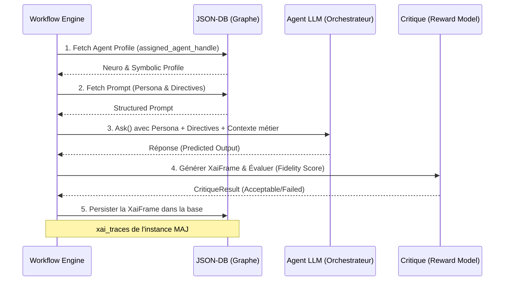

# 🧠 Workflow Engine (Neuro-Symbolic, Sovereign & Data-Driven)

Ce module implémente le cœur d'exécution **Neuro-Symbolique** du projet RAISE.
Il dépasse le simple moteur de script pour devenir une architecture de **Gouvernance par le Code et par le Graphe**, mariant :

1. **La Rigueur Constitutionnelle** : Mandats signés cryptographiquement, lignes rouges inviolables (Vetos dynamiques via AST), et compilation 100% *Data-Driven* depuis le graphe sémantique.
2. **L'Intelligence Générative Multi-Agents** : Les tâches ne sont plus génériques ; elles sont routées dynamiquement vers des profils d'Agents IA spécifiques (Squads, Personas) stockés en base de données.
3. **La Traçabilité et l'Explicabilité (XAI)** : Chaque décision génère une preuve d'explicabilité (`XaiFrame`) évaluée par un Reward Model (Critique) et persistée dans le Jumeau Numérique pour un audit total.
4. **L'Ancrage dans le Réel (Grounding)** : Capacité d'agir et de lire l'état du Jumeau Numérique via des outils déterministes (MCP) totalement *Stateless* connectés à la JSON-DB.
5. **Le Consensus Algorithmique** : Résolution de conflits par vote pondéré (Méthode de Condorcet).

---

## 🏛️ Architecture : Cerveau, Mains et Graphe

Le système repose sur un paradigme **Pure Graph**. Le code Rust ne contient plus de logique métier codée en dur. Tout est résolu dynamiquement via le `CollectionsManager` et l'ontologie JSON-LD.

| Composant | Fichier/Dossier | Rôle & Responsabilité |
| :--- | :--- | :--- |
| **Mandate** | `mandate.rs` | **La Constitution**. Structure JSON signée définissant la stratégie et les vetos (AST). |
| **Compiler** | `compiler.rs` | **Le Traducteur Dynamique**. Transforme le Mandat en un Graphe orienté (DAG). Lit les configurations en DB (ex: `ref:configs:tool_dependencies`) pour injecter les outils appropriés. |
| **Scheduler** | `scheduler.rs` | **Le Directeur**. Gère le cycle de vie, la Machine à États, et sauvegarde l'état de l'instance (`WorkflowInstance`) à chaque étape. |
| **State Machine**| `state_machine.rs`| **Le Navigateur**. Évalue les transitions, l'état des nœuds parents et résout les branchements (Legacy ou AST). |
| **Executor** | `executor.rs` | **Le Routeur Principal**. Propage le `HandlerContext` (qui inclut l'accès direct à la base de données) aux Handlers. |
| **Handlers** | `handlers/` | **Les Ouvriers**. Implémentent la logique de chaque nœud en exploitant le `CollectionsManager`. |
| **Tools (MCP)** | `tools/` | **Les Capteurs/Actionneurs**. Outils *Stateless* lisant et écrivant directement dans le Jumeau Numérique (`digital_twin`). |

---

## 🤖 Routage Multi-Agents & Traçabilité (XAI)

L'une des grandes forces du moteur est son intégration native avec l'infrastructure Multi-Agents. Le `TaskHandler` ne fait pas qu'appeler un LLM ; il assemble un contexte neuro-symbolique à la volée.



---

## 🛡️ Vetos et Sécurité (Fail-Safe & AST)

Les règles de sécurité (Vetos) reposent sur des **Abstract Syntax Trees (AST)** définis dans le Mandat. Le `GatePolicyHandler` utilise le moteur de règles pour évaluer ces arbres mathématiques de manière stricte sur les données du Jumeau Numérique.

> **Principe de Fail-Safe :** Si un AST est manquant, malformé, ou illisible, ou si l'outil requis pour acquérir la donnée est manquant, le système bloque immédiatement l'exécution. On ne laisse jamais passer une règle non évaluable.

---

## 🧩 Modèle de Données (Nœuds)

Le typage strict de Rust garantit qu'un nœud correspond toujours à une stratégie d'exécution valide :

| Type | Comportement Handler |
| --- | --- |
| **`Task`** | Résout l'Agent en DB, forge le prompt, exécute l'IA, génère et persiste une **XaiFrame**, et valide via le Critique. |
| **`CallMcp`** | Invoque un outil déterministe en lui passant le contexte de la base de données. Injecte le résultat dans le contexte du workflow. |
| **`Decision`** | Applique la méthode de **Condorcet** pondérée par la stratégie du Mandat sur une liste de candidats. |
| **`GatePolicy`** | Parse et évalue un **AST** via le moteur de règles sur les données réelles. Comportement **Fail-Safe**. |
| **`GateHitl`** | Met le workflow en pause (`Paused`) dans l'attente d'une validation humaine via UI ou CLI. |
| **`Wasm`** | Délègue l'exécution à un module WebAssembly isolé via le Hub sécurisé du **PluginManager**. |
| **`End`** | Marque officiellement le Workflow comme `Completed`. |

---

## 💻 API : Commandes Tauri & CLI

L'API est conçue pour être consommée indifféremment par le Front-end (Tauri) ou le Terminal (CLI), les deux initialisant l'accès au `CollectionsManager` de manière unifiée.

* **`submit_mandate(mandate)`** : Compile asynchronement une politique signée en workflow en résolvant les dépendances d'outils depuis la base.
* **`start_workflow(id)`** : Instancie le graphe et démarre la boucle souveraine d'exécution.
* **`resume_workflow(id, node_id, approved)`** : Feedback humain (RLHF / HITL) pour débloquer un nœud mis en pause.
* **`set_sensor_value(value)`** : Interface d'ancrage matériel écrivant directement dans la collection `digital_twin`.
```
 