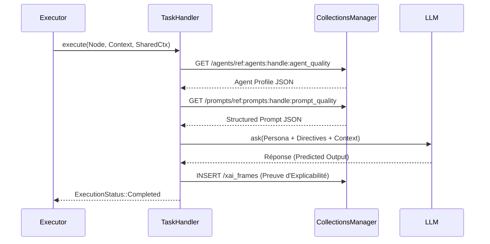

# ⚙️ Module Handlers (Les Ouvriers Neuro-Symboliques)

Ce module contient les implémentations concrètes de la logique métier du **Workflow Engine**. Il repose sur le **Design Pattern Strategy** : l'Exécuteur délègue le traitement de chaque étape du graphe à un `NodeHandler` spécialisé en fonction de son type (`NodeType`).

Grâce à la récente refonte architecturale, les Handlers sont désormais **100% Data-Driven**. Ils ne stockent aucun état interne lourd et tirent toute leur intelligence du Graphe Sémantique (JSON-DB).

---

## 🏗️ Le Contrat et le Contexte Partagé

Tous les Handlers implémentent le trait `NodeHandler` et reçoivent lors de leur exécution un `HandlerContext`. 

### Le `HandlerContext` (La "Boîte à Outils")
C'est le secret de la rapidité et de la souveraineté du moteur. Au lieu d'ouvrir des connexions coûteuses, l'Exécuteur prête aux Handlers un accès partagé et asynchrone aux ressources critiques :
* **`manager`** : Le `CollectionsManager`, offrant un accès instantané au Jumeau Numérique, aux profils des agents, et à l'ontologie.
* **`orchestrator`** : Le moteur LLM (Candle/FastEmbed) pour la génération de texte et l'analyse sémantique.
* **`critic`** : Le Reward Model chargé d'évaluer la qualité des réponses de l'IA.
* **`tools`** : Le registre des outils déterministes (MCP).
* **`plugin_manager`** : Le Hub WebAssembly pour l'extensibilité.

```rust
#[async_interface]
pub trait NodeHandler: Send + Sync {
    fn node_type(&self) -> NodeType;
    
    async fn execute(
        &self,
        node: &WorkflowNode,
        context: &mut UnorderedMap<String, JsonValue>,
        shared_ctx: &HandlerContext<'_>,
    ) -> RaiseResult<ExecutionStatus>;
}
```

---

## 🗂️ Catalogue des Handlers

### 🧠 1. `TaskHandler` (`task.rs`) - Routage Multi-Agents & XAI
C'est le composant le plus avancé du moteur. Il ne se contente pas d'appeler un LLM générique. Il :
1. **Résout l'Agent** : Lit l'URN de l'agent assigné (`assigned_agent_handle`) et récupère son Profil et son Prompt Structuré en base de données.
2. **Exécute** : Invoque l'Orchestrateur en se glissant dans le *Persona* de l'agent.
3. **Explicabilité (XAI)** : Génère une preuve mathématique et sémantique de son raisonnement (`XaiFrame`), la fait évaluer par le Critique, la sauvegarde en JSON-DB, et ajoute son UUID au contexte du workflow.

### 🛡️ 2. `GatePolicyHandler` (`policy.rs`) - Vetos et Sécurité (Fail-Safe)
Le gardien du temple. Il évalue les Lignes Rouges (Vetos) définies dans le Mandat.
* Il parse un **Abstract Syntax Tree (AST)** (ex: `gt(var(vibration), val(8.0))`).
* Il utilise le `rules_engine` pour l'évaluer contre les données du workflow.
* **Fail-Safe** : Si l'AST est corrompu ou qu'une variable manque, le handler retourne `ExecutionStatus::Failed` pour bloquer la machine par précaution.

### 🛠️ 3. `McpHandler` (`mcp.rs`) - Le Bras Armé (Grounding)
Fait le pont avec les Outils Physiques (MCP). 
* Résout l'outil demandé dans le registre du contexte.
* Lui passe les arguments JSON et le `CollectionsManager` pour qu'il agisse sur le système ou lise le Jumeau Numérique.
* Injecte le résultat de l'outil dans la mémoire (`context`) du workflow.

### ⚖️ 4. `DecisionHandler` (`decision.rs`) - Le Consensus
Lorsqu'un choix doit être fait entre plusieurs stratégies ou options, ce handler applique la **Méthode de Condorcet** pondérée par les directives du Mandat (ex: privilégier l'Agent Sécurité face à l'Agent Finance).

### ⏳ 5. `GateHitlHandler` (`hitl.rs`) - Human-in-the-Loop
Met le workflow en pause (`ExecutionStatus::Paused`). Le moteur s'arrête de lui-même, persiste son état en base de données, et attend qu'un humain valide ou rejette l'étape via l'UI ou le CLI.

### 🔮 6. `WasmHandler` (`wasm.rs`) - Extensibilité à Chaud
Permet d'exécuter des règles métier spécifiques à une entreprise, compilées en WebAssembly, de manière totalement sandboxée via le `PluginManager`.

### 🏁 7. `EndHandler` (`end.rs`)
Signal de terminaison propre qui marque l'instance comme `Completed`.

---

## 🔄 Flux d'exécution Data-Driven (Exemple : TaskHandler)



---

## 🛠️ Ajouter un nouveau Handler

Ajouter un nouveau comportement au moteur est trivial et respecte le principe d'Ouverture/Fermeture (OCP) :

1. Définir la nouvelle variante dans l'enum `NodeType` (dans `src-tauri/src/workflow_engine/mod.rs`).
2. Créer un fichier `mon_handler.rs` dans ce dossier implémentant le trait `NodeHandler`.
3. L'enregistrer dans le constructeur du `WorkflowExecutor` (`src-tauri/src/workflow_engine/executor.rs`).
```

 