# 🏗️ Systemarchitektur: RAISE

Dieses Dokument beschreibt die High-Level-Architektur der **RAISE**-Plattform (_Reliable AI for Sovereign Engineering_). Es erläutert, wie das System die Lücke zwischen probabilistischer KI und deterministischen technischen Anforderungen durch einen **neuro-symbolischen** Ansatz schließt.

## 1. Das Kernparadigma: Neuro-Symbolische Governance

RAISE arbeitet nach dem Prinzip, dass die KI (Neuro) der „Pilot“ ist, während eine deterministische Engine (Symbolisch) als „Fluglotse“ fungiert.

- **Die Neuro-Ebene**: Wird durch das `ai`-Modul verwaltet. Sie nutzt LLMs (lokal oder remote) für logisches Denken, Planung und Multi-Agenten-Konsens.
- **Die Symbolische Ebene**: Wird durch die `workflow_engine` und die `rules_engine` erzwungen. Sie garantiert Sicherheit durch **Mandate**, hartcodierte Vetos und algebraische Regeln.

---

## 2. Globale Modularchitektur

Das folgende Diagramm veranschaulicht die strukturelle Organisation des RAISE-Backends basierend auf der tatsächlichen Implementierung in `src-tauri/src`.

---

## 3. High-Level Schichtenmodell

Das System ist in vier verschiedene Schichten unterteilt, um Souveränität und Modularität zu gewährleisten:

| Schicht                     | Verantwortung                                              | Technologie                   |
| --------------------------- | ---------------------------------------------------------- | ----------------------------- |
| **Präsentation**            | Governance-Konsole, Visualisierung des Digitalen Zwilling. | React 18, TypeScript, Zustand |
| **Adaption**                | IPC-Bridge, Befehlsrouting, Zustandsverwaltung.            | Tauri v2 (Rust Commands)      |
| **Logik (Die Engine)**      | Workflow-Scheduling, Mandats-Kompilierung, Vetos.          | Rust, Tokio (Async)           |
| **Physisch (Der Zwilling)** | Hardware-Interaktion, Sensorsimulation, MCP-Tools.         | Natives MCP (Rust), JSON-DB   |

---

## 4. Kryptografisches Vertrauen: Mandatssignierung (Ed25519)

Sicherheit ist in RAISE ein **signierter Vertrag**. Bevor ein Mandat (die Richtlinie, die die Vetos definiert) in einen Workflow kompiliert wird, wird seine Integrität mittels **Ed25519**-Signaturen überprüft.

```mermaid
sequenceDiagram
    participant U as UI (React)
    participant B as Backend (Rust)
    participant C as Compiler
    participant S as Signatur-Prüfer (Ed25519)

    U->>B: submit_mandate(json_data, signature)
    B->>S: verify(json_data, signature, public_key)
    alt Signatur gültig
        S-->>B: OK
        B->>C: compile(mandate)
        C-->>U: Workflow bereit
    else Signatur ungültig
        S-->>B: REJECT
        B-->>U: 🚨 Kritischer Fehler: Manipulierte Richtlinie
    end

```

---

## 5. Grounding: Digitaler Zwilling & RAG

Um Halluzinationen zu vermeiden, nutzt RAISE zwei Formen des „Grounding“:

### 5.1. Der Digitale Zwilling (Physisches Grounding)

Die `model_engine` und die Tools der `workflow_engine` unterhalten ein virtuelles Echtzeit-Abbild des Systems.

- **Veto-Loop**: Die `GatePolicy`-Knoten im Workflow vergleichen KI-Vorschläge mit Echtzeitdaten des Zwillings.

### 5.2. RAG & Gedächtnis (Kognitives Grounding)

Das in `ai/context` und `ai/memory` angesiedelte **RAG (Retrieval Augmented Generation)** stellt sicher, dass die KI Zugriff auf souveräne technische Dokumentationen hat.

- **Vektorspeicher**: Unterstützung für `Qdrant` und `LeannStore`.
- **Embeddings**: Lokale Verarbeitung via `candle` oder `fast-embeddings`.

---

## 6. Blockchain & Rückverfolgbarkeit

Für kritisches Engineering muss jede Zustandsänderung und jedes Mandat prüfbar sein.

- **Unveränderliche Protokolle**: Das `traceability`-Modul zeichnet jede KI-Denkspur und jede Veto-Entscheidung auf.
- **Verankerung**: Das `blockchain/fabric`-Modul verankert diese Spuren in einem Hyperledger Fabric Ledger.
- **Sicherer Transport**: Die Konnektivität wird durch das `blockchain/vpn`-Modul (**Innernet**) verwaltet, um ein privates, dezentrales Mesh-Netzwerk aufrechterhalten.

---

## 7. Codegenerierung & Optimierung

- **Codegen**: Das `code_generator`-Modul nutzt Handlebars/Jinja-Templates, um Arcadia-Modelle in **Rust**, **C++**, **VHDL** oder **Verilog** zu transpilieren.
- **Genetik**: Das `genetics`-Modul führt evolutionäre Algorithmen aus, um Systemarchitekturen basierend auf Multi-Ziel-Constraints (Gewicht, Kosten, Sicherheit) zu optimieren.

---

## 8. Datensouveränität & Offline-First

RAISE ist standardmäßig auf **Souveränität** ausgelegt:

- **Lokaler Zustand**: Der Anwendungszustand (Zustand) und die Projektdaten (JSON-DB) werden auf dem Rechner des Benutzers gespeichert.
- **Lokale Ausführung**: Native MCP-Tools laufen als kompilierte Rust-Binärdateien, wodurch sichergestellt wird, dass ohne explizite Konfiguration keine Telemetriedaten an Drittanbieter-Clouds gesendet werden.
- **Netzwerkisolation**: Das System ist kompatibel mit Mesh-VPNs (Innernet) für eine sichere Zusammenarbeit ohne zentralen Server.

---

## 9. System-Prüfbarkeit (XAI)

Jede vom System getroffene Entscheidung wird in einer **Rückverfolgbarkeitsmatrix** festgehalten:

1. **Der Prompt**: Was die KI gefragt wurde.
2. **Der Kontext**: Zustand des Digitalen Zwillings zu diesem genauen Zeitstempel.
3. **Das Reasoning**: Die interne Logik der KI (Denkprozess).
4. **Die Veto-Entscheidung**: Warum die symbolische Engine die Aktion erlaubt oder blockiert hat.

---

_Diese Architektur stellt sicher, dass das System zuverlässig, erklärbar und unter vollständiger menschlicher Kontrolle durch das Mandatsprotokoll bleibt._
