# 🏗️ System Architecture: RAISE

This document outlines the high-level architecture of the **RAISE** (Reliable AI for Sovereign Engineering) platform. It describes how the system bridges the gap between probabilistic AI and deterministic engineering constraints through a **Neuro-Symbolic** approach.

## 1. The Core Paradigm: Neuro-Symbolic Governance

RAISE operates on the principle that AI (Neuro) should be the "Pilot" while a deterministic engine (Symbolic) acts as the "Air Traffic Controller".

- **The Neuro Layer**: Managed by the `ai` module. It uses LLMs (local or remote) for reasoning, planning, and multi-agent consensus.
- **The Symbolic Layer**: Enforced by the `workflow_engine` and `rules_engine`. It guarantees safety through **Mandates**, hard-coded Vetos, and algebraic rules.

---

## 2. Global Module Architecture

The following diagram illustrates the structural organization of the RAISE backend based on the actual `src-tauri/src` implementation.

---

## 3. High-Level Layered View

The system is organized into four distinct layers to ensure sovereignty and modularity:

| Layer                   | Responsibility                                      | Technology                    |
| ----------------------- | --------------------------------------------------- | ----------------------------- |
| **Presentation**        | Governance Console, Digital Twin visualization.     | React 18, TypeScript, Zustand |
| **Adaptation**          | IPC Bridge, Command routing, State management.      | Tauri v2 (Rust Commands)      |
| **Logic (The Engine)**  | Workflow scheduling, Mandate compilation, Vetos.    | Rust, Tokio (Async)           |
| **Physical (The Twin)** | Hardware interaction, Sensor simulation, MCP tools. | Native MCP (Rust), JSON-DB    |

---

## 4. Cryptographic Trust: Mandate Signing (Ed25519)

Safety in RAISE is a **signed contract**. Before a Mandate (the policy defining the Vetos) is compiled into a workflow, its integrity is verified using **Ed25519** signatures.

```mermaid
sequenceDiagram
    participant U as UI (React)
    participant B as Backend (Rust)
    participant C as Compiler
    participant S as Signature Verifier (Ed25519)

    U->>B: submit_mandate(json_data, signature)
    B->>S: verify(json_data, signature, public_key)
    alt Signature Valid
        S-->>B: OK
        B->>C: compile(mandate)
        C-->>U: Workflow Ready
    else Signature Invalid
        S-->>B: REJECT
        B-->>U: 🚨 Critical Error: Tampered Policy
    end

```

---

## 5. Grounding: Digital Twin & RAG

To prevent hallucinations, RAISE uses two forms of "Grounding":

### 5.1. The Digital Twin (Physical Grounding)

The `model_engine` and `workflow_engine/tools` maintain a real-time virtual replica of the system.

- **Veto Loop**: The `GatePolicy` nodes in the workflow compare AI proposals against real-time data from the Twin.

### 5.2. RAG & Memory (Cognitive Grounding)

Located in `ai/context` and `ai/memory`, the **RAG (Retrieval Augmented Generation)** ensures the AI has access to sovereign technical documentation.

- **Vector Stores**: Support for `Qdrant` and `LeannStore`.
- **Embeddings**: Local processing via `candle` or `fast-embeddings`.

---

## 6. Blockchain & Traceability

For critical engineering, every state change and mandate must be auditable.

- **Immutable Logs**: The `traceability` module records every AI "thinking" trace and Veto decision.
- **Anchoring**: The `blockchain/fabric` module anchors these traces into a Hyperledger Fabric ledger.
- **Secure Transport**: Connectivity is handled by the `blockchain/vpn` module (**Innernet**) to maintain a private, decentralized mesh.

---

## 7. Code Generation & Optimization

- **Codegen**: The `code_generator` module uses Handlebars/Jinja templates to transpile Arcadia models into **Rust**, **C++**, **VHDL**, or **Verilog**.
- **Genetics**: The `genetics` module runs evolutionary algorithms to optimize system architectures based on multi-objective constraints (Weight, Cost, Safety).

---

## 8. Data Sovereignty & Offline-First

RAISE is designed to be **Sovereign by Default**:

- **Local State**: Application state (Zustand) and project data (JSON-DB) are stored on the user's machine.
- **Local Execution**: Native MCP tools run as compiled Rust binaries, ensuring no telemetry is sent to third-party clouds unless explicitly configured.
- **Network Isolation**: The system is compatible with Mesh VPNs (Innernet) for secure collaboration without a central server.

---

## 9. System Auditability (XAI)

Every decision made by the system is recorded in a **Traceability Matrix**:

1. **The Prompt**: What the AI was asked.
2. **The Context**: State of the Digital Twin at that precise timestamp.
3. **The Reasoning**: The AI's internal logic (Thinking process).
4. **The Veto Decision**: Why the Symbolic engine allowed or blocked the action.

---

_This architecture ensures that the system remains reliable, explainable, and under total human control through the Mandate protocol._
