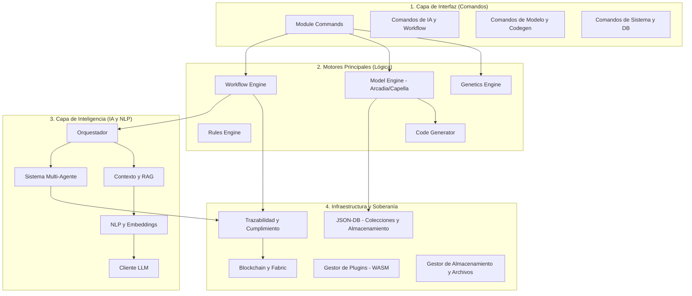
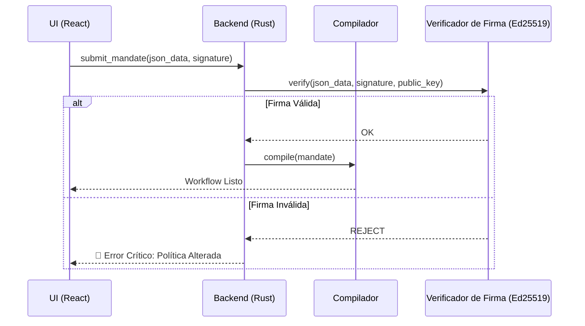

# 🏗️ Arquitectura del Sistema: RAISE

Este documento describe la arquitectura de alto nivel de la plataforma **RAISE** (_Reliable AI for Sovereign Engineering_). Explica cómo el sistema cierra la brecha entre la IA probabilística y las restricciones deterministas de la ingeniería mediante un enfoque **Neuro-Simbólico**.

## 1. El Paradigma Central: Gobernanza Neuro-Simbólica

RAISE funciona bajo el principio de que la IA (Neuro) debe ser el "Piloto", mientras que un motor determinista (Simbólico) actúa como el "Controlador Aéreo".

- **La Capa Neuro**: Gestionada por el módulo `ai`. Utiliza LLMs (locales o remotos) para el razonamiento, la planificación y el consenso multi-agente.
- **La Capa Simbólica**: Aplicada por el `workflow_engine` y el `rules_engine`. Garantiza la seguridad a través de **Mandatos**, Vetos codificados y reglas algebraicas.

---

## 2. Arquitectura Global de Módulos

El siguiente diagrama ilustra la organización estructural del backend de RAISE basada en la implementación real en `src-tauri/src`.

---

## 3. Vista por Capas de Alto Nivel

El sistema se organiza en cuatro capas distintas para garantizar la soberanía y la modularidad:

| Capa                | Responsabilidad                                                     | Tecnología                    |
| ------------------- | ------------------------------------------------------------------- | ----------------------------- |
| **Presentación**    | Consola de Gobernanza, visualización del Gemelo Digital.            | React 18, TypeScript, Zustand |
| **Adaptación**      | Puente IPC, enrutamiento de comandos, gestión de estado.            | Tauri v2 (Comandos Rust)      |
| **Lógica (Motor)**  | Planificación de workflow, compilación de Mandatos, Vetos.          | Rust, Tokio (Async)           |
| **Física (Gemelo)** | Interacción con hardware, simulación de sensores, herramientas MCP. | MCP Nativo (Rust), JSON-DB    |

---

## 4. Confianza Criptográfica: Firma de Mandatos (Ed25519)

En RAISE, la seguridad es un **contrato firmado**. Antes de que un Mandato (la política que define los Vetos) se compile en un flujo de trabajo, su integridad se verifica mediante firmas **Ed25519**.

---

## 5. Anclaje (Grounding): Gemelo Digital y RAG

Para evitar alucinaciones, RAISE utiliza dos formas de anclaje:

### 5.1. El Gemelo Digital (Anclaje Físico)

El `model_engine` y las herramientas del `workflow_engine` mantienen una réplica virtual en tiempo real del sistema.

- **Bucle de Veto**: Los nodos `GatePolicy` del flujo de trabajo comparan las propuestas de la IA con los datos en tiempo real provenientes del Gemelo.

### 5.2. RAG y Memoria (Anclaje Cognitivo)

Ubicado en `ai/context` y `ai/memory`, el **RAG (Retrieval Augmented Generation)** garantiza que la IA tenga acceso a documentación técnica soberana.

- **Almacenes Vectoriales**: Soporte para `Qdrant` y `LeannStore`.
- **Embeddings**: Procesamiento local mediante `candle` o `fast-embeddings`.

---

## 6. Blockchain y Trazabilidad

Para la ingeniería crítica, cada cambio de estado y cada mandato debe ser auditable.

- **Registros Inmutables**: El módulo `traceability` registra cada traza de pensamiento de la IA y cada decisión de Veto.
- **Anclaje**: El módulo `blockchain/fabric` ancla estas trazas en un libro mayor de Hyperledger Fabric.
- **Transporte Seguro**: La conectividad es gestionada por el módulo `blockchain/vpn` (**Innernet**) para mantener una red de malla privada y descentralizada.

---

## 7. Generación de Código y Optimización

- **Codegen**: El módulo `code_generator` utiliza plantillas Handlebars/Jinja para transpilar modelos Arcadia a **Rust**, **C++**, **VHDL** o **Verilog**.
- **Genética**: El módulo `genetics` ejecuta algoritmos evolutivos para optimizar las arquitecturas del sistema según restricciones multiobjetivo (Peso, Costo, Seguridad).

---

## 8. Soberanía de Datos y "Offline-First"

RAISE está diseñado para ser **Soberano por Defecto**:

- **Estado Local**: El estado de la aplicación (Zustand) y los datos del proyecto (JSON-DB) se almacenan en la máquina del usuario.
- **Ejecución Local**: Las herramientas MCP nativas se ejecutan como binarios Rust compilados, garantizando que no se envíe telemetría a nubes de terceros sin configuración explícita.
- **Aislamiento de Red**: El sistema es compatible con VPNs Mesh (Innernet) para una colaboración segura sin un servidor central.

---

## 9. Auditabilidad del Sistema (XAI)

Cada decisión tomada por el sistema se registra en una **Matriz de Trazabilidad**:

1. **El Prompt**: Lo que se le pidió a la IA.
2. **El Contexto**: Estado del Gemelo Digital en ese instante preciso.
3. **El Razonamiento**: La lógica interna de la IA (proceso de pensamiento).
4. **La Decisión de Veto**: Por qué el motor simbólico permitió o bloqueó la acción.

---

_Esta arquitectura garantiza que el sistema siga siendo confiable, explicable y bajo control humano total a través del protocolo de Mandato._
