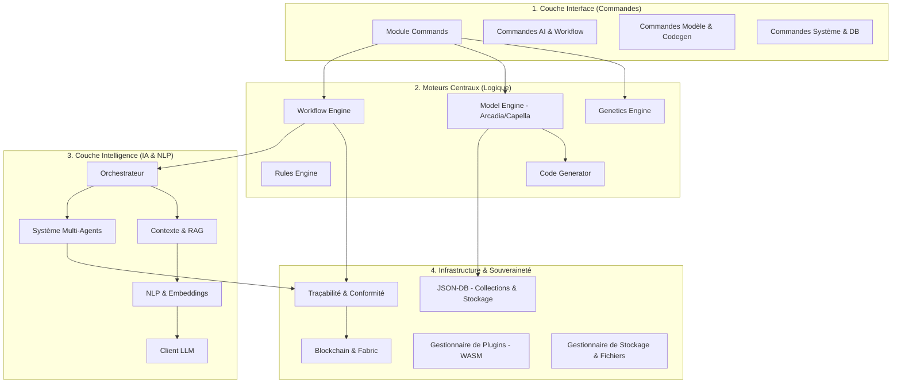
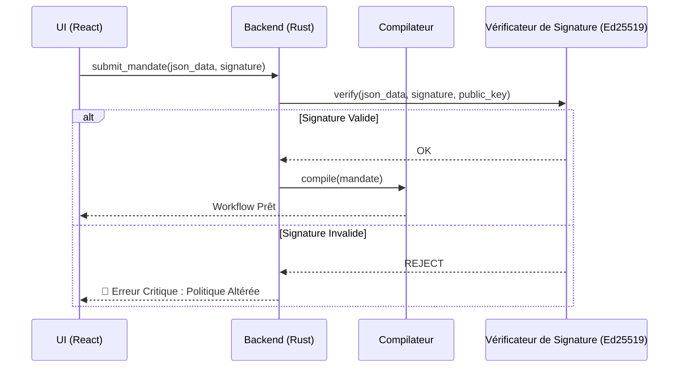

# 🏗️ Architecture Système : RAISE

Ce document présente l'architecture de haut niveau de la plateforme **RAISE** (_Reliable AI for Sovereign Engineering_). Il décrit comment le système comble le fossé entre l'IA probabiliste et les contraintes déterministes de l'ingénierie via une approche **Neuro-Symbolique**.

## 1. Le Paradigme Central : Gouvernance Neuro-Symbolique

RAISE fonctionne selon le principe que l'IA (Neuro) doit être le « Pilote » tandis qu'un moteur déterministe (Symbolique) agit comme le « Contrôleur Aérien ».

- **La Couche Neuro** : Gérée par le module `ai`. Elle utilise des LLM (locaux ou distants) pour le raisonnement, la planification et le consensus multi-agents.
- **La Couche Symbolique** : Appliquée par le `workflow_engine` et le `rules_engine`. Elle garantit la sécurité via des **Mandats**, des Vetos codés en dur et des règles algébriques.

---

## 2. Architecture Globale des Modules

Le diagramme suivant illustre l'organisation structurelle du backend RAISE basée sur l'implémentation réelle de `src-tauri/src`.

---

## 3. Vue par Couches de Haut Niveau

Le système est organisé en quatre couches distinctes pour assurer la souveraineté et la modularité :

| Couche                | Responsabilité                                             | Technologie                   |
| --------------------- | ---------------------------------------------------------- | ----------------------------- |
| **Présentation**      | Console de Gouvernance, visualisation du Jumeau Numérique. | React 18, TypeScript, Zustand |
| **Adaptation**        | Pont IPC, routage des commandes, gestion de l'état.        | Tauri v2 (Commandes Rust)     |
| **Logique (Moteur)**  | Planification de workflow, compilation de Mandats, Vetos.  | Rust, Tokio (Async)           |
| **Physique (Jumeau)** | Interaction matériel, simulation capteurs, outils MCP.     | MCP Natif (Rust), JSON-DB     |

---

## 4. Confiance Cryptographique : Signature de Mandat (Ed25519)

Dans RAISE, la sécurité est un **contrat signé**. Avant qu'un Mandat (la politique définissant les Vetos) ne soit compilé en workflow, son intégrité est vérifiée par des signatures **Ed25519**.

---

## 5. Ancrage (Grounding) : Jumeau Numérique & RAG

Pour éviter les hallucinations, RAISE utilise deux formes d'ancrage :

### 5.1. Le Jumeau Numérique (Ancrage Physique)

Le `model_engine` et les outils du `workflow_engine` maintiennent une réplique virtuelle en temps réel du système.

- **Boucle de Veto** : Les nœuds `GatePolicy` du workflow comparent les propositions de l'IA aux données réelles issues du Jumeau.

### 5.2. RAG & Mémoire (Ancrage Cognitif)

Situé dans `ai/context` et `ai/memory`, le **RAG (Retrieval Augmented Generation)** garantit que l'IA a accès à une documentation technique souveraine.

- **Bases Vectorielles** : Support de `Qdrant` et `LeannStore`.
- **Embeddings** : Traitement local via `candle` ou `fast-embeddings`.

---

## 6. Blockchain & Traçabilité

Pour l'ingénierie critique, chaque changement d'état et chaque mandat doit être auditable.

- **Logs Immuables** : Le module `traceability` enregistre chaque trace de réflexion de l'IA et chaque décision de Veto.
- **Ancrage** : Le module `blockchain/fabric` ancre ces traces dans un registre Hyperledger Fabric.
- **Transport Sécurisé** : La connectivité est gérée par le module `blockchain/vpn` (**Innernet**) pour maintenir un réseau maillé privé et décentralisé.

---

## 7. Génération de Code & Optimisation

- **Codegen** : Le module `code_generator` utilise des templates Handlebars/Jinja pour transpiler les modèles Arcadia en **Rust**, **C++**, **VHDL** ou **Verilog**.
- **Génétique** : Le module `genetics` exécute des algorithmes évolutionnaires pour optimiser les architectures système selon des contraintes multi-objectifs (Poids, Coût, Sécurité).

---

## 8. Souveraineté des Données & "Offline-First"

RAISE est conçu pour être **Souverain par Défaut** :

- **État Local** : L'état de l'application (Zustand) et les données projet (JSON-DB) sont stockés sur la machine de l'utilisateur.
- **Exécution Locale** : Les outils MCP natifs s'exécutent en binaires Rust compilés, garantissant qu'aucune télémétrie n'est envoyée vers des clouds tiers sans configuration explicite.
- **Isolation Réseau** : Le système est compatible avec les VPN Mesh (Innernet) pour une collaboration sécurisée sans serveur central.

---

## 9. Auditabilité du Système (XAI)

Chaque décision prise par le système est consignée dans une **Matrice de Traçabilité** :

1. **Le Prompt** : Ce qui a été demandé à l'IA.
2. **Le Contexte** : État du Jumeau Numérique à cet instant précis.
3. **Le Raisonnement** : La logique interne de l'IA (processus de réflexion).
4. **La Décision de Veto** : Pourquoi le moteur symbolique a autorisé ou bloqué l'action.

---

_Cette architecture garantit que le système reste fiable, explicable et sous contrôle humain total grâce au protocole de Mandat._
