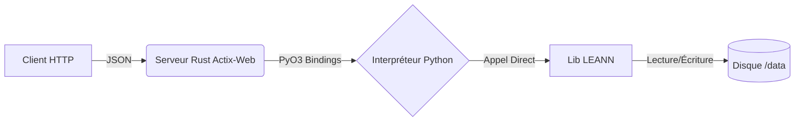

# 🧠 LEANN Service (Rust Wrapper)

Ce service est un **micro-service de recherche vectorielle léger**.

Il encapsule la librairie Python **LEANN** (Low-Resource Approximate Nearest Neighbors) dans un serveur Web haute performance écrit en **Rust** (via Actix-Web et PyO3).

## 🏗️ Architecture

Contrairement à une approche classique "Microservice Python" (Flask/FastAPI), nous utilisons ici une architecture **Embedded Python** :



- **Rust (Actix-Web)** : Gère la concurrence HTTP, la validation JSON et la sécurité des threads.
- **PyO3** : Permet à Rust d'appeler les fonctions Python directement en mémoire (pas de latence réseau interne).
- **Python (LEANN)** : Exécute la logique mathématique d'indexation et de recherche.

---

## 🚀 Démarrage Rapide (Docker)

C'est la méthode recommandée pour l'utilisation dans le projet RAISE.

```bash
# Depuis la racine du projet 'raise'
docker-compose up -d --build leann

```

Le service sera accessible sur `http://localhost:8000`.

---

## 🛠️ Développement Local (Sans Docker)

Pour modifier le code Rust ou tester rapidement sans reconstruire l'image, suivez ces étapes.

### 1. Prérequis Système

Vous devez installer les outils de compilation C++ et les librairies mathématiques requises par LEANN.

```bash
# Debian/Ubuntu
sudo apt update && sudo apt install -y \
    build-essential cmake pkg-config libssl-dev \
    libzmq3-dev libopenblas-dev liblapack-dev python3-dev

```

### 2. Environnement Python

Le wrapper Rust a besoin d'un environnement Python avec LEANN installé pour compiler.

```bash
# Dans le dossier leann/
python3 -m venv venv
source venv/bin/activate

# Installation de uv (plus rapide) et des dépendances
pip install uv
uv pip install "git+https://github.com/yichuan-w/LEANN.git" sentence-transformers

```

### 3. Lancer le Serveur Rust

Une fois l'environnement Python activé :

```bash
# Définir où stocker l'index (par défaut /data qui n'est pas inscriptible hors root)
export DATA_DIR="./local_storage"
mkdir -p local_storage

# Lancer le serveur
cargo run

```

---

## 🔌 API Reference

Le serveur expose une API REST simple sur le port **8000**.

### 1. Health Check

Vérifie que le serveur et le pont Python fonctionnent.

- **GET** `/health`
- **Réponse :**

```json
{
  "status": "ok",
  "engine": "leann-rust-wrapper"
}
```

### 2. Insertion de Documents

Ajoute des documents à l'index et déclenche une reconstruction (opération bloquante gérée dans un thread pool).

- **POST** `/insert`
- **Body :**

```json
{
  "documents": [
    { "text": "Le contenu de mon document..." },
    { "text": "Un autre document à indexer." }
  ]
}
```

- **Réponse :** `200 OK`

### 3. Recherche (Similarity Search)

Recherche les documents les plus proches sémantiquement.

> **Note :** Actuellement, la recherche utilise une requête "placeholder" définie dans le code Rust. L'implémentation future devra accepter un champ `query` ou `vector`.

- **POST** `/search`
- **Body :**

```json
{
  "k": 5 // Nombre de voisins à retourner
}
```

- **Réponse :**

```json
{
  "results": [
    {
      "id": "unknown",
      "text": "Le contenu de mon document...",
      "score": 0.85
    }
  ]
}
```

---

## 📂 Structure des Fichiers

- **`Cargo.toml`** : Dépendances Rust (`actix-web`, `pyo3`).
- **`Dockerfile`** : Build multi-étape (Install Python deps -> Build Rust Binary -> Runtime).

- **`src/main.rs`** : Code source unique contenant le serveur Web et la logique de pont `init_python_leann`, `python_insert`, `python_search`.

## ⚠️ Notes Techniques

- **Concurrence** : L'objet Python `LeannSearcher` est protégé par un `Mutex` Rust. Cependant, lors des recherches, nous clonons le pointeur `Py<PyAny>` pour permettre une exécution parallèle si le GIL le permet.
- **Persistance** : L'index est stocké dans le volume Docker monté sur `/data`. Si vous redémarrez le conteneur, l'index est rechargé au démarrage via `init_python_leann`.
