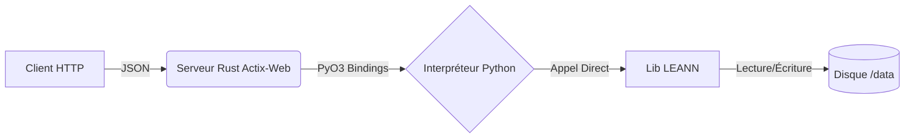

# 🧠 LEANN Service (Rust Wrapper)

Ce service est un **micro-service de recherche vectorielle léger**.

Il encapsule la librairie Python **LEANN** (Low-Resource Approximate Nearest Neighbors) dans un serveur Web haute performance écrit en **Rust** (via Actix-Web et PyO3).

## 🏗️ Architecture

Contrairement à une approche classique "Microservice Python" (Flask/FastAPI), nous utilisons ici une architecture **Embedded Python** :



- **Rust (Actix-Web)** : Gère la concurrence HTTP, la validation JSON et la sécurité des threads.
- **PyO3** : Permet à Rust d'appeler les fonctions Python directement en mémoire (pas de latence réseau interne).
- **Python (LEANN)** : Exécute la logique mathématique d'indexation et de recherche.

---

## 🚀 Démarrage Rapide (Docker)

C'est la méthode recommandée pour l'intégration dans le projet RAISE.

```bash
# Depuis la racine du projet 'raise'
docker-compose up -d --build leann

```

Le service sera accessible sur `http://localhost:8000`.

---

## 🛠️ Développement Local (Sans Docker)

Pour développer, debugger ou tester sans reconstruire l'image Docker à chaque fois.

### 1. Prérequis Système (Debian/Ubuntu)

Vous devez installer les outils de compilation C++ et les librairies mathématiques.

```bash
sudo apt update && sudo apt install -y \
    build-essential cmake pkg-config libssl-dev \
    libzmq3-dev libopenblas-dev liblapack-dev python3-dev

```

### 2. Environnement Python (Virtualenv)

Le wrapper Rust a besoin d'un environnement Python isolé avec LEANN installé.

```bash
cd leann

# 1. Créer et activer l'environnement virtuel
python3 -m venv venv
source venv/bin/activate

# 2. Installer 'uv' (pip rapide) et les dépendances
pip install uv
uv pip install "git+https://github.com/yichuan-w/LEANN.git" sentence-transformers

```

### 3. Lancer le Serveur

Avant de lancer `cargo run`, il faut configurer le dossier de stockage et, si vous n'avez pas de GPU configuré, forcer le mode CPU.

```bash
# 1. Créer le dossier local (ignoré par git)
mkdir -p local_storage

# 2. Configurer les variables d'environnement
export DATA_DIR="./local_storage"
export CUDA_VISIBLE_DEVICES=""  # ⚠️ Important : Force le mode CPU pour éviter les erreurs CUDA

# 3. Lancer le serveur
cargo run

```

---

## 🧪 Guide de Test (cURL)

Une fois le serveur lancé (localement ou via Docker), utilisez ces commandes pour tester.

### 1. Health Check

Vérifie que le pont Rust-Python est actif.

```bash
curl http://127.0.0.1:8000/health

```

✅ _Réponse attendue :_ `{"status":"ok","engine":"leann-rust-wrapper"}`

### 2. Insertion (Indexation)

Envoie des documents pour créer l'index. Cela va télécharger le modèle `all-MiniLM-L6-v2` au premier lancement.

```bash
curl -X POST http://127.0.0.1:8000/insert \
     -H "Content-Type: application/json" \
     -d '{
           "documents": [
             { "text": "Le chat mange des croquettes." },
             { "text": "L intelligence artificielle modulaire est le futur." }
           ]
         }'

```

✅ _Réponse attendue :_ `{"status":"indexed","count":2}`

### 3. Recherche (Search)

Recherche les documents les plus proches sémantiquement.

```bash
curl -X POST http://127.0.0.1:8000/search \
     -H "Content-Type: application/json" \
     -d '{ "k": 2 }'

```

✅ _Réponse attendue :_

```json
{
  "results": [
    { "id": "0", "text": "Le chat mange des croquettes.", "score": 2.04 },
    { "id": "1", "text": "L intelligence artificielle...", "score": 0.64 }
  ]
}
```

---

## 📂 Structure des Fichiers

- **`Cargo.toml`** : Dépendances Rust (`actix-web`, `pyo3`).
- **`Dockerfile`** : Build multi-étape (Install Python deps -> Build Rust Binary -> Runtime).
- **`src/main.rs`** : Code source unique. Contient :
- L'API HTTP (Actix).
- Le Wrapper PyO3 (`python_insert`, `python_search`).
- La gestion du GIL et du Hot Reload.

## ⚠️ Notes Techniques

- **Hot Reload** : Après chaque insertion `/insert`, le serveur recharge automatiquement l'index en mémoire pour que les nouveaux documents soient immédiatement consultables via `/search`.
- **Fichiers Index** : LEANN génère des fichiers `.index` et `.json`. Le wrapper Rust détecte automatiquement le fichier principal `[index_name].index` pour le chargement.
- **Concurrence** : L'objet Python est protégé par un `Mutex`, mais les pointeurs sont clonés lors de la recherche pour minimiser le blocage du thread principal.
