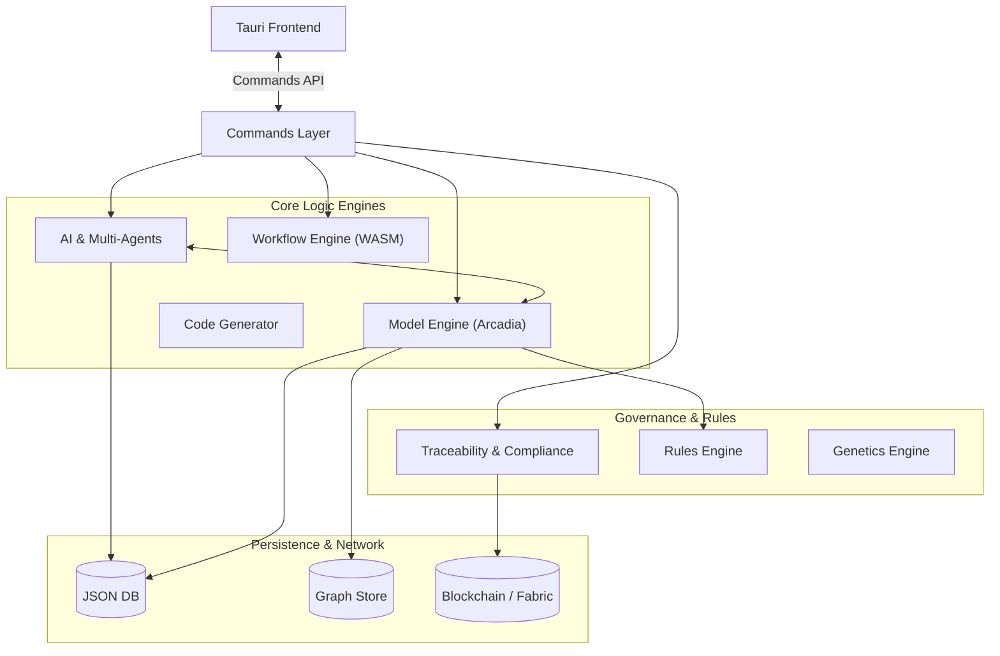
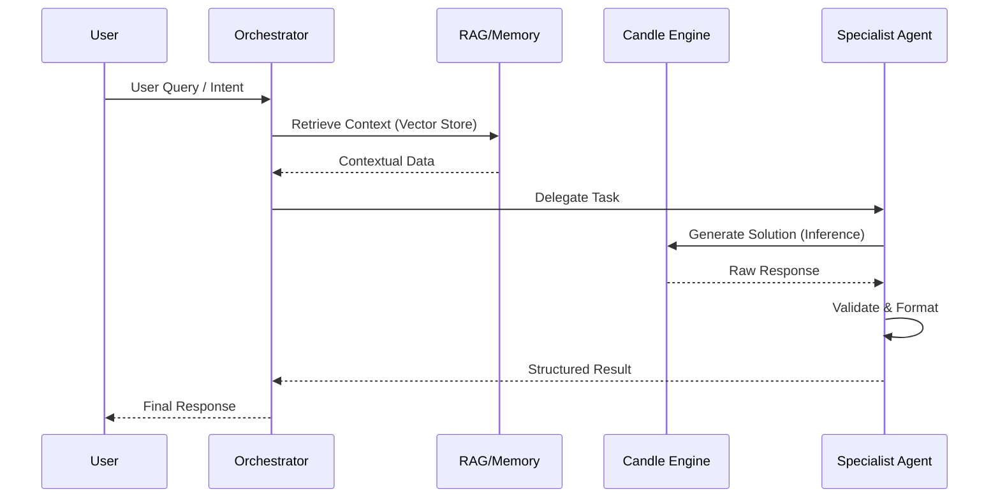
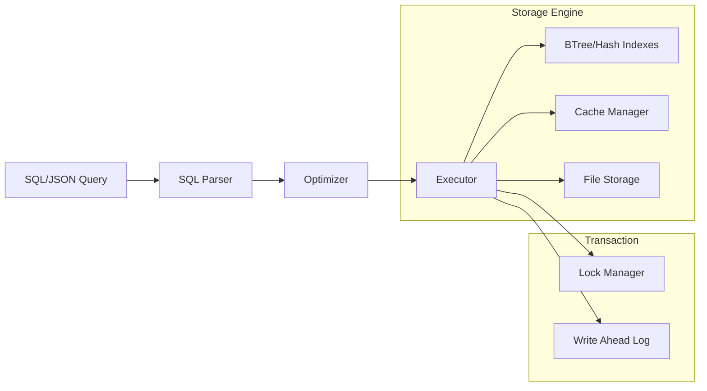

# Raise - Backend Architecture (Rust)

Ce répertoire contient le cœur technologique de la plateforme **Raise**. Il s'agit d'un backend écrit en Rust, orchestré par Tauri, conçu pour l'ingénierie système assistée par IA, la conformité normative et la modélisation MBSE (Arcadia).

## 🌍 Vue d'ensemble de l'Architecture

L'architecture suit un modèle modulaire centré sur le domaine (Domain-Driven Design), où chaque module majeur encapsule sa propre logique, ses données et ses règles. L'interaction avec le frontend se fait via la couche `commands`.



---

## 🧠 Module AI (`/ai`)

Le cerveau de Raise. Ce module implémente un système multi-agents autonome capable de raisonner sur les modèles d'ingénierie, aidé par des LLM locaux (via Candle) et une mémoire contextuelle (RAG).

### Structure des Agents

L'architecture multi-agents est spécialisée par domaine d'ingénierie :

- **Business Agent** : Analyse des besoins et contraintes métier.
- **System Agent** : Architecture système (haut niveau).
- **EPBS Agent** : Décomposition produit (End Product Breakdown Structure).
- **Hardware/Software Agents** : Spécialistes des couches physiques et logicielles.
- **Orchestrator** : Coordonne les agents et résout les conflits.

### Flux de Traitement IA



- **Composants Clés :**
- `llm/candle_engine.rs` : Inférence locale optimisée Rust pour modèles type Llama/Mistral.
- `context/rag.rs` : Moteur de Retrieval-Augmented Generation.
- `assurance/xai.rs` : eXplainable AI, pour justifier les décisions d'ingénierie critique.

---

## 📐 Model Engine (`/model_engine`)

Ce module est l'implémentation Rust du métamodèle **Arcadia**. Il gère la logique métier de l'ingénierie système.

### Capacités

1. **Support Méthodologique** : Couverture complète des phases Arcadia.

- `operational_analysis.rs` (OA)
- `system_analysis.rs` (SA)
- `logical_architecture.rs` (LA)
- `physical_architecture.rs` (PA)
- `epbs.rs` (Produit)

2. **Interopérabilité Capella** : Lecteurs et écrivains pour le format XML/XMI de Capella, permettant d'importer/exporter des modèles existants.
3. **Transformateurs** : Conversion automatique entre couches (ex: `dialogue_to_model` ou `system_transformer`).

### Validation et Cohérence

Intégré avec le `/rules_engine`, ce module assure que chaque modification du modèle respecte les contraintes structurelles d'Arcadia.

---

## 💾 JsonDB (`/json_db`)

Raise embarque sa propre base de données documentaire NoSQL/SQL hybride, écrite purement en Rust, pour garantir la portabilité et la performance sans dépendances externes lourdes.

### Architecture Interne



- **Fonctionnalités avancées** :
- Support **JSON-LD** pour le Web Sémantique et les ontologies.
- Transactions ACID avec **WAL** (Write Ahead Log).
- Indexation textuelle et BTree.

---

## 🔗 Traceability & Compliance (`/traceability`)

Module critique pour les systèmes normés (Aérospatial, Médical, Automobile, IA).

- **Change Tracker** : Surveille chaque mutation dans le `model_engine` ou le code généré.
- **Compliance Engines** : Vérificateurs dédiés pour :
- `do_178c.rs` (Avionique Logicielle)
- `iso_26262.rs` (Sécurité Automobile)
- `eu_ai_act.rs` (Régulation IA Européenne)

- **Reporting** : Génération de matrices de traçabilité et rapports d'audit.

---

## ⚙️ Workflow Engine (`/workflow_engine`)

Un moteur d'exécution de processus capable de faire tourner des plugins et des scripts définis par l'utilisateur.

- **WASM Host** : Exécution sécurisée de code arbitraire (plugins) via WebAssembly.
- **State Machine** : Gestion des états des workflows longs.
- **Scheduler** : Planification des tâches d'ingénierie automatisées.

---

## 🧬 Genetics (`/genetics`)

Moteur d'optimisation évolutionnaire pour l'architecture système.

- Permet de générer des milliers de variantes d'architectures (`genomes/arcadia_arch.rs`).
- Évalue les candidats selon des fonctions de fitness (coût, poids, latence, fiabilité).
- Opérateurs génétiques : Crossover, Mutation, Sélection.

---

## 💻 Code Generator (`/code_generator`)

Pont entre le modèle et l'implémentation.

- **Langages supportés** :
- Software : Rust, C++, TypeScript.
- Hardware : Verilog, VHDL.

- **Templates** : Moteur de template pour personnaliser la génération.
- **Analyzers** : Vérifie les dépendances avant la génération.

---

## 🛡️ Blockchain (`/blockchain`)

Assure l'immuabilité et la sécurité des données critiques de traçabilité.

- **Fabric Client** : Connecteur pour Hyperledger Fabric.
- **VPN** : Gestion réseau sécurisée (Innernet) pour les communications distribuées.

---

## 🚀 Commandes et API (`/commands`)

C'est la "Façade" du backend. Tous les appels depuis le frontend Tauri passent par ici.

| Module                   | Description                                     |
| ------------------------ | ----------------------------------------------- |
| `ai_commands.rs`         | Chat, RAG, requêtes agents                      |
| `model_commands.rs`      | Manipulation des diagrammes et éléments Arcadia |
| `blockchain_commands.rs` | Audit logs et signature                         |
| `project_commands.rs`    | Gestion de fichiers et configurations           |
| `codegen_commands.rs`    | Déclenchement de la génération de code          |

---

## 🛠️ Développement et Tests

### Prérequis

- Rust (Dernière version stable)
- Node.js & Pnpm (pour le frontend)
- Dépendances système pour Tauri (libwebkit2gtk, etc.)

### Lancer les tests

L'architecture est testée unitairement et par intégration.

```bash
# Tester le module AI uniquement
cargo test ai::

# Tester le moteur de base de données
cargo test json_db::

# Lancer toute la suite de tests
cargo test

```

### Ajouter une nouvelle commande Tauri

1. Créer la fonction dans `commands/votre_module.rs`.
2. L'ajouter au handler dans `main.rs` ou `lib.rs`.
3. Invoquer depuis le frontend via `invoke('nom_de_la_commande', { args })`.

---

© 2024-2025 Raise Project. Architecture Confidentielle.
