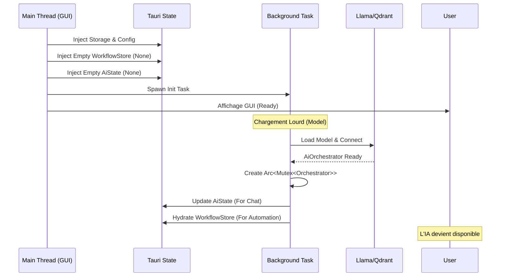

# 🚀 RAISE Backend - Entry Point (`src-tauri/src`)

Ce répertoire contient le point d'entrée de l'application Rust (**Backend**) et la configuration du pont avec le Frontend (Tauri).

C'est ici que s'opère la "Soudure" entre :

1. Le système d'exploitation (Fenêtres, Fichiers, Threads).
2. Le cœur métier (IA, Workflow, Base de données).
3. L'interface utilisateur (Commandes, Événements).

---

## 📂 Structure des Fichiers Clés

| Fichier       | Rôle Principal                                     | Détails Techniques                                                                                                                   |
| ------------- | -------------------------------------------------- | ------------------------------------------------------------------------------------------------------------------------------------ |
| **`main.rs`** | **Bootloader Exécutable**. Point d'entrée binaire. | Initialise les logs, configure la DB, lance les migrations et **spawne le thread asynchrone** pour l'IA.                             |
| **`lib.rs`**  | **Bibliothèque Partagée**.                         | (Convention Tauri) Expose les modules, les commandes et la configuration du builder pour être utilisés par les tests ou les mobiles. |

---

## ⚙️ Cycle de Démarrage (Boot Process)

Le démarrage de RAISE suit une procédure stricte en deux temps pour garantir une interface réactive (GUI) même pendant le chargement des modèles lourds (IA).

### 1. Initialisation Synchrone (Main Thread)

Au lancement de `main()`, l'application effectue les actions bloquantes légères :

- Resolution des chemins (`PATH_RAISE_DOMAIN`).
- Démarrage du `StorageEngine` (JSON-DB) et du `GraphStore` (SurrealDB).
- Exécution des **Migrations** de base de données.
- Injection des États "Vides" (`Default`) pour le Workflow et l'IA.
- Démarrage de l'interface graphique (Tauri Window).

### 2. Chargement Asynchrone (Background Thread)

Une tâche `tokio::spawn` est lancée immédiatement pour charger le "Cerveau" sans geler l'UI.



---

## 🧠 Gestion de la Mémoire Partagée (The Continuum)

RAISE utilise une architecture **Shared Ownership** pour permettre au Chat (Interactif) et au Workflow (Automatique) de partager le même contexte IA.

### Le Problème

L'`AiOrchestrator` est un objet lourd (connexions réseaux, contexte LLM, vecteurs) qui ne peut pas être dupliqué naïvement.

### La Solution (`Arc<Mutex>`)

Dans `main.rs`, nous utilisons un pointeur atomique compté référence (`Arc`) protégé par un verrou asynchrone (`Tokio Mutex`).

1. **Workflow Engine** : Reçoit une **copie du pointeur** (`shared_orch.clone()`). Il l'utilise pour exécuter des tâches autonomes.
2. **AiState (Chat)** : Reçoit le **même pointeur**. Il l'utilise pour répondre aux questions de l'utilisateur.

```rust
// Extrait conceptuel de main.rs
let shared_orch = Arc::new(AsyncMutex::new(orchestrator));

// Les deux modules pointent vers la MÊME adresse mémoire
let wf_scheduler = WorkflowScheduler::new(shared_orch.clone());
let ai_state = Some(shared_orch.clone());

```

---

## 🛡️ Injection de Dépendances (State Management)

Tauri gère l'état global de l'application. Les modules accèdent à ces états via l'injection `State<T>` dans les commandes.

| État            | Type Rust               | Description                                                        |
| --------------- | ----------------------- | ------------------------------------------------------------------ |
| `StorageEngine` | `StorageEngine`         | Accès direct au système de fichiers JSON (Thread-safe interne).    |
| `AiState`       | `Mutex<Option<Arc...>>` | Conteneur pour l'IA. `None` au démarrage, `Some` une fois chargé.  |
| `WorkflowStore` | `Mutex<WorkflowStore>`  | Contient le `Scheduler` (Optionnel) et les instances de processus. |
| `AppState`      | `AppState`              | Contient le `ProjectModel` (Architecture Système).                 |
| `PluginManager` | `PluginManager`         | Gestionnaire des plugins WASM chargés.                             |

---

## ⚠️ Points d'Attention pour les Développeurs

1. **Pas de `spawn_blocking` pour les Références** :
   Dans `main.rs`, le chargement du modèle utilise des références au `StorageEngine`. Il ne faut **jamais** utiliser `spawn_blocking` ici car cela causerait une erreur de durée de vie (`lifetime 'static`). Le chargement se fait "inline" dans la tâche asynchrone.
2. **Initialisation Tardive** :
   Les commandes `start_workflow` ou `ai_chat` doivent toujours vérifier si le service sous-jacent est prêt (`Some(...)`) avant de l'utiliser, et renvoyer une erreur explicite ("IA en cours de chargement") si ce n'est pas le cas.
3. **Commandes** :
   Toutes les nouvelles commandes doivent être enregistrées dans le macro `generate_handler!` dans `main.rs`.
