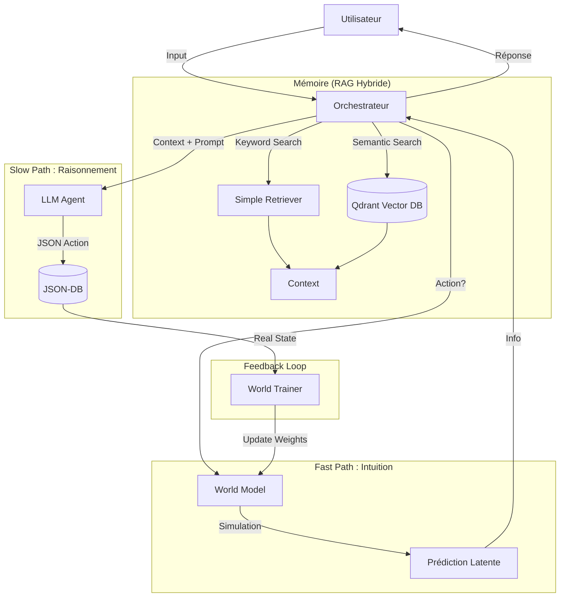

# Module AI — Intelligence Artificielle Neuro-Symbolique

Ce module implémente l'approche **MBAIE** (Model-Based AI Engineering) de RAISE. Il transforme le langage naturel en structures d'ingénierie formelles, valides et persistées.

## 🎯 Vision & Philosophie

L'IA de RAISE n'est pas un simple chatbot. C'est un **opérateur qualifié** qui agit sur le modèle.

1.  **Workstation-First** : Par défaut, l'intelligence tourne localement (Mistral via Docker + Candle).
2.  **Dual Mode** : Capacité à déborder sur le Cloud (Gemini Pro) pour les tâches complexes nécessitant un raisonnement supérieur.
3.  **Grounding (Ancrage)** : L'IA ne répond jamais "dans le vide". Elle est nourrie par le contexte réel du projet (`json_db`) via un système RAG Hybride.
4.  **Intégrité** : Les actions de l'IA passent par les mêmes validateurs (`x_compute`, Schema Validator) que les actions humaines.
5.  **Simulation** : Avant d'agir, l'IA "imagine" les conséquences de ses actions grâce à un **World Model** prédictif.

---

## 🏗️ Architecture Modulaire

Le module est divisé en quatre sous-systèmes interconnectés. Chaque sous-système possède sa propre documentation détaillée.

### 1\\. [Le Cerveau Exécutif (`agents/`)](./agents/README.md)

Responsable de la compréhension sémantique et de la construction des commandes.

- **Intent Classifier** : Analyse la demande (ex: "Crée un acteur") et produit une structure Rust stricte.
- **Agents Spécialisés** :
  - `SystemAgent` : Crée/Modifie les éléments OA/SA (Acteurs, Fonctions).
  - _(Futur)_ `SoftwareAgent`, `HardwareAgent`.

### 2\\. [La Mémoire Contextuelle (`context/`)](./context/README.md)

Responsable de l'ancrage des réponses dans la réalité du projet.

- **RAG Hybride** : Combine deux approches pour une précision maximale.
  - **Symbolique (`SimpleRetriever`)** : Recherche exacte par mots-clés sur la structure du modèle en mémoire.
  - **Vectoriel (`RagRetriever`)** : Recherche sémantique via **Qdrant** (base de données vectorielle) pour trouver des concepts similaires même sans mots-clés exacts.

### 3\\. [L'Infrastructure d'Inférence (`llm/`)](./llm/README.md)

Responsable de la communication brute avec les modèles de langage.

- **Client Dual Mode** : Interface unifiée `ask()` qui route vers Local ou Cloud.
- **Moteur Natif** : Intégration de `candle` pour faire tourner des modèles légers (Llama/Mistral) directement dans le binaire Rust (sans Docker).

### 4\\. [Le World Model (`world_model/`)](./world_model/README.md) ✨

Responsable de la **Simulation** et de l'**Apprentissage**. C'est un "Jumeau Numérique Cognitif".

- **Architecture JEPA** : Pipeline Perception -> Représentation -> Dynamique.
- **Prédiction** : Estime l'impact d'une action (`Create`, `Delete`) sur l'état latent du système.
- **Apprentissage** : S'améliore en continu via le feedback utilisateur (`reinforce_learning`).

---

## 🔄 Flux de Données (Orchestration)

L'orchestration est gérée par l'**`AiOrchestrator`** qui coordonne le LLM (Verbe), le RAG (Mémoire) et le World Model (Intuition).



---

## 🛠️ Points d'Entrée

### 1\. Application GUI (Tauri)

L'utilisateur final interagit via le panneau de chat React.

- **Commande** : `ai_chat` (Conversation).
- **Commande** : `ai_confirm_learning` (Feedback pour le World Model).
- **Retour** : Flux textuel ou confirmation d'action.

### 2\. Outil Développeur (`ai_cli`)

Pour le test rapide, l'automatisation et le débogage sans interface graphique.

- **Localisation** : `src-tauri/tools/ai_cli`.

---

## 📊 État d'Avancement (v0.2.0)

| Composant          | Statut    | Description                                             |
| ------------------ | --------- | ------------------------------------------------------- |
| **LLM Client**     | ✅ Stable | Support Local/Cloud, Gestion d'erreurs.                 |
| **Classification** | ✅ Stable | Détection précise (Create vs Chat).                     |
| **RAG Vectoriel**  | ✅ Stable | Intégration **Qdrant** opérationnelle (`RagRetriever`). |
| **System Agent**   | ✅ Actif  | Création d'éléments OA/SA.                              |
| **World Model**    | 🚀 Alpha  | Simulation et Apprentissage (Backpropagation) actif.    |
| **Deep Learning**  | ✅ Actif  | Support `candle-nn` et sérialisation `.safetensors`.    |

---

> **Note aux contributeurs :**
> Pour modifier la logique d'un agent, voir `src/ai/agents`.
> Pour ajuster la "physique" du cerveau IA, voir `src/ai/world_model`.
> Pour toucher à la base de données, passer par `json_db::collections::manager`.

```

```
