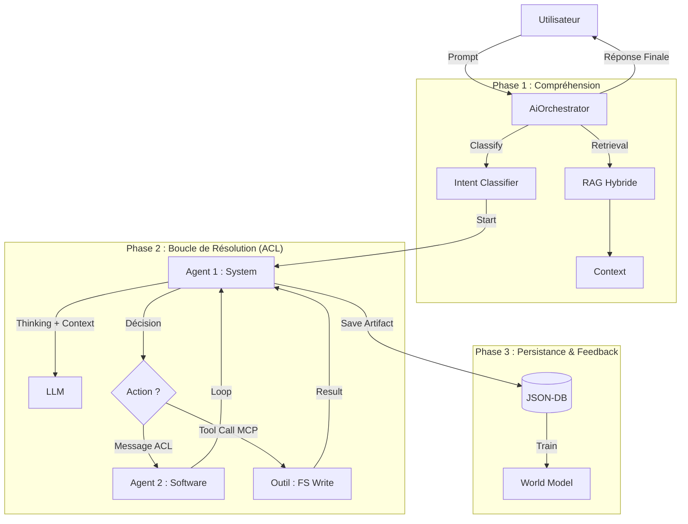

# Module AI — Intelligence Artificielle Neuro-Symbolique & Multi-Agents

Ce module implémente l'approche **MBAIE** (Model-Based AI Engineering) de RAISE. Il transforme le langage naturel en structures d'ingénierie formelles, valides et persistées, grâce à une architecture **Multi-Agents Unifiée**.

## 🎯 Vision & Philosophie

L'IA de RAISE n'est pas un simple chatbot. C'est un **opérateur qualifié** qui agit sur le modèle.

1.  **Workstation-First** : Par défaut, l'intelligence tourne localement (Mistral via Docker + Candle).
2.  **Grounding (Ancrage)** : L'IA ne répond jamais "dans le vide". Elle est nourrie par le contexte réel du projet (`json_db`) via un système RAG Hybride injecté dans chaque Agent.
3.  **Collaboration (Squad)** : Les tâches complexes sont résolues par une équipe d'agents spécialisés qui communiquent entre eux (Protocole ACL).
4.  **Intégrité & Outils** : Les agents manipulent le système via des outils standardisés et sécurisés (Protocole MCP).
5.  **Simulation** : Avant d'agir, l'IA "imagine" les conséquences de ses actions grâce à un **World Model** prédictif (Jumeau Numérique Cognitif).

---

## 🏗️ Architecture Modulaire

Le module est divisé en sous-systèmes interconnectés pilotés par un Orchestrateur central.

### 1\. [L'Orchestrateur & La Squad (`agents/` & `orchestrator.rs`)](./agents/README.md)

Le cœur du système. L'**`AiOrchestrator`** reçoit la demande, interroge le RAG, et lance une boucle de résolution.

- **Intent Classifier** : Analyse la demande et choisit l'Agent de départ.
- **La Squad (Agents Experts)** :
  - `BusinessAgent` (OA) : Analyse métier, besoins opérationnels.
  - `SystemAgent` (SA) : Architecture système, fonctions, acteurs.
  - `SoftwareAgent` (LA) : Architecture logicielle, génération de code.
  - `HardwareAgent` (PA) : Noeuds physiques, infrastructure.
  - `EpbsAgent` (EPBS) : Configuration, BOM.
  - `DataAgent` (DATA) : Modélisation de données, classes.
  - `TransverseAgent` (IVVQ) : Exigences, Tests, Qualité.

### 2\. [Protocoles de Communication (`protocols/`)](./protocols/mod.rs)

Pour garantir la robustesse et l'auditabilité des échanges.

- **ACL (Agent Communication Language)** : Permet aux agents de se déléguer des tâches (ex: _SystemAgent_ demande à _SoftwareAgent_ d'implémenter une fonction).
- **MCP (Model Context Protocol)** : Standardise l'utilisation des outils externes (ex: Écriture de fichiers, Requête DB).

### 3\. [La Mémoire Contextuelle (`context/`)](./context/README.md)

Responsable de l'ancrage des réponses.

- **RAG Hybride** : Combine recherche symbolique (Graphe Arcadia) et vectorielle (Qdrant). Ce contexte est injecté dynamiquement dans le prompt de chaque agent.

### 4\. [Le World Model (`world_model/`)](./world_model/README.md) ✨

Responsable de la **Simulation** et de l'**Apprentissage**.

- **Architecture JEPA** : Estime l'impact latent d'une action avant exécution.
- **Apprentissage** : S'améliore via le feedback utilisateur (`reinforce_learning`).

---

## 🔄 Flux de Données (Workflow Unifié)

L'orchestrateur gère une boucle de résolution itérative (ACL Loop).



---

## 🛠️ Points d'Entrée

### 1. Application GUI (Tauri)

L'utilisateur final interagit via le panneau de chat React. La commande `ai_chat` est désormais un contrôleur léger qui délègue tout à l'Orchestrateur.

- **Commande** : `ai_chat` (Point d'entrée unique).
- **Commande** : `ai_confirm_learning` (Feedback pour le World Model).

### 2. Outil Développeur (`ai_cli`)

Pour le test rapide sans interface graphique.

- **Localisation** : `src-tauri/tools/ai_cli`.

---

## 📊 État d'Avancement (v0.2.0 - Grand Unification)

| Composant         | Statut     | Description                                            |
| ----------------- | ---------- | ------------------------------------------------------ |
| **Orchestrateur** | ✅ Unifié  | Gère RAG + Agents + ACL dans une boucle unique.        |
| **Squad Agents**  | ✅ Complet | 7 Agents experts (Business ➔ Transverse).              |
| **Protocole ACL** | ✅ Actif   | Délégation automatique entre agents (Hop-to-Hop).      |
| **Protocole MCP** | ✅ Actif   | Support des outils standardisés (`fs_write`, etc.).    |
| **RAG Vectoriel** | ✅ Stable  | Intégration **Qdrant** partagée entre tous les agents. |
| **World Model**   | 🚀 Beta    | Simulation active en tâche de fond (Training Loop).    |

---

> **Note aux contributeurs :**
>
> - Pour ajouter un agent : `src/ai/agents/`.
> - Pour ajouter un outil (MCP) : `src/ai/tools/`.
> - Pour la logique centrale : `src/ai/orchestrator.rs`.

```

```
