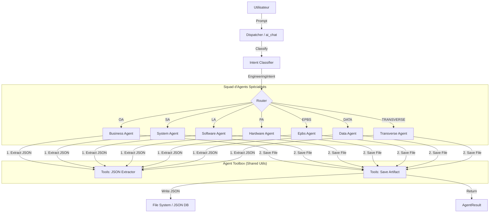

# Module `ai/agents` — Système Multi-Agents Neuro-Symbolique

Ce module implémente la logique **exécutive** de l'IA de RAISE. Il transforme des requêtes en langage naturel (floues) en artefacts d'ingénierie formels (stricts, validés et persistés) selon la méthodologie **Arcadia**.

---

## 🧠 Architecture Globale

Le système repose sur un pipeline **Comprendre → Décider → Agir** orchestré par un Dispatcher central.



---

## 👥 La "Squad" d'Agents

Chaque agent est expert dans sa couche d'abstraction Arcadia, mais partage désormais la même infrastructure technique (**AgentToolbox**).

| Agent               | Rôle & Responsabilités | Couche         | Schémas gérés                                              |
| ------------------- | ---------------------- | -------------- | ---------------------------------------------------------- |
| **BusinessAgent**   | Analyste Métier        | **OA**         | `OperationalCapability`, `OperationalActor`                |
| **SystemAgent**     | Architecte Système     | **SA**         | `SystemFunction`, `SystemComponent`, `SystemActor`         |
| **SoftwareAgent**   | Architecte Logiciel    | **LA**         | `LogicalComponent` + **Génération de Code**                |
| **HardwareAgent**   | Architecte Matériel    | **PA**         | `PhysicalNode` (Détection auto: Électronique vs Infra)     |
| **EpbsAgent**       | Config Manager         | **EPBS**       | `ConfigurationItem` (Gestion P/N, Kind)                    |
| **DataAgent**       | Data Architect         | **DATA**       | `Class`, `DataType`, `ExchangeItem` (MDM)                  |
| **TransverseAgent** | Qualité & IVVQ Manager | **TRANSVERSE** | `Requirement`, `Scenario`, `TestProcedure`, `TestCampaign` |

---

## 🛠️ Refactoring & Optimisation (AgentToolbox)

Le module a été massivement optimisé pour éliminer la duplication de code et garantir la robustesse.

### 1. Centralisation I/O (`tools::save_artifact`)

Les agents ne gèrent plus manuellement les chemins de fichiers ou la création de dossiers. Ils délèguent cette tâche à la **Toolbox** (`mod.rs`).

- **Avantage** : Si la structure des dossiers change (`un2/sa/...`), il suffit de modifier une seule fonction pour mettre à jour les 7 agents.
- **Standardisation** : Garantie que tous les artefacts ont un ID, un nom et sont stockés au bon endroit.

### 2. Parsing Robuste (`tools::extract_json_from_llm`)

Une fonction centralisée nettoie les réponses des LLM (qui sont souvent "bavards" en local).

- Ignore le Markdown (````json`).
- Trouve les accolades `{}` même s'il y a du texte avant/après.
- Validé par des tests unitaires dédiés.

---

## 📦 Sortie Structurée

Pour permettre une UI riche, les agents renvoient une structure `AgentResult` standardisée :

```rust
pub struct AgentResult {
    pub message: String,                 // Feedback textuel (Markdown)
    pub artifacts: Vec<CreatedArtifact>, // Liste des objets créés (ID, Path, Layer...)
}

```

Cela permet au Frontend d'afficher des **"Cartes d'Artefacts"** cliquables directement dans le chat.

---

## 🚀 Tests Unitaires (Colocation)

Les tests sont désormais **colocalisés** (situés dans les mêmes fichiers que le code) pour faciliter la maintenance.

### Lancer les tests du module

```bash
cargo test ai::agents -- --nocapture

```

### Couverture actuelle (15 tests passants)

- **Toolbox** : Validation du parsing JSON (cas nominaux, markdown, bruit).
- **Identity** : Vérification que chaque agent s'identifie correctement (`id()`).
- **Logique Métier** : Tests spécifiques (ex: catégorisation Matériel "Electronics" vs "Infrastructure").
- **Intent Classifier** : Validation des heuristiques de secours (`heuristic_fallback`).

---

## 🔮 Roadmap Technique

- [ ] **Intégration GraphStore** : Connecter `save_artifact` pour qu'il indexe aussi directement dans SurrealDB (en plus du fichier JSON).
- [ ] **Multi-Artefacts** : Permettre à un agent de générer une hiérarchie complète (ex: Un système + ses sous-fonctions) en une seule passe.
- [ ] **Validation Schéma** : Intégrer une validation JSON Schema stricte avant sauvegarde.

```

```
