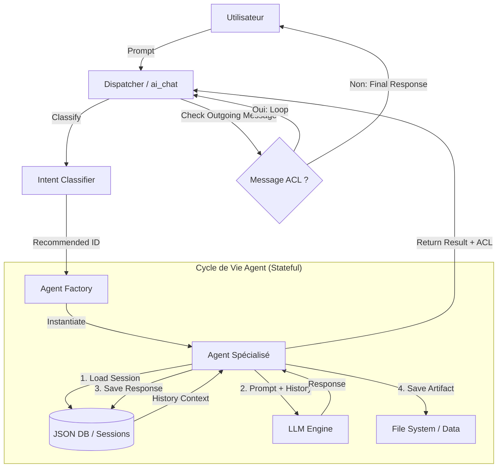

# Module `ai/agents` — Système Multi-Agents Neuro-Symbolique & Stateful

Ce module implémente la logique **exécutive** de l'IA de RAISE. Il transforme des requêtes en langage naturel en artefacts d'ingénierie formels (Arcadia), tout en maintenant une **mémoire conversationnelle persistante** et une capacité de **collaboration active** entre agents.

---

## 🧠 Architecture Globale

Le système repose sur un pipeline **Comprendre → Contextualiser → Agir → Déléguer**.
Le Dispatcher (`ai_commands.rs`) agit comme un chef d'orchestre qui gère une boucle de résolution jusqu'à satisfaction complète de la demande.



---

## 👥 La "Squad" d'Agents (Stateful & Communicants)

Chaque agent est expert dans sa couche d'abstraction Arcadia. Il sait **quoi produire** (Schémas) et **à qui transmettre la suite** (Transitions ACL).

| Agent             | Rôle            | Couche | Schémas gérés (Artefacts)   | Transitions Automatiques (Délégation) |
| ----------------- | --------------- | ------ | --------------------------- | ------------------------------------- |
| **BusinessAgent** | Analyste Métier | **OA** | `OperationalCapability`<br> |

<br>`OperationalActor` | ➔ **SystemAgent**<br>

<br>_(Transition Besoin → Système)_ |
| **SystemAgent** | Architecte Système | **SA** | `SystemFunction`<br>

<br>`SystemComponent`<br>

<br>`SystemActor` | ➔ **SoftwareAgent**<br>

<br>_(Transition Archi → Design)_ |
| **SoftwareAgent** | Architecte Logiciel | **LA** | `LogicalComponent`<br>

<br>`SourceFile` (Code Gen) | ➔ **EpbsAgent** (Config)<br>

<br>➔ **TransverseAgent** (Qualité) |
| **HardwareAgent** | Architecte Matériel | **PA** | `PhysicalNode`<br>

<br>_(Détection: Elec vs Infra)_ | ➔ **EpbsAgent**<br>

<br>_(Création BOM / Part Number)_ |
| **EpbsAgent** | Config Manager | **EPBS** | `ConfigurationItem`<br>

<br>_(Gestion P/N, Version)_ | _Fin de chaîne_ |
| **DataAgent** | Data Architect | **DATA** | `Class`, `DataType`<br>

<br>`ExchangeItem` | ➔ **Routage Dynamique**<br>

<br>_(Vers Business, Soft ou Hard)_ |
| **TransverseAgent** | Qualité & IVVQ | **TRANS** | `Requirement`, `Scenario`<br>

<br>`TestProcedure` | _Fin de chaîne_ |

---

## 🧠 Mémoire & Persistance

Les agents disposent d'une mémoire persistante partagée au sein d'une même séquence d'orchestration.

### Fonctionnement

1. **Session Partagée** : Le Dispatcher génère un `global_session_id`. Tous les agents impliqués dans la chaîne (ex: Business puis System) lisent et écrivent dans le même fil historique.
2. **Injection Contextuelle** : L'historique des échanges précédents (même ceux des autres agents) est injecté dans le prompt du LLM.
3. **Sauvegarde** : Chaque interaction est persistée dans `un2/_system/agent_sessions/`.

Cela permet au `SoftwareAgent` de "savoir" ce que le `SystemAgent` vient de décider sans que l'utilisateur ait besoin de le répéter.

---

## 🛠️ Agent Toolbox & Protocoles

### 1. Gestion de Session (`tools::load/save_session`)

Fonctions asynchrones standardisées pour lire et écrire dans la collection `agent_sessions`.

### 2. Protocole ACL (`protocols::acl`)

Implémentation standardisée des messages Agent-to-Agent.

- **Performative** : `Request`, `Inform`, `Propose`...
- **Contenu** : Instructions en langage naturel pour l'agent destinataire.

### 3. Parsing Robuste (`tools::extract_json_from_llm`)

Nettoie les réponses LLM (suppression du Markdown, extraction du JSON pur) pour garantir la conformité des schémas.

---

## 📦 Sortie Structurée

L'interface avec le Frontend a évolué pour supporter la communication inter-agents :

```rust
pub struct AgentResult {
    pub message: String,                 // Feedback textuel (Markdown)
    pub artifacts: Vec<CreatedArtifact>, // Liste des objets créés

    // NOUVEAU : Canal de communication sortant
    pub outgoing_message: Option<AclMessage>,
}

```

Si `outgoing_message` est présent, le Dispatcher intercepte la réponse et ne l'affiche pas tout de suite à l'utilisateur : il déclenche l'agent destinataire.

---

## 🚀 Tests Unitaires & Intégration

Les tests couvrent le cycle de vie complet, incluant la délégation ACL.

```bash
cargo test ai::agents -- --nocapture

```

### Couverture

- **Identity** : Validation du routage.
- **Workflow** : Vérification que `SystemAgent` déclenche bien `SoftwareAgent` lors de la création d'un composant.
- **Routage Dynamique** : Vérification que `DataAgent` choisit le bon destinataire selon le contexte.
- **Schémas** : Validation que les JSON produits respectent la structure attendue par la DB.

---

## 🔮 Roadmap Technique

- [ ] **Protocole MCP (Model Context Protocol)** : Standardiser les actions des agents (outils) via `mcp.rs`.
- [ ] **RAG (Retrieval Augmented Generation)** : Connecter la mémoire à une recherche vectorielle.
- [ ] **Validation Schema** : Intégrer une validation JSON Schema stricte (Valico) avant la sauvegarde disque.

```

```
