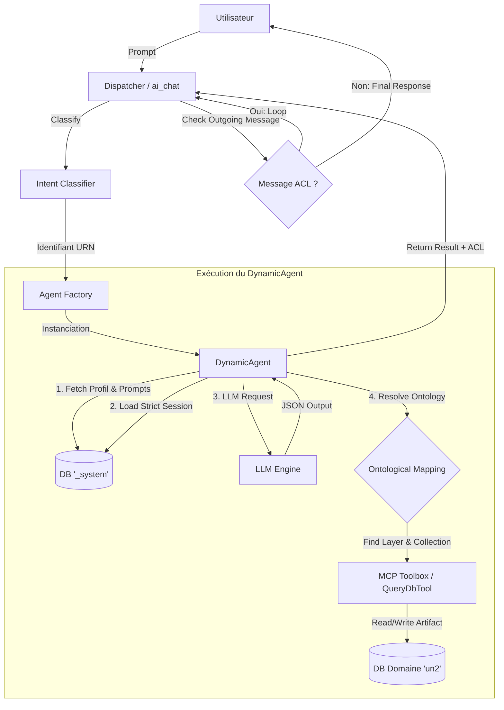

# Module `ai/agents` — Système Multi-Agents Neuro-Symbolique & Data-Driven

Ce module implémente la logique **exécutive** de l'IA de RAISE. Il transforme des requêtes en langage naturel en artefacts d'ingénierie formels (Arcadia).

Sa particularité absolue réside dans son architecture **Data-Driven (Zéro Dette)** : le moteur Rust est une coquille exécutive totalement agnostique. **Toute l'intelligence, les règles de routage, et la personnalité des agents sont définies dans le Graphe de Connaissances (JSON-LD).**

---

## 🧠 Architecture Globale (Le Paradigme Neuro-Symbolique)

Le système repose sur le `DynamicAgent`, un agent universel qui charge sa personnalité et ses règles depuis la base de données système avant chaque exécution.


```mermaid
graph TD
    User[Utilisateur] -->|Prompt| Dispatcher[Dispatcher / ai_chat]
    Dispatcher -->|Classify| Intent[Intent Classifier]
    Intent -->|Identifiant URN| Factory[Agent Factory]

    subgraph "Exécution du DynamicAgent"
        Factory -->|Instanciation| Agent[DynamicAgent]
        Agent -->|1. Fetch Profil & Prompts| SystemDB[(DB '_system')]
        Agent -->|2. Load Strict Session| SystemDB
        Agent -->|3. LLM Request| LLM[LLM Engine]
        
        %% Utilisation de MCP et de l'Ontologie
        LLM -->|JSON Output| Agent
        Agent -->|4. Resolve Ontology| Router{Ontological Mapping}
        Router -->|Find Layer & Collection| MCP[MCP Toolbox / QueryDbTool]
        MCP -->|Read/Write Artifact| DomainDB[(DB Domaine 'un2')]
    end

    Agent -->|Return Result + ACL| Dispatcher

    %% Boucle de rétroaction
    Dispatcher -->|Check Outgoing Message| ACL{Message ACL ?}
    ACL -->|Oui: Loop| Dispatcher
    ACL -->|Non: Final Response| User
```

---

## 🧬 Le "Cerveau" Ontologique (Zéro Code en Dur)

Contrairement aux architectures classiques, le code Rust ne contient aucun `match` ou dictionnaire associant une entité (ex: `OperationalCapability`) à un dossier de sauvegarde.

Tout passe par le **Mapping Ontologique** (`ref:configs:handle:ontological_mapping`) stocké en base :

1. L'Agent LLM génère un artefact (ex: `type: "Class"`).
2. L'outil interroge le Graphe de Connaissances pour savoir où le ranger.
3. Le Graphe répond : `layer: "data", collection: "classes"`.
4. L'outil MCP sauvegarde la donnée.

_Si une nouvelle norme ou couche d'ingénierie est ajoutée à RAISE demain, aucune ligne de Rust n'a besoin d'être recompilée !_

---

## 👥 Les Profils d'Agents (Configurés en Base)

Il n'y a plus de structures Rust dédiées (`BusinessAgent`, etc.). Ce sont désormais des **Profils** chargés dynamiquement par le `DynamicAgent` à partir des URNs (`ref:agents:handle:...`).

| Profil (Handle)      | Rôle (Couche)                | Schémas gérés (Artefacts)                   | Transitions Automatiques (ACL)   |
| -------------------- | ---------------------------- | ------------------------------------------- | -------------------------------- |
| **`agent_business`** | Analyste Métier (**OA**)     | `OperationalCapability`, `OperationalActor` | ➔ `agent_system`                 |
| **`agent_system`**   | Architecte Système (**SA**)  | `SystemFunction`, `SystemComponent`         | ➔ `agent_software`               |
| **`agent_software`** | Architecte Logiciel (**LA**) | `LogicalComponent`, `SourceFile` (Code Gen) | ➔ `agent_epbs` / `agent_quality` |
| **`agent_hardware`** | Architecte Matériel (**PA**) | `PhysicalNode`, `Hardware`                  | ➔ `agent_epbs`                   |
| **`agent_epbs`**     | Config Manager (**EPBS**)    | `ConfigurationItem` (BOM / Part Number)     | _Fin de chaîne_                  |
| **`agent_data`**     | Data Architect (**DATA**)    | `Class`, `DataType`, `ExchangeItem`         | _Routage Dynamique_              |
| **`agent_quality`**  | Qualité & IVVQ (**TRANS**)   | `Requirement`, `TestProcedure`              | _Fin de chaîne_                  |

---

## 🧠 Mémoire & Persistance (Schémas Stricts)

La gestion de session a été scindée pour respecter les bonnes pratiques des bases orientées document :

1. **Le Graphe Sémantique (`session-agent.schema.json`)** : La base de données ne stocke que les métadonnées d'état (Statut, Métriques de tokens, IDs de thread). Ce schéma est validé de manière **stricte** par le registre JSON-LD (`VocabularyRegistry`).
2. **Le Disque Local (`chats/agents/*.json`)** : L'historique lourd des messages (contexte LLM complet) est déporté sur le système de fichiers local du domaine pour ne pas alourdir l'index de recherche du graphe.
3. **Upsert Idempotent** : Chaque prise de parole de l'agent effectue une mise à jour (Upsert) de son document de session via son identifiant déterministe (`handle`).

---

## 🛠️ Agent Toolbox & Protocoles MCP

Les agents utilisent le **Model Context Protocol (MCP)** pour interagir avec le monde de manière sécurisée et centralisée.

- **`QueryDbTool`** : Outil fondamental permettant à l'agent de résoudre n'importe quelle URN (`ref:collection:champ:valeur`) dans le graphe système ou métier, avec support optionnel de l'export RDF/N-Triples.
- **`CodeGenTool`** : Orchestre la génération de code physique (Rust, C++, etc.) avec _Round-Trip Engineering_ (préservation du code manuel via balises `AI_INJECTION_POINT`).
- **Protocole ACL (`protocols::acl`)** : Gestion des messages Agent-to-Agent (Performative `Request`, `Inform`, etc.) pour la délégation de tâches.

---

## 🚀 Tests Unitaires & Intégration

Les tests d'intégration sont conçus autour de la `DbSandbox` qui isole un graphe de connaissances éphémère. Le registre de vocabulaire et les mocks sont injectés dynamiquement pour simuler la base système.

```bash
cargo test -p raise --test ai_suite --features cuda
```

---

## 🔮 Roadmap Technique

- [x] **Protocole MCP (Model Context Protocol)** : Standardisé via `QueryDbTool` et `CodeGenTool`.
- [x] **Round-Trip Engineering** : Préservation du code manuel (Implémenté).
- [x] **Validation Schema Stricte** : Validée via le `VocabularyRegistry` (`session-agent.schema.json`).
- [ ] **RAG (Retrieval Augmented Generation)** : Connecter le "Court Terme" (fichiers de chat) à la "Mémoire Long Terme" Vectorielle (Qdrant).

 
