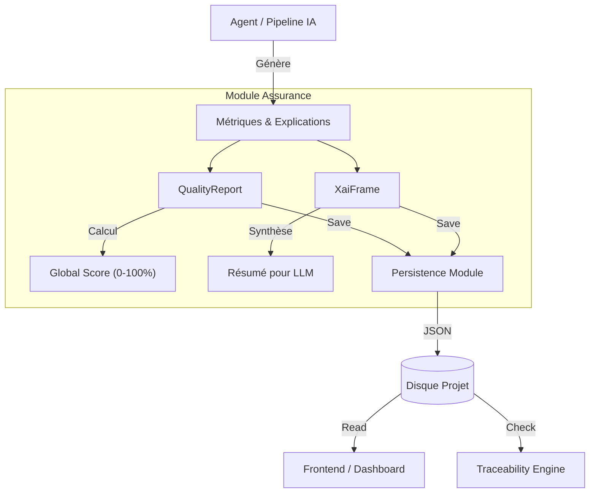

# Module d'Assurance IA (Trustworthy AI)

Ce module est le garant de la **Confiance** dans le système RAISE. Il fournit les structures et mécanismes pour capturer, scorer, stocker et auditer les performances et le comportement des modèles d'IA.

Il est conçu pour répondre aux exigences de documentation technique des normes critiques (DO-178C, EU AI Act).

---

## 🎯 Objectifs

1.  **Explicabilité (XAI)** : Standardiser le "Pourquoi" d'une décision (SHAP, LIME) et la rendre digeste pour un humain ou un LLM.
2.  **Qualité (Quality)** : Calculer un score objectif (0-100%) et un statut de validation (Pass/Fail) pour chaque modèle.
3.  **Persistance (Audit)** : Sauvegarder ces preuves de manière immuable dans le référentiel du projet (`un2/transverse`).

---

## 🏗️ Architecture & Flux



## 📂 Structure du Module

| Fichier          | Rôle                                                                                                     |
| ---------------- | -------------------------------------------------------------------------------------------------------- |
| **`mod.rs`**     | Point d'entrée. Contient le sous-module **`persistence`** pour l'écriture disque.                        |
| **`quality.rs`** | Gestion de la Qualité. Calcul du score global et validation des seuils (Performance, Biais, Robustesse). |
| **`xai.rs`**     | Gestion de l'Explicabilité. Structures pour Feature Importance et génération de résumés textuels.        |

---

## 🛡️ 1. Qualité (`quality.rs`)

Le `QualityReport` agit comme un certificat de conformité.

### Nouveautés

- **Scoring** : Calcule automatiquement un `global_score` (0.0 à 100.0).
- **Validation** : Statut `Pass`, `Warning` ou `Fail` selon la criticité des métriques.

### Exemple

```rust
use crate::ai::assurance::quality::{QualityReport, MetricCategory};

let mut report = QualityReport::new("model_credit_v1", "dataset_2025");

// Ajout d'une métrique (Critique)
report.add_metric(
    "Accuracy",
    MetricCategory::Performance,
    0.95,       // Valeur mesurée
    Some(0.90), // Min accepté
    None,       // Max
    true        // Critique ? Oui.
);

// Le score et le statut sont mis à jour automatiquement
println!("Score: {}%, Status: {:?}", report.global_score, report.overall_status);

```

---

## 🔍 2. Explicabilité (`xai.rs`)

Le `XaiFrame` capture les raisons d'une prédiction.

### Nouveautés

- **LLM Helper** : La méthode `summarize_for_llm()` génère un texte narratif décrivant l'explication. Utile pour que l'Assistant (RAG) puisse expliquer ses propres choix.

### Exemple

```rust
use crate::ai::assurance::xai::{XaiFrame, XaiMethod, ExplanationScope};

let mut frame = XaiFrame::new("model_v1", XaiMethod::Lime, ExplanationScope::Local);
frame.predicted_output = "Rejeté".to_string();
frame.add_feature("Dette", "Élevée", -0.85, 1);

// Génère : "Explication pour 'Rejeté'. Facteurs principaux : - Dette (Élevée): Impact -0.85..."
let text_summary = frame.summarize_for_llm();

```

---

## 💾 3. Persistance (`mod.rs`)

Le sous-module `persistence` standardise le stockage des preuves d'audit au sein du projet utilisateur.

### Emplacements de stockage

Les fichiers sont sauvegardés au format JSON dans :

- `un2/transverse/collections/quality_reports/{uuid}.json`
- `un2/transverse/collections/xai_frames/{uuid}.json`

### Exemple de Sauvegarde

```rust
use crate::ai::assurance::persistence;
use std::path::Path;

let domain_root = Path::new("/path/to/project");

// Sauvegarde automatique et création des dossiers
persistence::save_quality_report(domain_root, &report)?;
persistence::save_xai_frame(domain_root, &frame)?;

```

---

## ✅ Tests

Pour vérifier la logique de scoring et la bonne écriture sur le disque :

```bash
cargo test ai::assurance -- --nocapture

```

```

```
