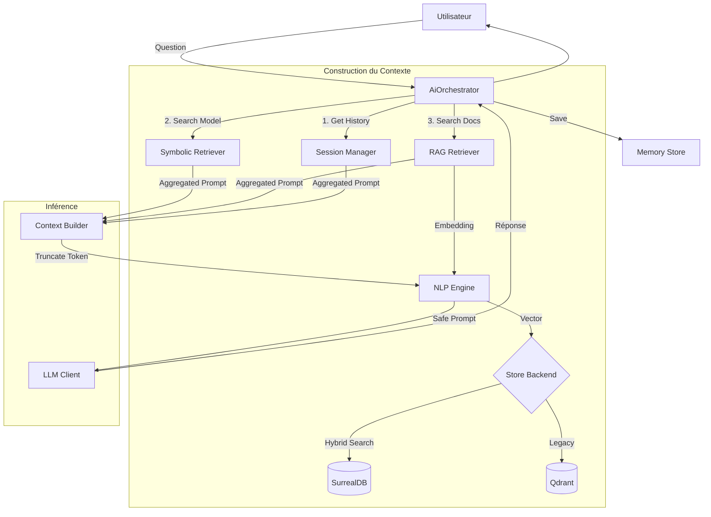

# Module Context — Mémoire & Ancrage (RAG Hybride)

Ce module est le cerveau mnésique de RAISE. Il est responsable de fournir au LLM le **Grounding** (Vérité Terrain) nécessaire pour répondre aux questions de l'ingénieur, en combinant connaissances techniques (Symbolique), documentation (Sémantique) et historique (Épisodique).

---

## 🏗️ Architecture Globale (The 5-Pillars)

Le contexte repose désormais sur une architecture orchestrée pour couvrir tous les horizons de données :

| Composant            | Fichier                   | Rôle                                                                                                     | Technologie                         |
| :------------------- | :------------------------ | :------------------------------------------------------------------------------------------------------- | :---------------------------------- |
| **Orchestrateur**    | `orchestrator.rs`         | **Chef d'Orchestre**. Fusionne toutes les sources de contexte, gère le flux LLM et sécurise les prompts. | Rust (Native)                       |
| **Sémantique (RAG)** | `rag.rs`                  | **Mémoire Long-Terme**. Recherche vectorielle dans la documentation et les notes.                        | **SurrealDB** (Graph+Vec) ou Qdrant |
| **Symbolique**       | `retriever.rs`            | **Vérité Terrain**. Scanne le modèle structuré (`ProjectModel`) en RAM.                                  | Algorithmes de recherche floue      |
| **Session**          | `conversation_manager.rs` | **Mémoire de Travail**. Gère le fil de discussion et la fenêtre glissante (Sliding Window).              | Rust Structs                        |
| **Persistance**      | `memory_store.rs`         | **Stockage**. Sauvegarde/Charge les historiques de chat sur disque.                                      | JSON Files                          |

---

## 🔄 Flux de Données (Data Flow)

Tout passe désormais par l'`AiOrchestrator`.



---

## ⚙️ Configuration & Stockage

Le système de contexte est **agnostique** au moteur de base de données vectorielle. Il se configure via le fichier `.env`.

### Variables d'Environnement

```bash
# Choix du moteur (Recommandé : surreal)
VECTOR_STORE_PROVIDER="surreal" # ou "qdrant"

# Si Qdrant est choisi (nécessite Docker)
PORT_QDRANT_GRPC=6334

# Si SurrealDB est choisi (Embarqué, pas de Docker requis)
# Active l'auto-vectorisation dans le GraphStore global
ENABLE_GRAPH_VECTORS=true

```

### Stockage Physique

Les données sont stockées localement dans le dossier défini par `PATH_RAISE_DOMAIN` (par défaut `.raise_storage/`).

- `/chats` : Historiques de conversation (JSON).
- `/raise_graph.db` : Base de données SurrealDB (Graphe + Vecteurs).

---

## 📂 Détails des Modules

### 1. L'Orchestrateur (`orchestrator.rs`)

C'est le point d'entrée unique. Il :

1. Détecte l'intention (Fast Path vs LLM).
2. Interroge les 3 mémoires (Symbolique, RAG, Session).
3. Construit un prompt optimisé.
4. Tronque le prompt pour respecter la fenêtre de contexte du modèle (via `nlp::tokenizers`).
5. Gère la réponse et la sauvegarde.

### 2. Le RAG (`rag.rs`)

Il implémente l'ingestion et la recherche documentaire.

- **Ingestion** : Découpe le texte (Chunking), calcule les vecteurs (BERT/All-MiniLM), et stocke le tout.
- **Retrieval** : Utilise la similarité cosinus pour trouver les morceaux de texte pertinents.
- **Backend** : Utilise une abstraction pour switcher entre `GraphStore` (Surreal) et `QdrantMemory`.

### 3. Gestionnaire de Session (`conversation_manager.rs`)

- Gère l'historique `User` <-> `Assistant`.
- Implémente une **fenêtre glissante** (par défaut ~10 échanges) pour ne pas saturer le LLM avec de vieilles discussions.

---

## 🚀 Commandes de Test

### Tester l'ensemble du contexte (Unitaires + Intégration)

```bash
# Lance les tests avec SurrealDB (par défaut)
cargo test ai::context -- --nocapture

# Lance les tests avec Qdrant (nécessite Docker)
cargo test ai::context -- --ignored

```

### Tester l'Orchestrateur (Pipeline complet simulé)

```bash
cargo test ai::orchestrator

```

---

## 🛠️ État d'avancement

- [x] **Retriever Symbolique** : Fonctionnel.
- [x] **RAG Sémantique** : Fonctionnel (Multi-Backend).
- [x] **Conversation Manager** : Fonctionnel (Sliding Window).
- [x] **Memory Store** : Fonctionnel (Persistance JSON).
- [x] **Orchestrateur** : Fonctionnel (Router + Context Guard).
- [x] **Intégration GraphStore** : Fonctionnel (Hybrid Search).

```

```
