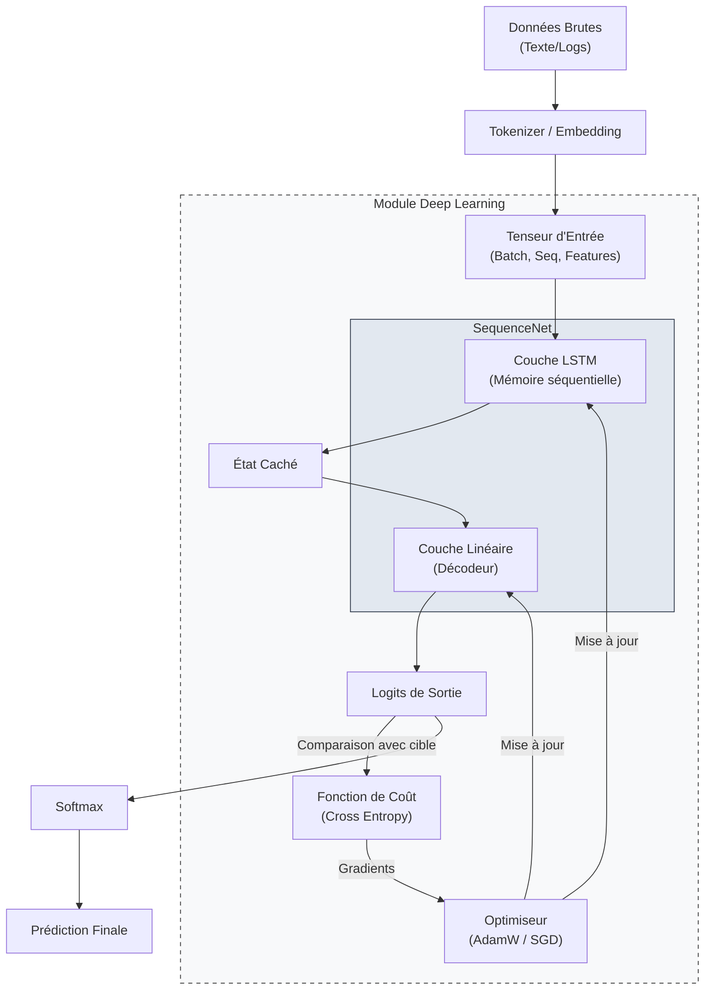

# Module Deep Learning (`src-tauri/src/ai/deep_learning`)

Ce module fournit une implémentation native et légère de réseaux de neurones récurrents, écrite entièrement en Rust. Il est conçu pour permettre à **Raise** d'effectuer un apprentissage continu local (sur la machine de l'utilisateur) sans dépendre d'API externes lourdes pour des tâches spécifiques (prédiction de séquences, analyse de logs, classification d'intentions contextuelles).

## 1. Structure du Module

Le module est organisé de manière hiérarchique, du plus bas niveau (opérations mathématiques) au plus haut niveau (boucle d'entraînement).

| Sous-module      | Description                                                                                                                                                        |
| :--------------- | :----------------------------------------------------------------------------------------------------------------------------------------------------------------- |
| **`layers/`**    | **Briques fondamentales**. Contient l'implémentation mathématique des neurones (Linear, LSTMCell). C'est ici que sont définis les poids et les biais.              |
| **`models/`**    | **Architectures**. Assemble les couches pour former des réseaux complets (ex: `SequenceNet`). Gère la propagation avant (forward pass) sur des séquences entières. |
| **`trainer.rs`** | **Boucle d'apprentissage**. Gère l'optimisation des poids via la rétropropagation à travers le temps (BPTT).                                                       |
| **`mod.rs`**     | Point d'entrée public exposant les fonctionnalités au reste de l'application (Orchestrator).                                                                       |

---

## 2. Flux de Données (Architecture)

Le schéma ci-dessous illustre comment une donnée brute (ex: une commande utilisateur) est transformée en prédiction via ce module.



---

## 3. Fondements Théoriques

Nous utilisons `candle-core` comme backend pour les tenseurs (tableaux multidimensionnels) et la différenciation automatique.

### Fonction de Perte (Loss)

Pour l'entraînement sur des séquences (classification de tokens), nous minimisons généralement l'entropie croisée (Cross Entropy) :

$$
L = - \sum_{c=1}^{M} y_{o,c} \log(p_{o,c})
$$

Où :

- §M§ est la taille du vocabulaire.
- §y§ est l'étiquette réelle (one-hot).
- §p§ est la probabilité prédite par le modèle.

### Optimisation

Les poids §W§ sont mis à jour itérativement selon la règle de la descente de gradient :

$$
W_{t+1} = W_t - \eta \cdot \nabla_W L
$$

Où §\eta§ est le taux d'apprentissage (learning rate) et §\nabla_W L§ le gradient de la perte par rapport aux poids.

---

## 4. Exemple d'Intégration (Rust)

Voici comment instancier et entraîner un réseau complet depuis le code principal de Raise.

```rust
use crate::ai::deep_learning::{models::SequenceNet, trainer::Trainer};
use candle_core::{VarBuilder, Device, DType};

pub fn train_custom_model() -> RaiseResult<()> {
    let device = Device::Cpu; // Ou Device::new_cuda(0) si disponible

    // 1. Définition des hyperparamètres
    let input_dim = 64;   // Dimension de l'embedding
    let hidden_dim = 128; // Mémoire du LSTM
    let output_dim = 10;  // Nombre de classes / tokens

    // 2. Création du modèle
    let varmap = VarMap::new();
    let vb = VarBuilder::from_varmap(&varmap, DType::F32, &device);
    let model = SequenceNet::new(input_dim, hidden_dim, output_dim, vb)?;

    // 3. Configuration de l'entraîneur
    let mut trainer = Trainer::new(&varmap, 0.001, 100)?; // learning_rate=0.001, epochs=100

    // 4. Données factices pour l'exemple
    let dummy_input = Tensor::randn(0f32, 1.0, (1, 5, input_dim), &device)?;
    let dummy_target = Tensor::zeros((1, 5), DType::U32, &device)?; // Classes cibles

    // 5. Lancement de l'entraînement
    let final_loss = trainer.train_step(&model, &dummy_input, &dummy_target)?;
    println!("Perte finale : {}", final_loss);

    Ok(())
}

```

## 5. Roadmap

- [x] Définition des Couches (`layers/`)
- [x] Architecture du Modèle (`models/`)
- [ ] Implémentation du Trainer (`trainer.rs`)
- [ ] Sérialisation/Sauvegarde des poids (Format `.safetensors`)
- [ ] Intégration avec le module `nlp/tokenizers` pour des cas réels.

```

```
