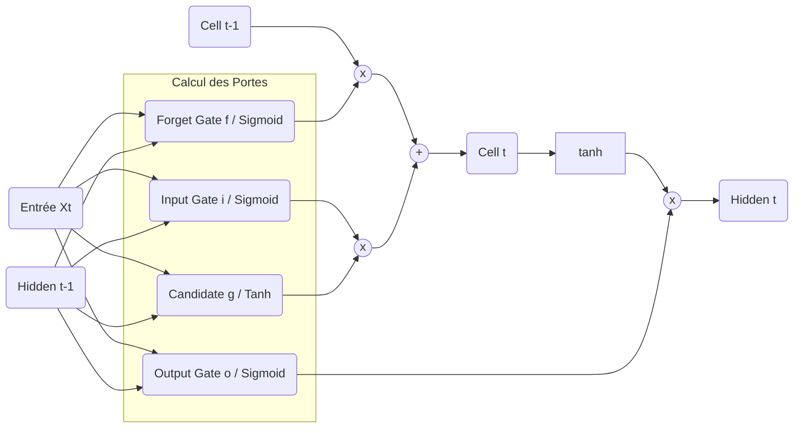

# Module Layers (`src-tauri/src/ai/deep_learning/layers`)

Ce module implémente les briques fondamentales (les couches) du réseau neuronal. L'objectif est de gérer la logique mathématique interne (les poids, les biais, les calculs de portes) tout en déléguant les opérations matricielles lourdes au backend `candle-core`.

## 1. Architecture Globale

Le schéma ci-dessous détaille le flux de données interne d'une cellule LSTM. C'est cette logique exacte que nous implémentons dans `rnn_cell.rs`.



---

## 2. Spécification : Couche Linéaire (`linear.rs`)

Une couche entièrement connectée (Dense) standard.

### Structure de Données

```rust
pub struct Linear {
    weight: Tensor,          // Dimensions: [out_features, in_features]
    bias: Option<Tensor>,    // Dimensions: [out_features]
}

```

### Méthodes Requises

1. **`new(weight: Tensor, bias: Option<Tensor>) -> Self`**

- Constructeur simple qui prend la propriété des tenseurs.

2. **`forward(&self, x: &Tensor) -> RaiseResult<Tensor>`**

- Applique l'opération affine :
  $$
  y = x W^T + b
  $$
- Gère le _broadcasting_ du biais si nécessaire (ex: application sur un batch).

---

## 3. Spécification : Cellule LSTM (`rnn_cell.rs`)

Implémentation d'une cellule _Long Short-Term Memory_ standard (sans Peephole connections).

### Structure de Données

```rust
pub struct LSTMCell {
    weight_ih: Tensor,    // Poids Input-Hidden. Dim: [4 * hidden_size, input_size]
    weight_hh: Tensor,    // Poids Hidden-Hidden. Dim: [4 * hidden_size, hidden_size]
    bias_ih: Tensor,      // Biais Input-Hidden. Dim: [4 * hidden_size]
    bias_hh: Tensor,      // Biais Hidden-Hidden. Dim: [4 * hidden_size]
    hidden_size: usize,   // Taille du vecteur caché
}

```

### Équations Formelles (Forward Pass)

Soient :

- §x_t§ : Entrée au temps §t§.
- §h\_{t-1}§ : État caché précédent (Short-term memory).
- §c\_{t-1}§ : État de la cellule précédent (Long-term memory).
- §W*{ih}, W*{hh}§ : Matrices de poids concaténées pour les 4 portes.
- §b*{ih}, b*{hh}§ : Vecteurs de biais.

**1. Calcul Vectorisé des Portes**
On calcule d'abord un vecteur brut contenant les 4 composantes concaténées en une seule opération matricielle pour l'efficacité :

$$
gates = x*t W*{ih}^T + h*{t-1} W*{hh}^T + b*{ih} + b*{hh}
$$

Le vecteur résultant §gates§ a une taille de §4 \times hidden_size§.

**2. Découpage et Activation**
Le vecteur §gates§ est découpé en 4 parties de taille égale (§hidden_size§) auxquelles on applique les fonctions d'activation :

- **Input Gate (§i_t§)** : Décide de l'intensité de la mise à jour.
  $$
  i*t = \sigma(i*{raw})
  $$
- **Forget Gate (§f_t§)** : Décide de la quantité d'oubli du passé.
  $$
  f*t = \sigma(f*{raw})
  $$
- **Cell Candidate (§g_t§)** : La nouvelle information potentielle (normalisée entre -1 et 1).
  $$
  g*t = \tanh(g*{raw})
  $$
- **Output Gate (§o_t§)** : Décide de la part de la mémoire à exposer en sortie.
  $$
  o*t = \sigma(o*{raw})
  $$

_Note : §\sigma§ est la fonction Sigmoïde §\frac{1}{1+e^{-x}}§._

**3. Mise à jour des États**

- **Nouvel état de Cellule (§c_t§)** :
  $$
  c*t = f_t \odot c*{t-1} + i*t \odot g_t
  $$
  \*(Où §\odot§ désigne le produit de Hadamard : multiplication élément par élément)\_
- **Nouvel état Caché (§h_t§)** :
  $$
  h_t = o_t \odot \tanh(c_t)
  $$

### Méthodes Requises

1. **`new(in_dim: usize, hidden_dim: usize, vb: VarBuilder) -> RaiseResult<Self>`**

- Initialise les poids avec **Xavier Uniform** pour `weight_ih`.
- Initialise les poids avec **Orthogonal** pour `weight_hh` (Crucial pour la stabilité des gradients temporels).
- Initialise les biais à zéro.

2. **`forward(&self, input: &Tensor, hidden: &Tensor, cell: &Tensor) -> RaiseResult<(Tensor, Tensor)>`**

- Implémente strictement les équations ci-dessus.
- Retourne un tuple `(next_hidden, next_cell)`.

---

## 4. Exemple d'Utilisation (Pseudo-code)

```rust
use candle_core::{Tensor, Result};

// Un pas de temps unique
fn run_step(lstm: &LSTMCell, x: &Tensor, h: &Tensor, c: &Tensor) -> RaiseResult<(Tensor, Tensor)> {
    let (new_h, new_c) = lstm.forward(x, h, c)?;
    Ok((new_h, new_c))
}

```

```

```
