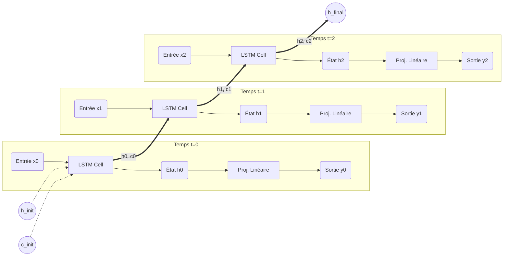

# Module Models (`src-tauri/src/ai/deep_learning/models`)

Ce module assemble les couches (layers) élémentaires pour former des architectures de réseaux complètes. L'objectif est de créer des modèles capables de traiter des séquences temporelles (comme du texte ou des logs) "from scratch".

## 1. Modèle : SequenceNet (`sequence_net.rs`)

`SequenceNet` est une architecture de type **RNN Many-to-Many** (ou Many-to-One selon la configuration). Elle utilise une cellule LSTM pour capturer les dépendances temporelles et une couche linéaire pour projeter l'état caché vers l'espace de sortie (ex: vocabulaire).

### Architecture Logique

Le schéma ci-dessous montre le "déroulement" (unrolling) du réseau sur 3 pas de temps.



---

### Spécification Mathématique

Soit une séquence d'entrée §X = (x_1, x_2, ..., x_T)§.
Le modèle calcule la séquence de sortie §Y = (y_1, y_2, ..., y_T)§ comme suit :

1. **Initialisation** :
   $$
   h_0 = 0, \quad c_0 = 0
   $$
2. **Récurrence (pour §t = 1 \dots T§)** :

- Mise à jour de la mémoire LSTM :
  $$
  (h*t, c_t) = \text{LSTMCell}(x_t, h*{t-1}, c\_{t-1})
  $$
- Décodage / Projection (calcul des logits) :
  $$
  y*t = \text{Linear}(h_t) = h_t W*{head}^T + b\_{head}
  $$

---

### Structure de Données (Rust)

```rust
use crate::ai::deep_learning::layers::{linear::Linear, rnn_cell::LSTMCell};

pub struct SequenceNet {
    pub lstm: LSTMCell,      // Le cœur récurrent (mémoire)
    pub head: Linear,        // La tête de lecture (décodeur)
    pub hidden_size: usize,  // Dimension interne
}

```

### Méthodes Requises

#### 1. `new(...)`

```rust
pub fn new(
    input_size: usize,
    hidden_size: usize,
    output_size: usize,
    vb: VarBuilder
) -> RaiseResult<Self>

```

- Initialise le `LSTMCell` (input -> hidden).
- Initialise le `Linear` (hidden -> output).

#### 2. `forward(...)`

```rust
pub fn forward(&self, input_seq: &Tensor) -> RaiseResult<Tensor>

```

- **Entrée** : Tenseur de forme `[batch_size, seq_len, input_size]`.
- **Processus** :

1. Boucler sur la dimension `seq_len`.
2. Extraire la tranche (slice) temporelle §x_t§.
3. Passer dans le LSTM.
4. Passer dans le Linear.
5. Empiler les résultats.

- **Sortie** : Tenseur de forme `[batch_size, seq_len, output_size]`.

#### 3. `forward_step(...)` (Optionnel mais utile pour la génération token par token)

```rust
pub fn forward_step(
    &self,
    input_step: &Tensor,
    state: (Tensor, Tensor)
) -> RaiseResult<(Tensor, (Tensor, Tensor))>

```

- Traite un seul pas de temps (utile pour l'inférence en temps réel).

---

## Utilisation Prévue

```rust
// 1. Création du modèle
let model = SequenceNet::new(10, 32, 50, vb)?; // 10 inputs features, 32 hidden units, 50 classes

// 2. Données (Batch=1, Seq=5, Features=10)
let input = Tensor::randn(0f32, 1.0, (1, 5, 10), &device)?;

// 3. Propagation
let output = model.forward(&input)?;
// output shape: [1, 5, 50]

```

```

```
