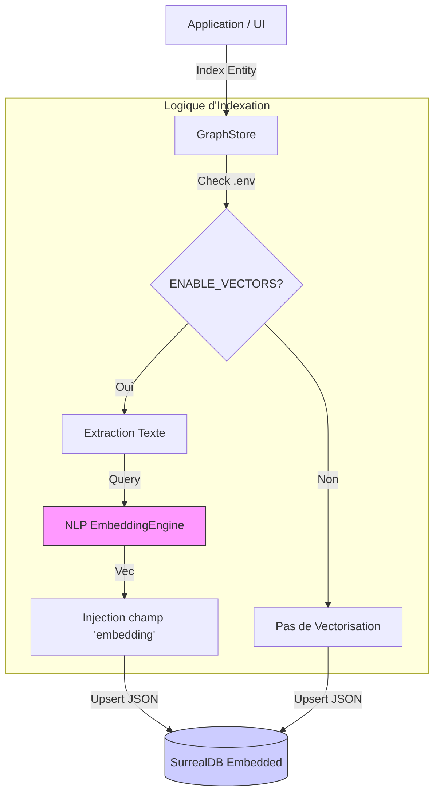

# 🧠 Graph Store (Hybrid Graph + Vector)

Ce module fournit une base de données locale **Multi-Modèle** pour RAISE. Il combine la persistance de graphe (Relations) et la recherche vectorielle (Sémantique) au sein d'une seule abstraction.

Il repose sur **SurrealDB** (mode embarqué `SurrealKv`) couplé optionnellement au moteur NLP de RAISE pour l'autovectorisation.

## 🌟 Architecture Hybride

Le `GraphStore` agit comme une couche intelligente au-dessus de la base de données brute.



## ⚙️ Configuration (.env)

La fonctionnalité vectorielle (coûteuse en ressources) est conditionnelle. Elle s'active via le fichier `.env` :

```bash
# true : Charge le modèle NLP (Candle/FastEmbed) et calcule les vecteurs à la volée.
# false : Mode base de données classique (Graphe/Document uniquement).
ENABLE_GRAPH_VECTORS=true

```

## 🚀 Fonctionnalités Clés

### 1. Indexation Auto-Vectorisée

Lorsque vous sauvegardez une entité, le Store analyse le JSON pour trouver du contenu textuel pertinent, génère un vecteur (384 dimensions), et l'injecte automatiquement.

**Stratégie d'extraction de texte (Ordre de priorité) :**

1. Champ `description`
2. Champ `content`
3. Champ `name`
4. Fallback : Dump complet du JSON.

### 2. Recherche Sémantique Hybride

Permet de rechercher des nœuds par sens plutôt que par mots-clés exacts.

```rust
// Recherche les 5 composants qui parlent sémantiquement de "propulsion"
let results = store.search_similar("component", "système de propulsion", 5).await?;

```

### 3. Relations Graphiques

Stocke les liens directionnels sans schéma rigide.

```rust
store.link_entities(
    ("person", "alice"),
    "working_on",
    ("project", "raise")
).await?;

```

---

## 📚 Guide d'Utilisation (API)

L'interaction se fait via la struct `GraphStore` (défini dans `mod.rs`), et non directement via `SurrealClient`.

### Initialisation

```rust
use crate::graph_store::GraphStore;
use std::path::PathBuf;

// Initialise la DB et charge le modèle IA si activé dans .env
let store = GraphStore::new(PathBuf::from("./data")).await?;

```

### Indexation (Upsert)

```rust
use serde_json::json;

// Si ENABLE_GRAPH_VECTORS=true, un champ "embedding" sera ajouté automatiquement
// basé sur la description "Base de données...".
store.index_entity("tech", "surreal", json!({
    "name": "SurrealDB",
    "description": "Base de données multi-modèle pour le web moderne."
})).await?;

```

### Recherche

```rust
// 1. Recherche Vectorielle (si activée)
// Renvoie les objets JSON enrichis d'un score de similarité (0.0 à 1.0)
let hits = store.search_similar("tech", "stockage données", 2).await?;

// 2. Suppression
store.remove_entity("tech", "surreal").await?;

```

---

## ⚠️ Détails Techniques (SurrealDB)

### Gestion des IDs

SurrealDB utilise le format `table:id`.

- Le `GraphStore` abstrait cela : vous passez `collection` ("table") et `id` ("id") séparément.
- En interne, les requêtes gèrent le cast `<string>id` pour garantir que le JSON retourné contient des IDs lisibles et non des objets binaires `Thing`.

### Performance

- **Démarrage** : Si les vecteurs sont activés, le premier lancement peut prendre 1-2 secondes (chargement des modèles ONNX/Rust).
- **Stockage** : Les vecteurs ajoutent ~1.5 Ko de données par entité (384 floats).

### Dépendances

Ce module dépend de :

- `surrealdb` (Feature `kv-surrealkv` pour l'embarqué).
- `crate::ai::nlp::embeddings` (Pour la vectorisation).

```

```
