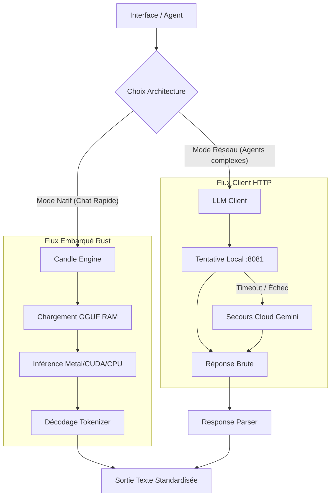

# Module `ai::llm` - Infrastructure Bas Niveau LLM

Ce module constitue la couche d'infrastructure (**Low-Level Layer**) de RAISE pour la communication avec les modèles de langage. Il fournit la "tuyauterie" technique permettant aux services de fonctionner sans se soucier de la complexité réseau ou de l'inférence locale.

Il supporte désormais deux modes de fonctionnement :

1.  **Client HTTP (Agnostique)** : Pour connecter des serveurs d'inférence externes (llama.cpp, vLLM) ou Cloud (Gemini).
2.  **Moteur Natif (Embedded)** : Pour exécuter des modèles (GGUF) directement dans le processus Rust via `Candle` (sans dépendance externe).

---

## 📂 Structure du Module

Voici l'organisation physique des fichiers de ce module :

```text
src-tauri/src/ai/llm/
├── mod.rs               # Point d'entrée : expose les structures et gère l'état global (NativeLlmState).
├── client.rs            # Client HTTP : gère la connexion réseau (llama.cpp/Gemini) et le Fallback.
├── candle_engine.rs     # [NOUVEAU] Moteur Natif : Inférence locale pure via HuggingFace Candle.
├── prompts.rs           # Personas : contient les constantes des "System Prompts".
├── response_parser.rs   # Nettoyeur : extrait le JSON/Code des réponses brutes.
└── tests.rs             # Validation : tests unitaires et d'intégration.

```

---

## 📊 Architecture & Flux de Données

Le système est **hybride**. Il permet de choisir le bon outil pour la bonne tâche.

### Schéma du Flux (Pipeline)



### Description des Moteurs

1. **Le Client HTTP (`client.rs`)** :

- Utilisé par les **Agents Autonomes** (Software, Intent, etc.).
- Avantage : Peut utiliser des modèles énormes (70B+) hébergés sur un serveur dédié ou dans le Cloud.
- Résilience : Bascule sur Gemini si le serveur local est éteint.

2. **Le Moteur Natif (`candle_engine.rs`)** :

- Utilisé par le **Chat Direct** ou les tâches rapides.
- Avantage : **Zéro configuration**. Pas besoin de Docker ni de Python. L'application télécharge et lance le modèle (ex: Llama 3.2 1B) toute seule.
- Performance : Utilise l'accélération matérielle (Metal sur Mac, CUDA sur Nvidia, AVX sur CPU).

---

## 💻 Exemples d'Utilisation (Rust)

### Cas 1 : Via le Client HTTP (Agents)

Utilisé pour les tâches complexes nécessitant un modèle puissant distant.

```rust
use crate::ai::llm::{client, prompts, response_parser};

async fn classify_user_request(user_input: &str) -> Result<serde_json::Value, String> {
    // 1. Initialisation
    let llm_client = client::LlmClient::new( );

    // 2. Prompting
    let full_prompt = format!("{}\nREQ: {}", prompts::INTENT_CLASSIFIER_PROMPT, user_input);

    // 3. Appel Réseau
    let raw_response = llm_client.ask_raw(&full_prompt).await.map_err(|e| e.to_string())?;

    // 4. Parsing
    let json_data = response_parser::extract_json(&raw_response).map_err(|e| e.to_string())?;
    Ok(json_data)
}

```

### Cas 2 : Via le Moteur Natif (Embedded)

Utilisé pour interagir avec le modèle chargé en mémoire (State Tauri).

```rust
use crate::ai::llm::NativeLlmState;
use tauri::State;

#[tauri::command]
pub async fn chat_with_local_model(
    state: State<'_, NativeLlmState>,
    prompt: String
) -> Result<String, String> {
    // 1. Récupération du verrou (Mutex)
    let mut guard = state.0.lock().map_err(|_| "Erreur Lock".to_string())?;

    // 2. Vérification si le modèle est chargé
    if let Some(engine) = guard.as_mut() {
        // 3. Génération directe (In-Process)
        // Pas de réseau, pas de JSON, c'est du "Raw Text"
        engine.generate("Tu es un assistant.", &prompt, 200)
            .map_err(|e| e.to_string())
    } else {
        Err("Le modèle charge encore...".to_string())
    }
}

```

---

## ⚙️ Configuration Requise

Variables d'environnement (fichier `.env`) :

### Configuration Client HTTP (Agents)

| Variable           | Description                                                                  |
| ------------------ | ---------------------------------------------------------------------------- |
| `RAISE_LOCAL_URL`  | URL du serveur d'inférence local (ex: `http://localhost:8081`)               |
| `LLM_MODEL_FILE`   | Fichier modèle chargé par le serveur (ex: qwen2.5-1.5b-instruct-q4_k_m.gguf) |
| `RAISE_GEMINI_KEY` | Clé API Google (Backup)                                                      |

### Configuration Moteur Natif (Rust/Candle)

Si ces variables ne sont pas définies, des valeurs par défaut (Llama 3.2 1B) sont utilisées.

| Variable                  | Description                      | Exemple / Recommandé                   |
| ------------------------- | -------------------------------- | -------------------------------------- |
| `LLM_RUST_REPO_ID`        | Dépôt HuggingFace du modèle GGUF | `bartowski/Llama-3.2-1B-Instruct-GGUF` |
| `LLM_RUST_MODEL_FILE`     | Nom du fichier GGUF spécifique   | `Llama-3.2-1B-Instruct-Q4_K_M.gguf`    |
| `LLM_RUST_TOKENIZER_REPO` | Dépôt contenant `tokenizer.json` | `unsloth/Llama-3.2-1B-Instruct`        |

---

## ✅ Validation

### Tester la logique générale

Pour vérifier le parser et le client HTTP :

```bash
cargo test ai::llm

```

### Tester le Moteur Natif (Téléchargement + Inférence)

**Attention :** Ce test télécharge le modèle (~700 Mo) lors de la première exécution.

```bash
cargo test candle_engine -- --ignored

```

```

```
