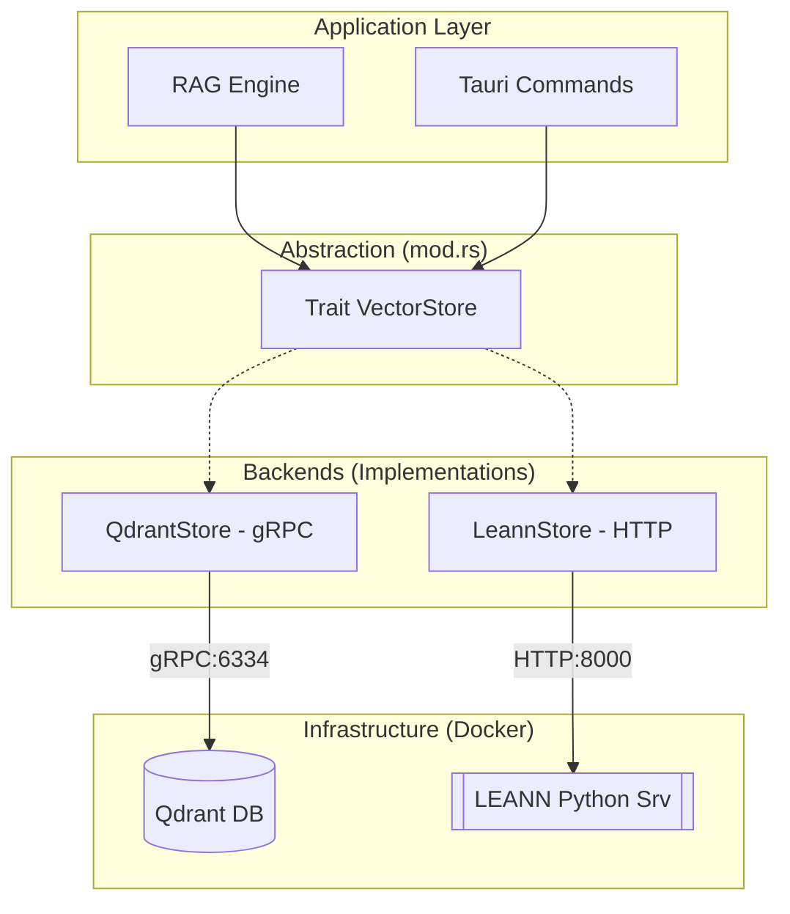

# Module Memory — Mémoire Sémantique Hybride

Ce module gère la **persistance sémantique** de l'IA (Long-Term Memory). Il agit comme l'hippocampe du système RAISE en stockant les documents et contextes sous forme vectorielle (embeddings) pour permettre une recherche par le sens plutôt que par mot-clé exact.

---

## 🏗️ Architecture : Pattern Strategy

Le module est conçu autour d'une architecture flexible qui découple la logique métier du moteur de stockage sous-jacent.



### 1. L'Abstraction (`VectorStore`)

Nous définissons une interface générique (Trait) `VectorStore`. Tout moteur de base de données doit implémenter ces méthodes atomiques :

- `init_collection` : Prépare l'index ou la table (ex: dimension des vecteurs).
- `add_documents` : Stocke les documents, leurs vecteurs et leurs métadonnées.
- `search_similarity` : Retrouve les documents les plus proches avec support du **filtrage par métadonnées**.

### 2. Les Moteurs (Backends)

| Caractéristique | **Qdrant** (`qdrant_store.rs`) | **LEANN** (`leann_store.rs`)   |
| --------------- | ------------------------------ | ------------------------------ |
| **Type**        | Serveur DB Autonome (Rust)     | Librairie/Service Python léger |
| **Protocole**   | **gRPC**                       | **HTTP/REST**                  |
| **Performance** | Très Haute (Production)        | Moyenne (Optimisé Low-RAM)     |
| **Usage Idéal** | Serveur, Cloud, Gros volumes   | Local-first, Laptop, Embarqué  |

---

## ⚙️ Configuration des Ports & Environnement

Le module s'appuie sur les variables d'environnement définies dans le fichier `.env` à la racine du projet pour la communication avec l'infrastructure Docker.

| Variable           | Port par défaut         | Description                                                            |
| ------------------ | ----------------------- | ---------------------------------------------------------------------- |
| `PORT_QDRANT_GRPC` | `6334`                  | Port de communication binaire pour l'ingestion et la recherche Qdrant. |
| `PORT_LEANN`       | `8000`                  | Port de l'API REST pour le moteur de recherche léger LEANN.            |
| `QDRANT_URL`       | `http://127.0.0.1:6334` | URL complète utilisée par le client Rust pour Qdrant.                  |

---

## 🚀 Utilisation

Le choix du moteur se fait à l'initialisation. Grâce au polymorphisme, le reste de l'application manipule uniquement un `Box<dyn VectorStore>`.

```rust
use crate::ai::memory::{leann_store::LeannMemory, qdrant_store::QdrantMemory, VectorStore};

async fn setup_memory(use_cloud: bool) -> Result<Box<dyn VectorStore>, anyhow::Error> {
    let store: Box<dyn VectorStore> = if use_cloud {
        let port = std::env::var("PORT_QDRANT_GRPC").unwrap_or("6334".to_string());
        Box::new(QdrantMemory::new(&format!("http://127.0.0.1:{}", port))?)
    } else {
        let port = std::env::var("PORT_LEANN").unwrap_or("8000".to_string());
        Box::new(LeannMemory::new(&format!("http://127.0.0.1:{}", port))?)
    };

    // Initialisation & Recherche
    store.init_collection("ma_base", 384).await?;
    let results = store.search_similarity("ma_base", &vec![0.1; 384], 5, 0.4, None).await?;

    Ok(store)
}

```

---

## 🧪 Tests & Validation

Le module contient des tests unitaires et d'intégration consolidés.

### Tests Unitaires (Statique)

Vérifie la logique interne et les clients sans nécessiter de base de données active.

```bash
cargo test ai::memory

```

### Tests d'Intégration (Dynamique)

Ces tests vérifient la connexion réelle aux backends. Ils sont marqués `#[ignore]` et **paniquent explicitement** si Qdrant ou LEANN ne sont pas accessibles sur les ports configurés.

```bash
# Lancer les tests d'intégration (Nécessite Docker up)
cargo test ai::memory -- --ignored --nocapture

```

---

## 📂 Structure des Fichiers

```text
src-tauri/src/ai/memory/
├── mod.rs            # Interface VectorStore, Structs & Tests d'intégration
├── qdrant_store.rs   # Implémentation gRPC pour Qdrant
├── leann_store.rs    # Implémentation HTTP pour le wrapper Python
└── README.md         # Documentation du module

```
