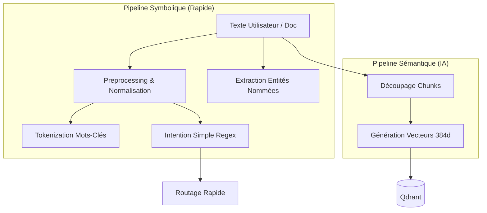

# Module `ai/nlp` — Traitement du Langage Naturel

Ce module regroupe les outils de **bas niveau** pour la manipulation technique du texte dans RAISE. Il combine des approches **Symboliques** (Règles, Regex) et **Sémantiques** (Vecteurs IA) pour préparer les données avant leur traitement par les Agents ou le RAG.

Il sert de bibliothèque utilitaire transversale pour `llm` (gestion du contexte) et `context` (préparation des données RAG).

---

## 🎯 Objectifs

1.  **Normalisation** : Nettoyer le texte utilisateur (accents, majuscules, stop words) pour standardiser les recherches.
2.  **Extraction d'Entités** : Identifier les concepts clés (Noms propres, Types Arcadia) sans appeler le LLM.
3.  **Vectorisation (Embeddings)** : Transformer le texte en vecteurs mathématiques (`Vec<f32>`) via GPU ou CPU pour la recherche sémantique.
4.  **Découpage (Chunking)** : Diviser intelligemment les documents longs pour le RAG.

---

## 📂 Architecture & Flux

Le module est divisé en deux pipelines complémentaires :



---

## 🧩 Sous-Modules Implémentés

### 1. `embeddings` (Moteur Vectoriel)

Gère la transformation Texte -> Vecteur.

- **Support Hybride** : Utilise **Candle** (Rust Natif + GPU CUDA/Metal) par défaut, avec fallback sur **FastEmbed** (ONNX).
- **Modèle** : `all-MiniLM-L6-v2` (384 dimensions).
- **Documentation détaillée** : Voir `src-tauri/src/ai/nlp/embeddings/README.md`.

### 2. `preprocessing` (Nettoyage)

Prépare le texte pour l'analyse.

- **Normalisation** : Conversion minuscule, suppression des accents (ex: "Hélène" -> "helene").
- **Stop Words** : Filtrage des mots vides français ("le", "la", "pour", "avec"...).
- **Ponctuation** : Remplacement des caractères spéciaux par des espaces.

### 3. `entity_extractor` (NER - Named Entity Recognition)

Extraction heuristique sans LLM (Regex).

- **Types Arcadia** : Détecte `Fonction`, `Composant`, `Acteur`, `Interface`, etc.
- **Noms Propres** : Détecte les séquences avec Majuscules (ex: "Station Sol").
- **Citations** : Capture le contenu entre guillemets.

### 4. `parser` (Intentions Rapides)

Classification d'intention basée sur des règles (Zero-Latency).

- Détecte les actions simples : `Create`, `Delete`, `Search`, `Explain`.
- Permet de court-circuiter le LLM pour des commandes basiques.

### 5. `splitting` (Chunking)

Découpage de documents pour le RAG.

- Utilise la crate `text-splitter`.
- Respecte la sémantique (paragraphes) et une limite de tokens définie.

### 6. `tokenizers` (Analyse Lexicale)

Outils légers pour la recherche par mots-clés.

- `tokenize` : Produit une liste de mots-clés normalisés.
- `truncate_tokens` : Coupe une chaîne pour respecter une fenêtre contextuelle (heuristique).

---

## 🚀 Exemples d'Utilisation

### Pipeline de Recherche (Search)

```rust
use crate::ai::nlp::{preprocessing, tokenizers};

let query = "Je veux chercher le composant 'Moteur'";
// 1. Extraction Entités
let entities = entity_extractor::extract_entities(query);
// -> Entity { text: "Moteur", category: QuotedLiteral }

// 2. Tokenization pour Index Inversé
let keywords = tokenizers::tokenize(query);
// -> ["veux", "chercher", "composant", "moteur"]

```

### Pipeline d'Indexation (RAG)

```rust
use crate::ai::nlp::{splitting, embeddings};

let doc_content = "Texte très long...";
// 1. Découpage
let chunks = splitting::split_text_into_chunks(doc_content, 512);

// 2. Vectorisation (GPU si dispo)
let mut engine = embeddings::EmbeddingEngine::new()?;
let vectors = engine.embed_batch(chunks)?;

```

---

## 📊 État d'Avancement

| Composant            | Statut        | Technologie                    |
| -------------------- | ------------- | ------------------------------ |
| **Preprocessing**    | ✅ Implémenté | Regex / Chars mapping          |
| **Embeddings**       | ✅ Implémenté | Candle (GPU) / FastEmbed (CPU) |
| **Entity Extractor** | ✅ Implémenté | Regex Heuristique              |
| **Parser (Intent)**  | ✅ Implémenté | Rule-Based                     |
| **Splitter**         | ✅ Implémenté | `text-splitter`                |
| **Tokenizers**       | ✅ Implémenté | Whitespace / Heuristique       |

---

## ⚠️ Notes Techniques

- **Performance** : Le module est conçu pour être "Zero-Latency" sur le chemin critique (Parser/Extractor). Seuls les Embeddings peuvent prendre quelques millisecondes (accélérés par GPU).
- **Langue** : Optimisé pour le **Français** (Stopwords, Accents), mais compatible Anglais par défaut.

```

```

```

```
