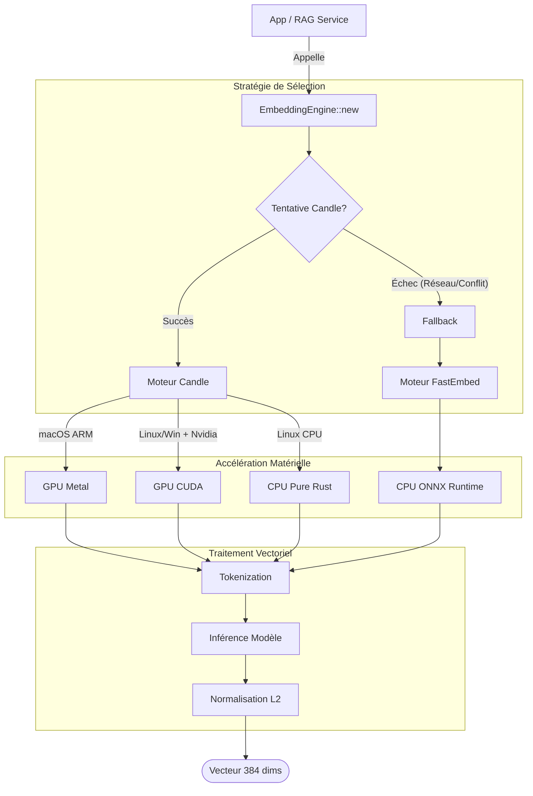

# 🧠 NLP Embeddings Engine

Ce module gère la vectorisation de texte (Text Embedding), brique fondamentale du système RAG (Retrieval-Augmented Generation) de RAISE. Il transforme le langage naturel en vecteurs mathématiques comparables pour permettre la recherche sémantique dans Qdrant.

## 🏗 Architecture

Le moteur utilise un **Pattern Stratégie** pour abstraire l'implémentation sous-jacente. L'interface publique est fournie par `EmbeddingEngine` dans `mod.rs`. Il sélectionne automatiquement la meilleure implémentation disponible selon l'environnement.

### Diagramme de Flux



### Moteurs Disponibles

#### 1. Candle (Pure Rust + GPU/Accelerate) - _Prioritaire_

- **Fichier** : `candle.rs`
- **Technologie** : Framework ML natif Rust de Hugging Face.
- **Modèle** : `sentence-transformers/all-MiniLM-L6-v2` (384 dimensions).
- **Performance** :
- **macOS (Apple Silicon)** : Utilise l'accélération **Metal** (très rapide).
- **Linux/Windows (Nvidia)** : Utilise **CUDA** (si configuré).
- **Linux (CPU)** : Utilise **MKL/OpenBLAS** (via la feature `accelerate` si activée, ou CPU pur).

- **Avantage** : Contrôle total, pas de dépendance Python/ONNX externe, support GPU natif.

#### 2. FastEmbed (ONNX Runtime) - _Fallback_

- **Fichier** : `fast.rs`
- **Technologie** : Runtime ONNX via la crate `fastembed`.
- **Modèle** : `BAAI/bge-small-en-v1.5` (384 dimensions).
- **Usage** : Utilisé si Candle échoue à s'initialiser ou si l'utilisateur force ce mode. Très performant sur CPU standard.

## 📂 Structure des Fichiers

```text
src-tauri/src/ai/nlp/embeddings/
├── mod.rs       # Façade publique et logique de sélection (Factory).
├── fast.rs      # Implémentation CPU-Optimized (FastEmbed/ONNX).
└── candle.rs    # Implémentation GPU-Capable (Candle/BERT).

```

## 🚀 Utilisation

```rust
use crate::ai::nlp::embeddings::{EmbeddingEngine, EngineType};

async fn example() -> Result<()> {
    // 1. Initialisation (Auto-détection GPU/CPU)
    // Télécharge les modèles automatiquement au premier lancement (~90 Mo)
    let mut engine = EmbeddingEngine::new()?;

    // 2. Vectorisation d'une requête (pour la recherche)
    let query_vec = engine.embed_query("Comment créer un acteur logique ?")?;
    println!("Vecteur de dimension : {}", query_vec.len()); // Toujours 384

    // 3. Vectorisation par lot (pour l'indexation massive)
    let docs = vec![
        "L'ingénierie système est complexe.".to_string(),
        "Arcadia définit 5 couches.".to_string()
    ];
    let batch_vecs = engine.embed_batch(docs)?;

    Ok(())
}

```

## ⚙️ Configuration (Cargo.toml)

La performance dépend des "features" activées dans `src-tauri/Cargo.toml`.

### Pour macOS (Apple Silicon)

```toml
candle-core = { version = "...", features = ["metal", "accelerate"] }

```

### Pour Linux / Windows (NVIDIA)

```toml
# Nécessite CUDA Toolkit installé (nvcc)
candle-core = { version = "...", features = ["cuda"] }

```

### Pour Linux / Serveur (CPU Universel)

```toml
# Configuration par défaut la plus stable
candle-core = { version = "...", features = [] }

```

## 📦 Gestion du Cache

Les modèles sont téléchargés automatiquement lors de la première exécution :

- **Candle** : Cache standard Hugging Face (`~/.cache/huggingface/hub`).
- **FastEmbed** : Cache local `src-tauri/.fastembed_cache/` (ignoré par Git).

## ⚠️ Notes Techniques

1. **Dimensions** : Les deux moteurs sont configurés pour sortir des vecteurs de taille **384**. C'est la taille standard pour les modèles "Small" (MiniLM, BGE-Small) qui offrent le meilleur compromis vitesse/précision pour du RAG local.
2. **Normalisation** : Les vecteurs de sortie sont **normalisés (L2 Norm)**. C'est crucial pour que la "Cosine Similarity" (utilisée par Qdrant) fonctionne correctement via un simple produit scalaire.
3. **Thread Safety** : L'instanciation du moteur peut prendre du temps (chargement modèle). Il est recommandé de l'instancier une fois au démarrage de l'app (dans le `State` Tauri) et de le réutiliser.

```

```
