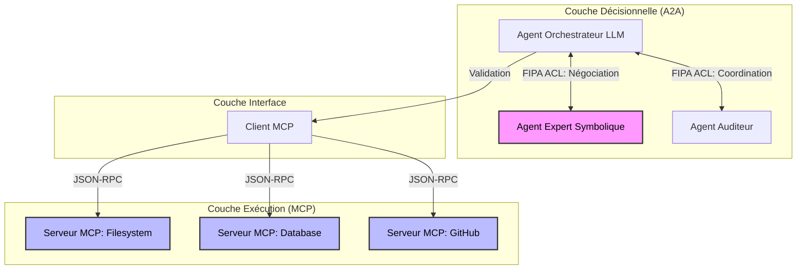
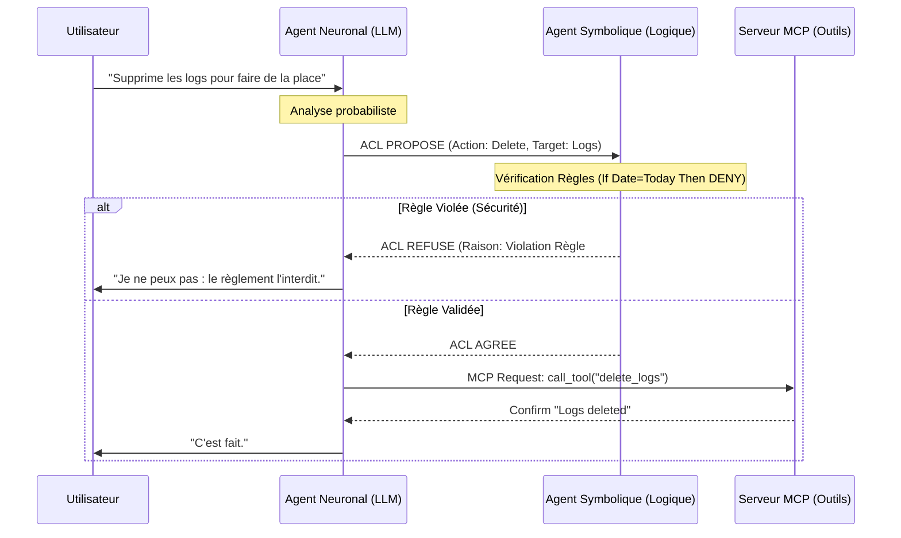

# Protocoles IA : Architecture Neuro-Symbolique (A2A & MCP)

Ce module implémente les standards de communication qui structurent l'intelligence de Raise.
Il concrétise l'approche **Neuro-Symbolique** en séparant strictement la _négociation_ (l'intention) de l' _exécution_ (l'action).

## 1. Philosophie : Le Cerveau Bicaméral

Pour éviter les hallucinations et garantir la sécurité industrielle (DO-178C), Raise n'utilise pas un LLM monolithique, mais une chaîne de commande :

1.  **Couche Décisionnelle (A2A) :** Un "Conseil d'Administration" où des agents neuronaux (créatifs) et symboliques (règles strictes) débattent.
2.  **Couche Exécutive (MCP) :** Des "Bras" techniques qui exécutent les ordres validés sans ambiguïté.

### Comparatif des Protocoles

| Critère              | **A2A (FIPA ACL)**                                      | **MCP (Model Context Protocol)**                             |
| :------------------- | :------------------------------------------------------ | :----------------------------------------------------------- |
| **Rôle**             | **Coordination Sociale** : Négocier, demander, refuser. | **Connexion Technique** : Lire un fichier, requêter une API. |
| **Philosophie**      | "Actes de Langage" (L'intention prime).                 | "Plug-and-Play" (L'accès prime).                             |
| **Abstraction**      | **Haut** : "Je _veux_ que tu fasses X".                 | **Bas** : "Exécute la fonction Y".                           |
| **Gestion d'Erreur** | Sociale (Refus, Contre-proposition).                    | Technique (Exception, Timeout).                              |
| **Analogie**         | Le **Langage** (Diplomatie).                            | La **Main** (Outil).                                         |

---

## 2. Architecture en Couches : Traçabilité et Rôles

Cette architecture sépare strictement la prise de décision ("Pourquoi on le fait") de l'exécution technique ("Comment on le fait").



### Bénéfices pour la Sécurité :

- **Isolation :** Les agents LLM (Couche Décisionnelle) n'ont _aucun_ accès direct aux Serveurs MCP. Ils doivent passer par le Client MCP, qui n'obéit qu'aux ordres validés.
- **Audit :** L'Agent Auditeur (C) enregistre les décisions avant qu'elles ne deviennent des actions.

---

## 3. Le Flux de Contrôle Sécurisé

Le but principal est d'empêcher un LLM d'utiliser directement un outil critique. Il doit passer par une "Soupape de Sécurité" logique.

### Diagramme de Séquence (Validation)



---

## 4. Détails Techniques

### Protocol A2A (Agent-to-Agent)

Défini dans `acl.rs`. Utilise des **Performatifs** pour typer l'échange :

- `REQUEST` : Demande d'action.
- `PROPOSE` : Proposition de solution (souvent par le LLM).
- `REFUSE` : Le "Non" logique (émis par le Moteur de Règles).
- `CONFIRM` : Le feu vert pour passer à l'étape MCP.

### Protocol MCP (Model Context Protocol)

Défini dans `mcp.rs`. Standardise l'appel d'outil via JSON-RPC :

- `ToolCall` : Nom de l'outil + Arguments JSON.
- `ToolResult` : Succès ou Erreur technique.

```


```
