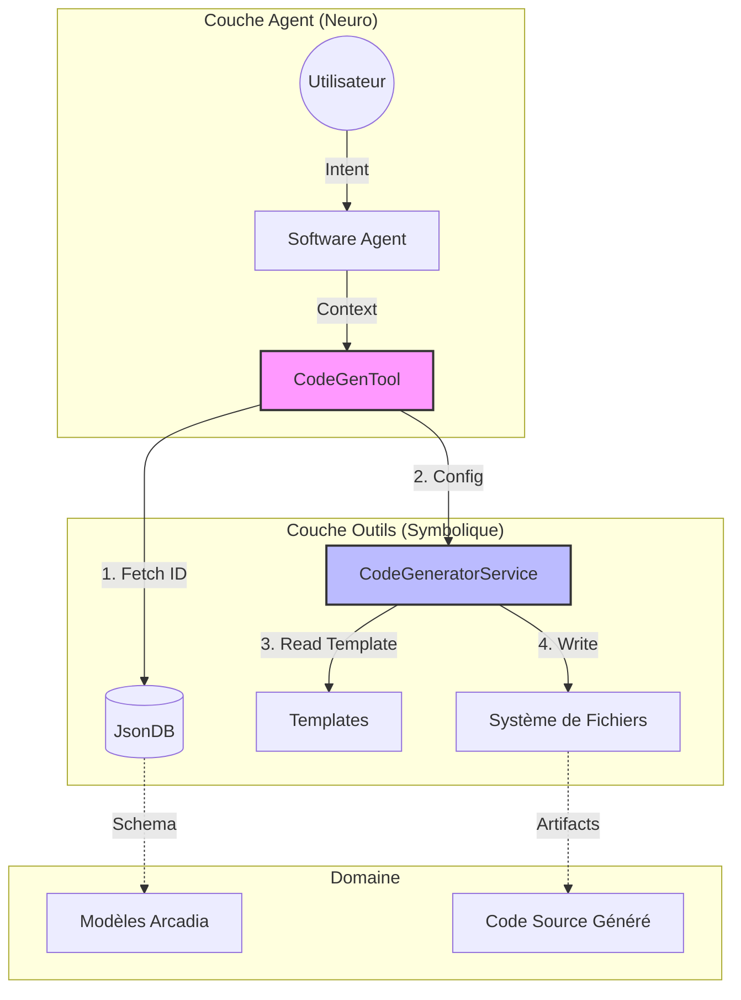
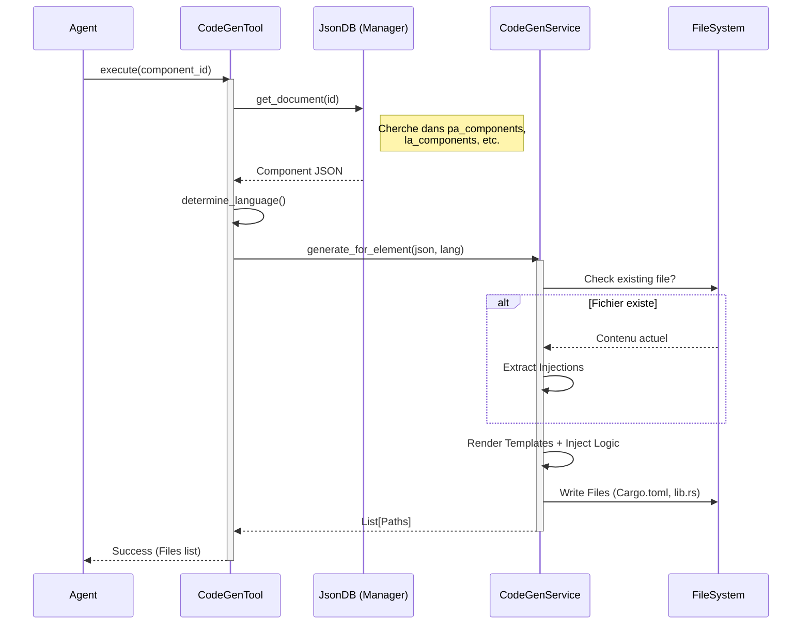
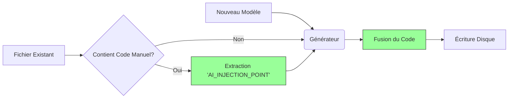

# AI Tools (Moteur d'Exécution Symbolique)

Ce module contient les **outils MCP (Model Context Protocol)** utilisés par les agents intelligents (Software Agent, etc.) pour interagir avec le système de fichiers, la base de données et le moteur de génération de code.

C'est ici que s'opère le **"Grounding"** (l'ancrage) : l'IA passe de la génération de texte probabiliste à l'exécution d'actions déterministes et sécurisées.

## 📐 Architecture Globale



## 🛠️ Outils Disponibles

### 1. `CodeGenTool` (`codegen_tool.rs`)

**Nom MCP :** `generate_component_code`

C'est l'outil principal pour l'ingénierie logicielle. Il fait le pont entre le modèle système et le code physique.

**Fonctionnalités Clés :**

- **Smart Linking :** Retrouve la configuration complète via UUID.
- **Multi-Langage :** Supporte Rust, C++, Python, VHDL, etc..
- **Round-Trip Engineering :** Préserve le code manuel utilisateur.

#### Flux d'Exécution



---

### 2. `FileWriteTool` (`file_system.rs`)

**Nom MCP :** `fs_write`

Outil bas niveau permettant à un agent d'écrire ou de modifier des fichiers spécifiques.

**Sécurité :**

- **Sandbox :** L'outil est restreint à un `root_dir`.
- **Path Traversal :** Bloque les tentatives type `../secret.txt`.

## 🛡️ Sécurité & Round-Trip

### Protection du code manuel

Le système utilise des balises d'injection pour permettre la collaboration Homme-Machine. L'IA n'écrase jamais le code situé entre ces balises.



**Exemple de code protégé :**

```rust
pub fn analyser_flux_video() {
    // AI_INJECTION_POINT: analyser_flux_video
    // Le code écrit ici est IMMUABLE pour l'IA.
    opencv::process(...);
    // END_AI_INJECTION_POINT
}

```

## 🧪 Tests

Chaque outil dispose de tests unitaires et d'intégration robustes.

```bash
# Tester la génération complète (DB -> Tool -> Fichier)
cargo test ai::tools::codegen_tool

# Tester la sécurité du système de fichiers
cargo test ai::tools::file_system


```
