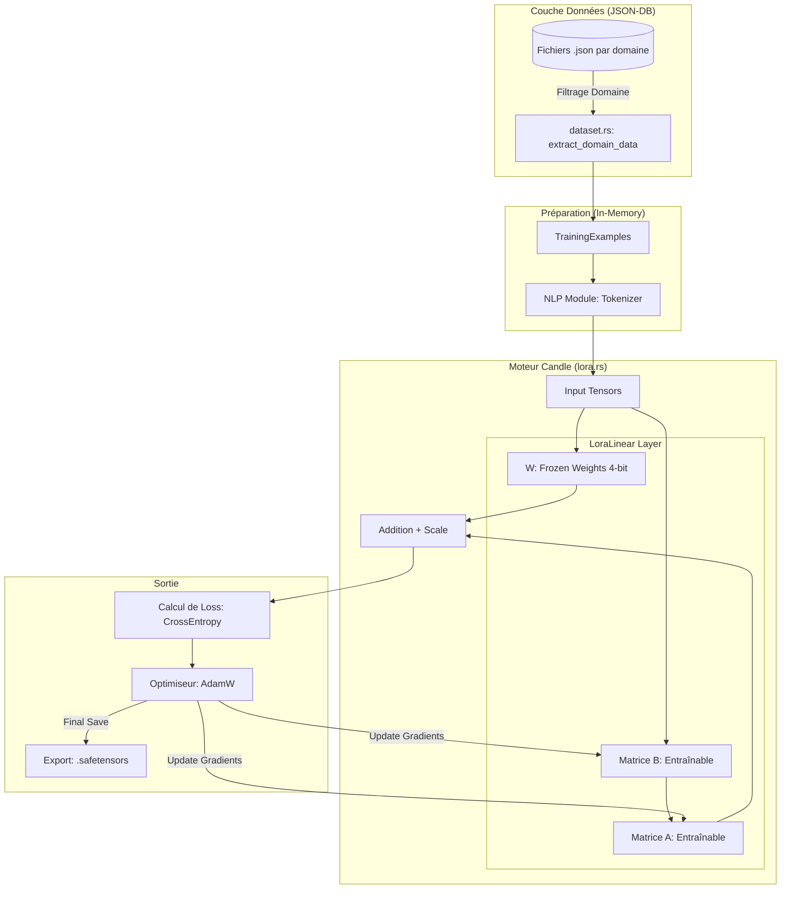

# 🎓 AI Training & Fine-Tuning Module (Native Rust)

Ce module gère la préparation des données et l'entraînement **Fine-Tuning** au sein de l'application. Il utilise **Candle** (HuggingFace) pour un entraînement QLoRA natif, permettant de spécialiser l'IA par domaine métier sans dépendre de Python.

## 📂 Structure du Module et Arborescence

L'organisation des fichiers suit une séparation stricte entre la gestion des données, la structure mathématique des modèles et l'orchestration Tauri :

```text
src-tauri/src/ai/training/
├── mod.rs              # Point d'entrée, commandes Tauri et orchestration
├── dataset.rs          # Extraction, filtrage par domaine et formatage JSON-DB
├── lora.rs             # Implémentation technique des couches LoraLinear (Matrices A & B)
└── README.md           # Documentation technique et mathématique

```

### Rôle des fichiers :

- **`mod.rs`** : Contient la commande `ai_train_domain_native`. Il initialise le `VarMap`, configure l'optimiseur AdamW et gère la boucle d'entraînement ainsi que la sauvegarde finale des adaptateurs.
- **`dataset.rs`** : Gère l'interface avec le `StorageEngine`. Il filtre les collections de la base de données selon le domaine (ex: "safety") et transforme les documents bruts en structures `TrainingExample` (Instruction/Input/Output).
- **`lora.rs`** : Définit la logique des tenseurs. C'est ici qu'est injectée la branche de bas rang qui permet l'apprentissage sans modifier les poids originaux du modèle.

## 🏗️ Architecture du Système

Le flux de travail est entièrement intégré au backend Rust :



## ➗ Détails Mathématiques : L'opération LoRA

L'adaptation de bas rang (LoRA) permet de ne pas modifier la matrice de poids originale (gelée), mais d'ajouter une déviation apprise par deux matrices plus petites et .

Pour une entrée de dimension , le calcul se décompose ainsi :

1. **Branche Standard (Frozen) :**
   Calcul de la sortie classique du modèle :

2. **Branche LoRA (Adaptation) :**
   L'entrée subit une réduction puis une projection :

- **Réduction () :** (où est de dimension ). Résultat : .
- **Projection () :** (où est de dimension ). Résultat : .

3. **Combinaison :**

Le facteur `scale` est défini par .

## 🚀 Utilisation (Tauri)

L'entraînement est déclenché depuis le frontend par domaine métier :

```typescript
await invoke('ai_train_domain_native', {
  space: 'Projet_Arcadia',
  dbName: 'main_db',
  domain: 'safety',
  epochs: 5,
  lr: 0.0001,
});
```

## 🧪 Validation et Tests

Le module inclut des tests unitaires pour garantir la stabilité :

- **Dimensions** : Vérifie que le calcul matriciel respecte les formes .
- **Filtrage** : Valide que seules les collections du domaine demandé sont extraites de JSON-DB.

```bash
cargo test ai::training

```

---
