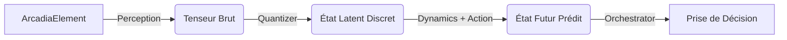

# RAISE World Model (Moteur Neuro-Symbolique)

Ce module implémente le "Jumeau Numérique Cognitif" de l'architecture RAISE. Il permet à l'IA de passer d'un raisonnement purement linguistique (LLM) à un raisonnement spatial et causal (Simulation).

## 🎯 Vision & Philosophie

L'ingénierie système critique ne peut se satisfaire d'approximations probabilistes. Notre approche neuro-symbolique vise à hybrider deux mondes :

1.  **La Rigueur (Symbolique) :** Portée par le `model_engine` et la méthode Arcadia, qui garantissent la cohérence structurelle et le respect des règles métier.
2.  **L'Intuition (Neuronal) :** Portée par ce **World Model**, capable d'apprendre la dynamique du système pour anticiper des pannes ou proposer des optimisations complexes que des règles statiques ne peuvent voir.

> **Le mantra :** _"Reasoning is Simulation"._ Une IA qui ne peut pas simuler les conséquences de ses actions dans un modèle mental ne peut pas raisonner de manière fiable sur un système critique.

## Structure du Module

```text
src-tauri/src/ai/world_model/
├── mod.rs               # Exportations publiques
├── engine.rs            # Moteur central (NeuroSymbolicEngine) & Gestion des Actions
├── training.rs          # Coach d'apprentissage (WorldTrainer)
├── README.md            # Ce fichier
├── perception/          # SOUS-SYSTÈME 1 : L'OEIL (Encodage)
│   ├── mod.rs
│   ├── encoder.rs
│   └── README.md
├── representation/      # SOUS-SYSTÈME 2 : LE CONCEPT (Quantification)
│   ├── mod.rs
│   ├── quantizer.rs
│   └── README.md
└── dynamics/            # SOUS-SYSTÈME 3 : LE SIMULATEUR (Prédiction)
    ├── mod.rs
    ├── predictor.rs
    └── README.md

```

## Architecture JEPA (Joint-Embedding Predictive Architecture)

Le fonctionnement suit le paradigme des architectures prédictives à embedding joint :

### 1. Perception (`/perception`)

- **Rôle :** Grounding (Ancrage).
- **Implémentation :** `ArcadiaEncoder`.
- **Technique :** Encodage **One-Hot** hybride (Couche + Catégorie) produisant un vecteur de dimension 15.

### 2. Représentation (`/representation`)

- **Rôle :** Abstraction.
- **Implémentation :** `VectorQuantizer`.
- **Technique :** Quantification Vectorielle (VQ). Mappe les observations continues vers un **Codebook** de concepts discrets.

### 3. Dynamique (`/dynamics`)

- **Rôle :** Prédiction.
- **Implémentation :** `WorldModelPredictor` (MLP).
- **Technique :** Prédit l'état futur dans l'espace latent en fonction de l'état actuel et de l'action (). Utilise une activation **GELU**.

## Flux de Données (Simulation)



## Apprentissage & Entraînement (`training.rs`)

Le système n'est pas statique, il apprend de ses erreurs grâce au `WorldTrainer`.

- **Méthode :** Apprentissage auto-supervisé (Self-Supervised Learning).
- **Optimiseur :** **AdamW** (Weight Decay).
- **Loss Function :** **MSE** (Mean Squared Error) entre l'état prédit par le modèle et l'état réel observé après l'action.
- **Cycle :**

1. L'Orchestrateur propose une action.
2. L'action est exécutée (ou simulée par l'utilisateur).
3. Le Trainer compare la prédiction à la réalité.
4. Rétro-propagation des gradients pour ajuster les poids du réseau.

## Persistance & Stockage

Le "Cerveau" est sauvegardé localement pour garantir la continuité de l'apprentissage.

- **Format :** `.safetensors` (Format sûr et rapide de HuggingFace).
- **Contenu :** Poids du Codebook (Quantizer) + Poids du MLP (Predictor).
- **Gestion :** Thread-safe via `tokio::spawn_blocking` pour ne pas figer l'interface utilisateur lors des sauvegardes.

## Intégration

Ce module est piloté par le **`AiOrchestrator`** (`src/ai/orchestrator.rs`) qui l'utilise pour :

1. **Simuler** les conséquences des commandes utilisateur (`Create`/`Delete`) avant confirmation.
2. **Apprendre** (`reinforce_learning`) en continu à partir des interactions réelles.

```

```
