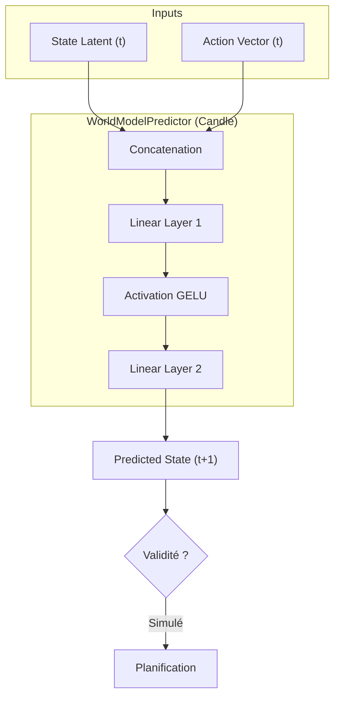

# Module Dynamique (Le Simulateur)

Le sous-module **Dynamique** est le moteur prédictif du World Model. C'est lui qui introduit la dimension temporelle et causale dans le cerveau de l'IA.

Il est implémenté via `candle-nn` et réside principalement dans `predictor.rs`.

## 🎯 Objectif

Apprendre et simuler la "Physique du Système".
Il ne s'agit pas de physique newtonienne (gravité), mais de la **logique d'évolution** des architectures Arcadia.

> **Analogie :** C'est le cortex préfrontal. Il permet de répondre à la question : _"Si je fais cette action maintenant, quel sera l'état du système à l'étape suivante ?"_

## Structure du Module

```text
dynamics/
├── mod.rs          # Exportations publiques
├── predictor.rs    # Implémentation du WorldModelPredictor (Réseau de Neurones)
└── README.md       # Documentation (ce fichier)
```

## Fonctionnement : Predictor Latent

Contrairement aux LLMs qui prédisent le mot suivant (token textuel), ce module prédit le **Vecteur Latent suivant** dans l'espace abstrait défini par le module _Représentation_.

### L'Équation Fondamentale

- : L'état actuel (Vectoriel/Quantifié) provenant du `VectorQuantizer`.
- : L'action proposée (encodée en tenseur One-Hot ou Embedding).
- : L'estimation de l'état futur (Tenseur).

### Architecture Technique (`predictor.rs`)

L'implémentation actuelle utilise un **MLP (Multi-Layer Perceptron)** performant pour la fusion des données :

1. **Early Fusion** : Les tenseurs d'État () et d'Action () sont concaténés en entrée.
2. **Couche 1 (Linear)** : Projection vers une dimension cachée (`hidden_dim`).
3. **Activation** : Utilisation de **GELU** (Gaussian Error Linear Unit) pour la non-linéarité.
4. **Couche 2 (Linear)** : Projection vers la dimension de sortie (identique à l'état latent).

## Flux de Données



## Utilisation

Ce module est orchestré par le `NeuroSymbolicEngine`.

```rust
// Exemple conceptuel d'utilisation dans l'engine
let state_t = ...; // Tenseur d'état actuel
let action_t = ...; // Tenseur d'action

// Le prédicteur calcule l'état futur probable
let predicted_state = engine.predictor.forward(&state_t, &action_t)?;

```

## Évolutions Futures

- **Transformer Block** : Remplacer le MLP simple par un bloc Transformer si la complexité des dépendances temporelles augmente (séquences d'actions longues).
- **Incertitude** : Ajouter une tête de prédiction de variance pour estimer la confiance du modèle dans sa propre prédiction.

```


```

```

```
