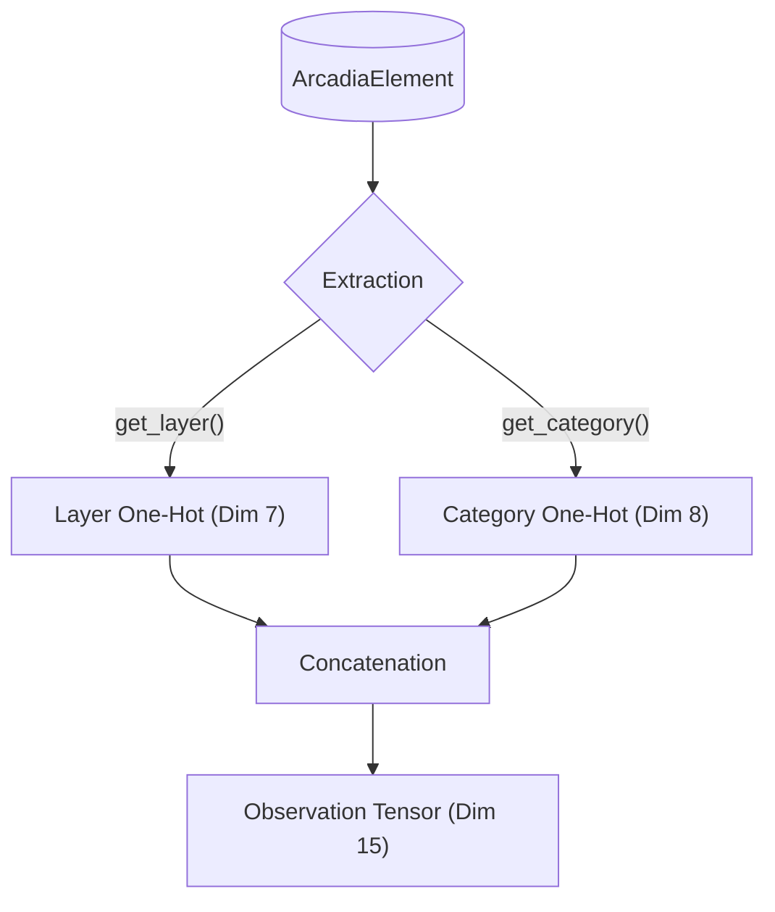

# Module Perception (L'Œil du Système)

Le sous-module **Perception** est la première étape du pipeline Neuro-Symbolique. Il assure le **Grounding** (Ancrage) des concepts d'ingénierie système dans l'espace vectoriel.

Il est implémenté dans `encoder.rs`.

## 🎯 Objectif

Traduire les structures de données typées du `model_engine` (ArcadiaElement) en tenseurs normalisés exploitables par les réseaux de neurones (Candle).

> **Analogie :** C'est la rétine de l'IA. Elle transforme la lumière (Données Brutes) en signaux nerveux (Tenseurs).

## Stratégie d'Encodage Actuelle

L'encodeur actuel (`ArcadiaEncoder`) est **stateless** (sans état) et utilise une concaténation de vecteurs **One-Hot**.

### Vecteur de Sortie (Dimension Totale : 15)

Le tenseur résultant est la fusion de deux vecteurs sémantiques :

1.  **Layer Encoding (Dimension 7)** : Quelle est la couche d'abstraction ?
    - Indices : `0:OA`, `1:SA`, `2:LA`, `3:PA`, `4:EPBS`, `5:Data`, `6:Unknown`.
2.  **Category Encoding (Dimension 8)** : Quelle est la nature de l'élément ?
    - Indices : `0:Component`, `1:Function`, `2:Actor`, `3:Exchange`, `4:Interface`, `5:Data`, `6:Capability`, `7:Other`.

### Schéma de Fusion (Feature Fusion)



## Implémentation Technique

- **Fichier :** `src-tauri/src/ai/world_model/perception/encoder.rs`
- **Struct :** `ArcadiaEncoder` (Utilitaire statique)
- **Dépendances :**
- `candle_core` : Pour la création des Tenseurs CPU.
- `model_engine` : Pour l'extraction sémantique via les Traits Arcadia.

## Évolutions Futures

- **Encodage Structurel** : Ajouter des métriques de graphe (degré, centralité) au vecteur.
- **Embeddings Textuels** : Utiliser un petit modèle (BERT/SentenceTransformers) pour encoder le nom et la description de l'élément et le concaténer au vecteur actuel.

```


```
