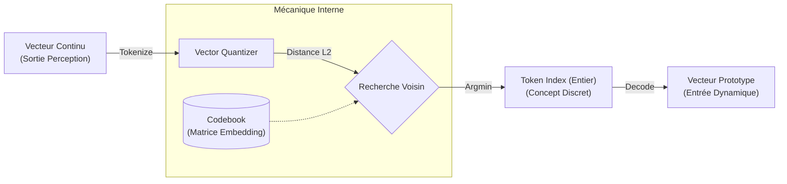

# Module Représentation (L'Espace Latent)

Le sous-module **Représentation** est le cœur de l'abstraction. Il structure l'information perçue pour la rendre manipulable par des algorithmes de raisonnement.

Il est implémenté dans `quantizer.rs`.

## 🎯 Objectif

Transformer les vecteurs continus (flous) issus de la _Perception_ en symboles discrets (concepts). C'est ce qui permet au World Model de "parler" un langage proche de celui du `model_engine`.

> **Analogie :** C'est la zone du cerveau qui classifie. Elle ne voit plus "une forme grise avec 4 pattes" (Perception), elle reconnaît le concept "Chat" (Représentation).

## Technologie : Vector Quantization (VQ)

Nous utilisons une **Quantification Vectorielle** (approche VQ-VAE) pour discrétiser l'espace latent.

### Algorithme (`VectorQuantizer`)

L'implémentation repose sur la recherche du plus proche voisin dans un dictionnaire de vecteurs appris (Codebook).

1.  **Le Codebook (Embedding Table) :**
    Stocké sous forme de matrice `[K, D]` via `candle_nn::Embedding`.

    - $K$ : Nombre de concepts (Vocabulaire).
    - $D$ : Dimension des vecteurs (Embedding Dim).

2.  **Tokenization (Encodage) :**
    Pour un vecteur d'entrée $z$, on calcule la distance avec tous les vecteurs du codebook $e_i$ :
    $$k = \text{argmin}_i \|z - e_i\|^2$$
    _Optimisation mathématique :_ Le calcul utilise la décomposition $\|z - e\|^2 = \|z\|^2 + \|e\|^2 - 2\langle z, e \rangle$ pour profiter des accélérations matricielles.

3.  **Décodage (Reconstruction) :**
    À partir d'un index $k$, on récupère le vecteur prototype $e_k$.

## Pourquoi c'est vital pour RAISE ?

L'ingénierie système repose sur des états discrets (Validé/Non-Validé, Connecté/Déconnecté).

- Un réseau de neurones standard sort une probabilité continue (ex: `0.98`).
- Ce module force cette sortie à devenir un état ferme (ex: `State::Connected`, Token #42).
- Cela permet d'appliquer les **Validateurs** symboliques de `model_engine` directement sur les prédictions de l'IA.

## Flux de Données



## Implémentation Technique

- **Fichier :** `src-tauri/src/ai/world_model/representation/quantizer.rs`
- **Struct :** `VectorQuantizer`
- **Dépendances :** `candle-nn` (Module Embedding).

## Évolutions Futures

- **Codebook dynamique :** Ajouter des concepts au dictionnaire à la volée si l'erreur de reconstruction dépasse un seuil (Apprentissage continu de nouveaux concepts).
- **Entraînement :** Implémenter le "Straight-Through Estimator" pour permettre la rétro-propagation du gradient à travers l'opération discrète `argmin`.

```

```
