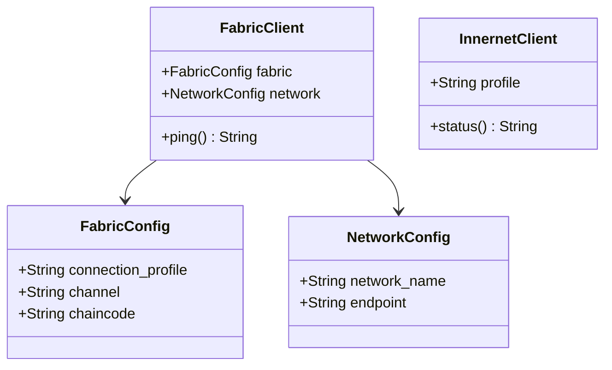
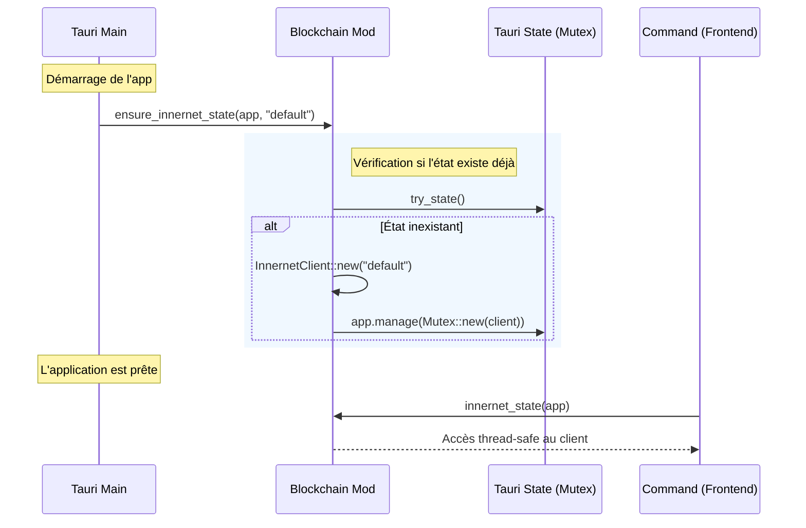

# Module `blockchain`

## Vue d'Ensemble

Le module **`blockchain`** de RAISE sert de pont entre l'application Tauri (Frontend/Commandes) et les deux technologies de souveraineté :

1.  **Hyperledger Fabric** : Blockchain privée pour l'immuabilité.
2.  **Innernet (WireGuard)** : Mesh VPN pour la sécurité réseau.

⚠️ **Note d'implémentation** : Ce module (`mod.rs`) définit les **abstractions de configuration** et la **gestion de l'état (State)** dans Tauri. La logique métier lourde (commandes système, appels gRPC) est déléguée aux sous-modules ou aux commandes Tauri pour garder ce point d'entrée léger.

---

## 🏗️ Architecture des Données

Ce module expose les structures partagées dans tout le backend Rust.

### Modèle de Configuration

Contrairement à une configuration monolithique, RAISE sépare la configuration Fabric (Blockchain) de la configuration Réseau (VPN).



---

## 📚 Détail des Structures (`mod.rs`)

### 1. Configuration Fabric (`FabricConfig`)

Définit comment se connecter au réseau Hyperledger Fabric. Plutôt que de coder en dur les MSP et certificats, nous utilisons un **Connection Profile** standard (YAML/JSON).

```rust
pub struct FabricConfig {
    /// Chemin vers le connection profile Fabric (YAML/JSON).
    /// Contient les pairs, orderers, et CAs.
    pub connection_profile: String,

    /// Nom du channel Fabric (ex: "raise-channel").
    pub channel: String,

    /// Nom du chaincode par défaut (ex: "arcadia-chaincode").
    pub chaincode: String,
}

```

### 2. Configuration Réseau (`NetworkConfig`)

Définit le point d'entrée réseau. Cette configuration est agnostique de la technologie VPN sous-jacente, bien que nous utilisions Innernet.

```rust
pub struct NetworkConfig {
    /// Nom logique du réseau (ex: "dev-mesh", "prod-mesh").
    pub network_name: String,

    /// Endpoint de l'API Fabric ou du peer principal.
    pub endpoint: String,
}

```

### 3. Client Innernet (`InnernetClient`)

Ce client est géré comme un **État Tauri (Tauri State)**. Il permet aux commandes de l'interface utilisateur de vérifier l'état du VPN sans réinstancier le client à chaque fois.

- **Rôle** : Wrapper léger autour de la CLI `innernet`.
- **État** : Stocke le profil actif (ex: "dev", "prod").

```rust
// Gestion dans le State Tauri
pub type SharedInnernetClient = Mutex<InnernetClient>;

// Utilisation
let client = InnernetClient::new("dev");
println!("{}", client.status()); // -> "innernet profile=dev"

```

---

## 🔄 Intégration Tauri (Flux de Vie)

Le module fournit des helpers pour initialiser ces clients au démarrage de l'application Tauri (`main.rs`).



### Fonctions Clés

| Fonction                    | Description                                                                                                  |
| --------------------------- | ------------------------------------------------------------------------------------------------------------ |
| **`ensure_innernet_state`** | Initialise le client VPN dans le gestionnaire d'état de Tauri. Idempotent (ne fait rien si déjà initialisé). |
| **`innernet_state`**        | Helper pour récupérer l'état (`State<SharedInnernetClient>`) depuis n'importe quelle commande Tauri.         |

---

## 🚀 Roadmap du Module

Ce fichier `mod.rs` est la fondation. Voici les fonctionnalités prévues dans les sous-modules (`fabric/` et `vpn/`) :

- [ ] **Fabric** : Parsing du `connection_profile` (YAML) pour extraire les certificats TLS.
- [ ] **Fabric** : Implémentation réelle de `submit_transaction` via gRPC (tonic).
- [ ] **VPN** : Parsing de la sortie de la commande `innernet` pour récupérer l'IP réelle et les pairs connectés.
- [ ] **State** : Ajout d'un `FabricState` similaire au `InnernetState` pour mettre en cache la connexion gRPC.

---
