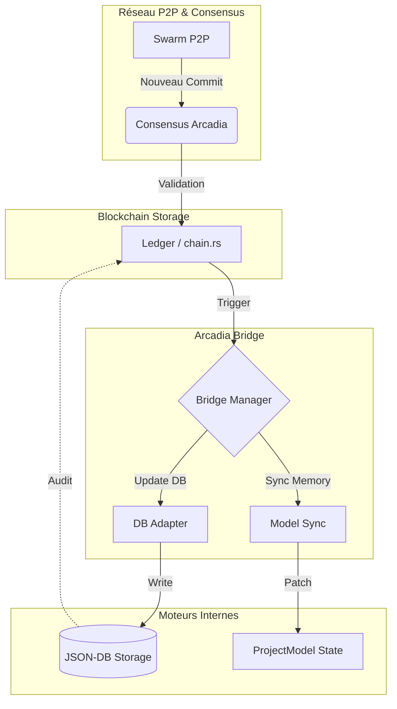

# Arcadia Bridge 🌉

Ce module sert d'interface de réconciliation entre le registre décentralisé (**Blockchain Arcadia**) et les moteurs internes de l'application **RAISE**.

## Rôle du Bridge

Le Bridge surveille les nouveaux commits validés par le consensus et assure leur propagation vers :

1. **JSON-DB** : Persistance physique des documents.
2. **Model Engine** : Mise à jour de la topologie symbolique en mémoire.

## Architecture du Flux de Données

## Sous-modules

- **`mod.rs`** : Orchestrateur principal du Bridge.
- **`db_adapter.rs`** : Traduit les `Mutation` de la blockchain en appels `insert/update/delete` pour la `StorageEngine`.
- **`model_sync.rs`** : Applique les changements sur le `ProjectModel` (AppState) pour refléter l'état global du réseau.

## Principes de Sécurité

- **Atomicité** : Une mutation blockchain ne doit être appliquée en local que si la signature et le parent_hash sont valides.
- **Idempotence** : Appliquer deux fois le même commit ne doit pas corrompre la base de données locale.
- **Traçabilité** : Chaque document en base conserve l'ID du commit Arcadia qui l'a créé ou modifié.
