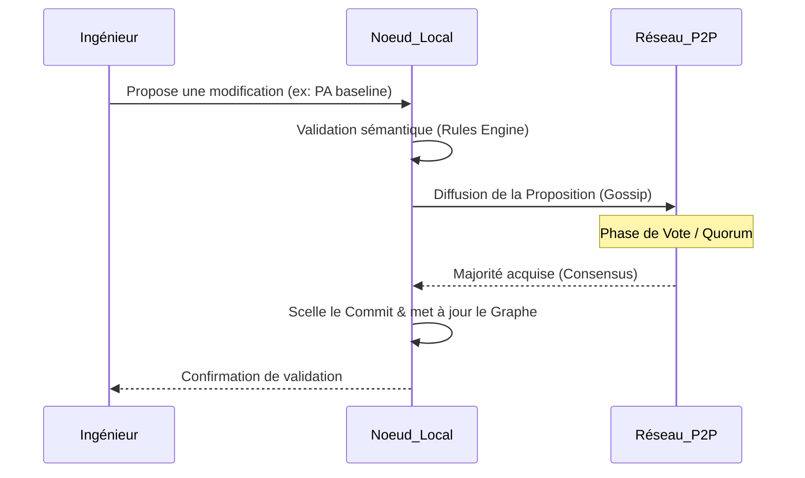

# Module Consensus — Validation Collective et Gouvernance

## Présentation

Le module `consensus` garantit que toutes les instances de **Raise** connectées au VPN Mesh s'accordent sur l'état du modèle Arcadia. Il évite les conflits (ex: deux ingénieurs modifiant simultanément le même composant physique) et assure que les règles d'ingénierie sont respectées avant toute validation définitive.

Dans une architecture P2P, le consensus remplace l'autorité du serveur central par une **décision distribuée**.

## Mécanisme de Décision

## Composants clés

1. **Leader Election (`leader.rs`)** :

- Gère l'élection d'un nœud "référent" pour des opérations spécifiques (comme le gel d'une version majeure).
- Utilise un algorithme inspiré de **Raft** pour garantir qu'il n'y a qu'un seul leader par couche Arcadia (`OA`, `SA`, etc.) à un instant T.

2. **Vote Management (`vote.rs`)** :

- Gère le cycle de vie des scrutins.
- Vérifie que les votes proviennent d'agents autorisés (`foaf:Agent`) via leurs signatures cryptographiques.
- Définit le seuil du quorum (ex: 51% des nœuds actifs pour une modification mineure, unanimité pour une baseline critique).

3. **Mod.rs (Orchestrateur)** :

- Reçoit les propositions de mutations du `model_engine`.
- Interagit avec le `rules_engine` pour s'assurer que la proposition est "légale" (ex: respect des types dans `data.jsonld`) avant de la soumettre au réseau.

## Concepts Fondamentaux

### Quorum et Majorité

Contrairement à un simple enregistrement de fichier, une modification dans Raise n'est "vraie" que si elle est acceptée par la majorité du réseau. Cela protège le projet contre les erreurs de manipulation isolées.

### Validation Sémantique

Le consensus n'est pas qu'informatique ; il est **métier**. Le réseau peut refuser un commit si le `rules_engine` détecte qu'un composant physique ne réalise plus correctement sa fonction logique suite à la modification proposée.

### Gouvernance Souveraine

Le système permet de définir qui a le droit de vote sur quelle couche. Par exemple, seuls les membres du groupe "Architectes Physiques" peuvent voter sur le consensus de la couche `PA`.

---
