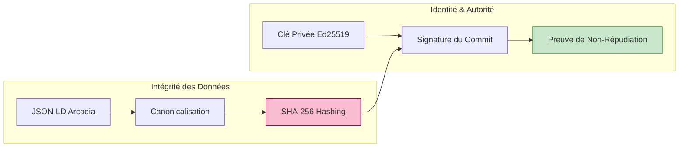

# Module Crypto — Identité et Intégrité Cryptographique

## Présentation

Le module `crypto` fournit les primitives nécessaires pour sécuriser la blockchain SysML v2. Il assure deux fonctions vitales :

1. **L'Intégrité** : Garantir qu'un élément Arcadia (ex: un `PhysicalComponent`) n'a pas été altéré.
2. **L'Authenticité** : Garantir qu'une décision d'architecture provient bien d'un auteur autorisé (`foaf:Agent`).

## Architecture de Sécurité

## Composants clés

1. **Hashing (`hashing.rs`)** :

- Implémente le hachage déterministe (SHA-256).
- **Important** : Avant de hacher, les données JSON-LD sont "canonicalisées" (tri des clés, suppression des espaces inutiles) pour que le même contenu produise toujours le même hash, quel que soit l'OS ou le nœud Rust.

2. **Signing (`signing.rs`)** :

- Gère les signatures numériques via l'algorithme **Ed25519** (rapide et ultra-sécurisé).
- Lie chaque signature à un identifiant unique `urn:agent:...`.
- Permet la vérification des votes dans le module `consensus`.

3. **Mod.rs (Gestion des Clés)** :

- Gère le stockage sécurisé de la clé privée locale (souvent chiffrée au repos).
- Interface pour la dérivation de l'identifiant de pair (`PeerId`) utilisé par le module `p2p`.

## Concepts Fondamentaux

### Hachage Déterministe

En ingénierie système, un `LogicalFunction` est défini par ses propriétés. Si deux ingénieurs créent exactement la même fonction, elles doivent avoir le même hash. Cela permet d'identifier les doublons et de stabiliser les Arbres de Merkle.

### Identité Souveraine (SSI)

Raise n'utilise pas de mot de passe centralisé. L'identité d'un ingénieur est sa clé cryptographique. Si la clé signe un commit de la couche `EPBS`, la blockchain enregistre cette action de manière indélébile.

### Sécurité du VPN Mesh

Bien que le module `vpn` sécurise le transport, le module `crypto` sécurise la donnée elle-même. Même si un intrus accédait au réseau VPN, il ne pourrait pas falsifier de modifications sans les clés privées des architectes.
