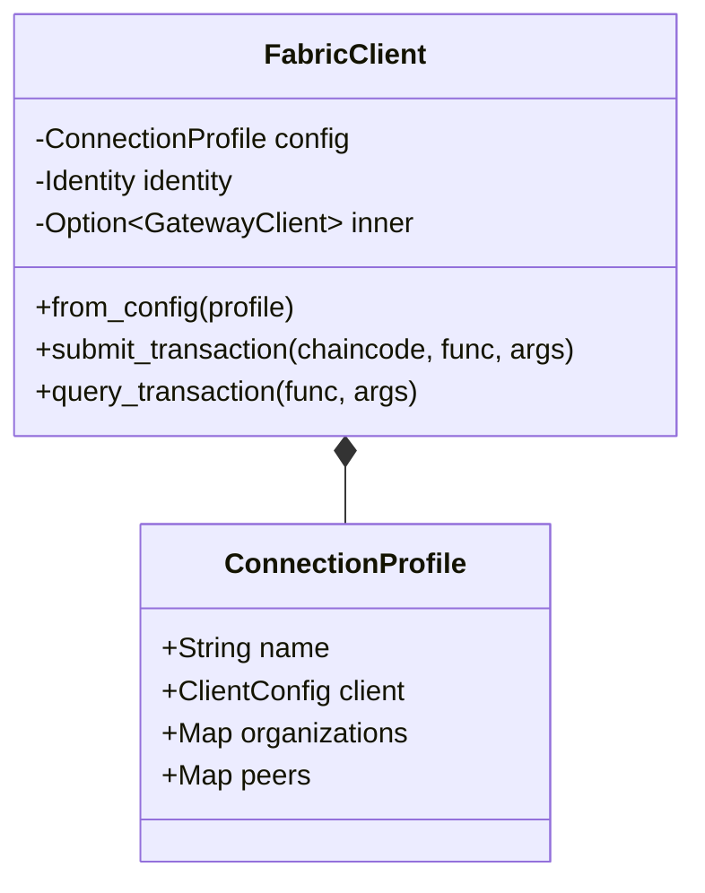

# Module `fabric` - RAISE Core

## 🎯 Objectif

Le module **`fabric`** fournit l'intégration native de Hyperledger Fabric au sein de l'écosystème RAISE. Il permet une traçabilité immuable et souveraine des processus de conception.

Il est conçu pour être :

1.  **Asynchrone** : Basé sur `tokio` et `tonic` pour ne pas bloquer l'UI.
2.  **Sécurisé** : Support complet du **mTLS** (mutual TLS) via le moteur cryptographique `ring`.
3.  **Flexible** : Configuration via des _Connection Profiles_ standards (YAML/JSON).
4.  **Thread-safe** : Géré via `Arc<Mutex>` pour un accès concurrent sûr depuis Tauri.

---

## 🏗️ Architecture du Client

Le client utilise une architecture de façade asynchrone.



---

## ⚙️ Configuration & Connexion

Le client se configure désormais via un `ConnectionProfile` (norme Hyperledger Fabric).

### 1. Authentification mTLS

Le module gère automatiquement l'authentification mutuelle :

- **Certificat Client** : Utilisé pour signer les propositions.
- **Clé Privée** : Stockée de manière sécurisée et jamais exposée.
- **Root CA** : Pour vérifier l'identité des Peers du réseau.

### 2. État Partagé (Tauri)

Dans RAISE, le client est injecté dans le State Tauri :

```rust
app.manage(Mutex::new(FabricClient::from_config(profile)) as SharedFabricClient);

```

---

## 📡 Opérations de Ledger

### 1. Soumission (`submit_transaction`)

**Action :** Écriture sur le Ledger (Consensus requis).

- **Processus** : Forge une proposition gRPC, la signe avec l'identité locale, et l'envoie aux peers pour endossement.
- **Retour** : Un `RaiseResult<String, BlockchainError>` contenant l'ID de transaction unique.

### 2. Requête (`query_transaction`)

**Action :** Lecture optimisée (Pas de consensus nécessaire).

- **Usage** : Idéal pour récupérer l'état actuel d'un composant ou d'une règle sans latence de bloc.

---

## 🚨 Gestion des Erreurs Typées

Le module utilise l'énumération `BlockchainError` pour une remontée d'erreur précise vers le frontend :

- `BlockchainError::Connection` : Échec de liaison gRPC ou mTLS.
- `BlockchainError::Identity` : Certificat expiré ou clé invalide.
- `BlockchainError::Transaction` : Rejet par les politiques d'endossement du Chaincode.
- `BlockchainError::Parse` : Erreur lors du décodage du profil de connexion.

---

## 🗺️ Roadmap & État d'Avancement

- [x] Structures de données conformes aux spécifications Fabric.
- [x] Moteur de transport gRPC avec `Tonic`.
- [x] Support mTLS (Certificats X.509).
- [x] Intégration asynchrone dans le State Tauri.
- [ ] Support du Service de Commande (Ordering Service) complet.
- [ ] Gestion des événements (Event Listeners) du ledger.

```


```
