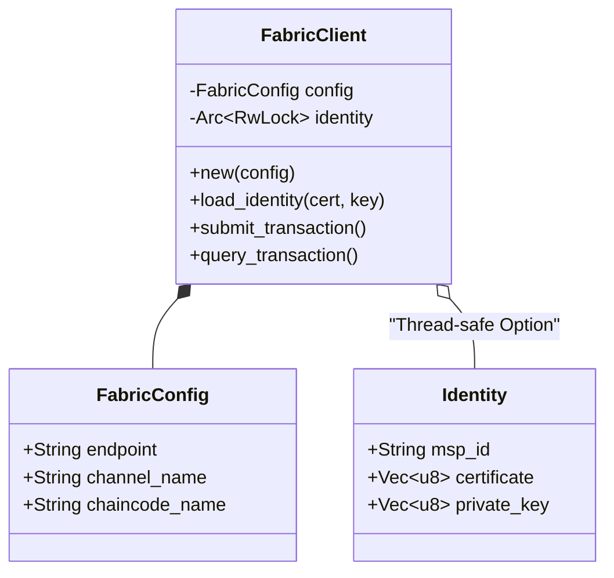

# Module `fabric`

## 🎯 Objectif

Le module **`fabric`** fournit l'implémentation bas niveau du client Hyperledger Fabric. Il est conçu pour être :

1.  **Asynchrone** (basé sur `tokio`).
2.  **Thread-safe** (les identités sont protégées par `Arc<RwLock>`).
3.  **Léger** (évite d'embarquer le SDK Fabric Go complet).

Il gère la cryptographie (chargement des certificats) et la communication (gRPC) avec les pairs du réseau.

---

## 🏗️ Architecture du Client

Le struct principal `FabricClient` agit comme une façade pour toutes les interactions blockchain.



---

## ⚙️ Configuration (`FabricConfig`)

La configuration est définie via la structure `FabricConfig`. Elle détermine la cible de connexion par défaut.

| Champ            | Type     | Description                | Valeur par défaut         |
| ---------------- | -------- | -------------------------- | ------------------------- |
| `endpoint`       | `String` | URL gRPC du Peer cible     | `"grpc://localhost:7051"` |
| `msp_id`         | `String` | ID de l'organisation (MSP) | `"RAISEMSP"`              |
| `channel_name`   | `String` | Canal cible                | `"raise-channel"`         |
| `chaincode_name` | `String` | Smart Contract cible       | `"arcadia-chaincode"`     |
| `tls_enabled`    | `bool`   | Activation du TLS          | `false`                   |

---

## 🔐 Gestion des Identités

Le client est initialisé **sans identité**. Une identité (Certificat X.509 + Clé Privée) doit être chargée dynamiquement avant de pouvoir signer des transactions.

### Chargement d'Identité

L'opération est asynchrone et thread-safe :

```rust
// Exemple d'utilisation
client.load_identity(
    "./crypto/users/Admin@org1/msp/signcerts/cert.pem",
    "./crypto/users/Admin@org1/msp/keystore/priv_key"
).await?;

```

Si aucune identité n'est chargée, les appels de transaction échoueront avec l'erreur `FabricError::Identity("No identity loaded")`.

---

## 📡 Transactions & Requêtes

### 1. Soumission (`submit_transaction`)

Utilisé pour modifier l'état du ledger (écritures).

- **Input** : Nom de la fonction, Arguments (bytes).
- **Output** : `TransactionResult` contenant un ID de transaction (UUID v4) et le timestamp.

> ⚠️ **État Actuel (Mock)** : L'implémentation actuelle simule une transaction réussie ("VALID") sans effectuer l'appel réseau gRPC réel. Les logs tracent l'appel pour le débogage.

### 2. Lecture (`query_transaction`)

Utilisé pour lire l'état sans consensus.

- **Input** : Nom de la fonction, Arguments.
- **Output** : Payload brut (`Vec<u8>`).

---

## 🚨 Gestion des Erreurs

Le module utilise `thiserror` pour des erreurs typées :

- `FabricError::Connection` : Échec réseau gRPC.
- `FabricError::Identity` : Certificat manquant ou invalide.
- `FabricError::Transaction` : Rejet par le chaincode ou le peer.
- `FabricError::Serialization` : Erreur de formatage JSON.

## 🗺️ Roadmap Implémentation

- [x] Structures de données (`Config`, `Identity`).
- [x] Chargement asynchrone des certificats X.509.
- [x] Architecture Thread-safe (`Arc<RwLock>`).
- [ ] **Critique** : Remplacer les Mocks par de vrais appels gRPC via `tonic`.
- [ ] Implémenter le parsing des réponses Chaincode.

```

```
