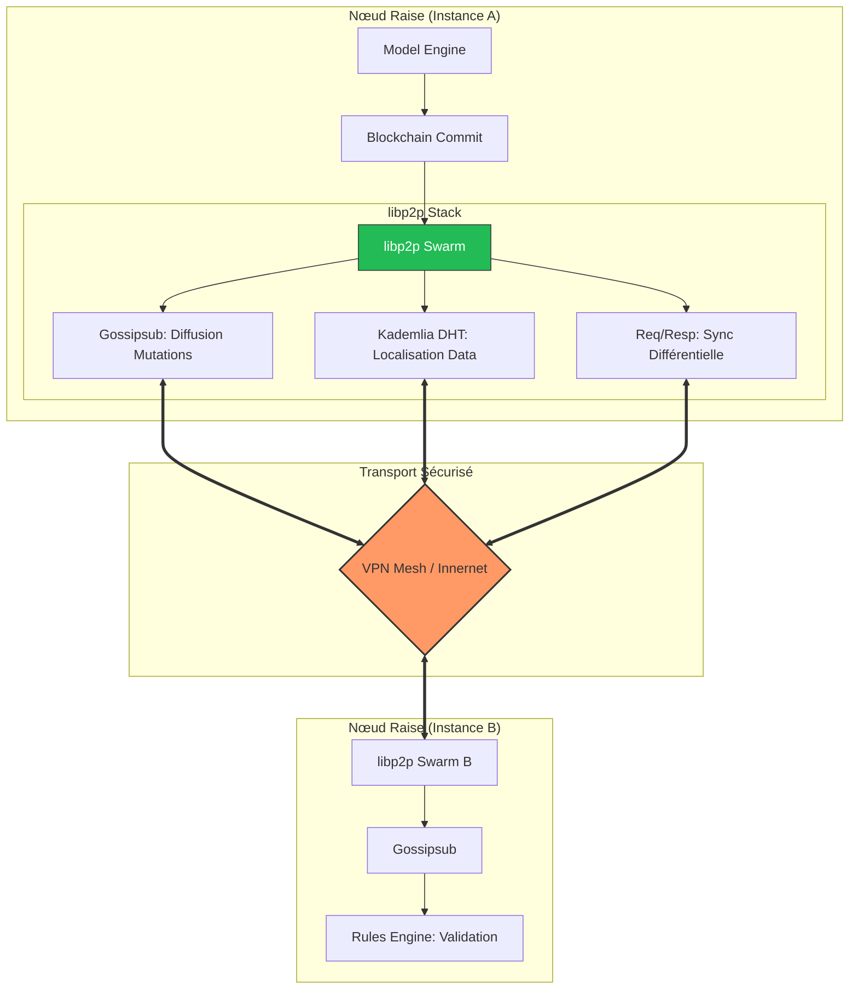

# Module P2P (Peer-to-Peer) — Réseau Souverain Raise

## Présentation

Le module `p2p` constitue la couche de transport décentralisée du moteur **Raise**. Contrairement à une architecture client-serveur classique, ce module permet à chaque instance de Raise de découvrir ses pairs, d'échanger des fragments de modèles SysML v2 et de participer au consensus sans aucun point central de défaillance.

Ce réseau circule exclusivement à l'intérieur du tunnel **VPN Mesh (Innernet)** pour garantir une souveraineté totale des données d'ingénierie.

## Schéma d'Architecture Réseau

## Architecture Technique

Le module s'appuie sur la stack **libp2p**, le standard de l'industrie pour les réseaux décentralisés en Rust.

### Composants clés

1. **Swarm (`swarm.rs`)** : Le gestionnaire de connexions. Il orchestre les flux réseau et maintient les liaisons sécurisées entre les nœuds ingénieurs.
2. **Behavior (`behavior.rs`)** : Définit les protocoles réseau utilisés :

- **Kademlia (DHT)** : Pour la découverte des pairs et la localisation des fragments de modèles (ex: qui possède la dernière version de `pa.jsonld` ?).
- **Gossipsub** : Pour la diffusion rapide (broadcast) des propositions de modifications et des votes de consensus.
- **Request-Response** : Pour le téléchargement direct de blocs de données spécifiques lors de la synchronisation différentielle.

3. **Protocol (`protocol.rs`)** : Définit la grammaire des échanges. Chaque message est typé selon la sémantique Arcadia (ex: `Msg::ProposeMutation`, `Msg::Heartbeat`, `Msg::SyncRequest`).

## Flux de données

1. **Découverte** : Au démarrage, le nœud rejoint le réseau via les adresses IP statiques fournies par le module `vpn`.
2. **Annonce** : Le nœud annonce les couches (OA, SA, LA, PA, EPBS) qu'il héberge localement dans la DHT.
3. **Propagation** : Lorsqu'une modification est effectuée dans le `model_engine`, elle est encapsulée et "gossipée" à travers le réseau pour validation.

## Sécurité

- **Transport TLS/Noise** : Toutes les communications sont chiffrées de bout en bout.
- **Isolation VPN** : Le P2P est configuré pour n'écouter que sur l'interface réseau du VPN Mesh.
- **Authentification** : Chaque nœud est identifié par sa `PeerId`, elle-même liée à une identité cryptographique `foaf:Agent`.

---
