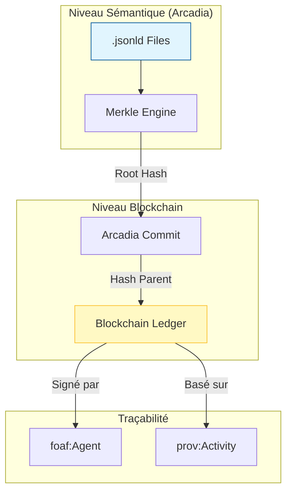

# Module Storage — Immuabilité et Graphe Sémantique

## Présentation

Le module `storage` est responsable de la persistance et de l'intégrité des modèles Arcadia au sein de la blockchain Raise. Il ne remplace pas le `graph_store` ou le `json_db`, mais il agit comme une **couche d'immuabilité** qui certifie l'état des données.

C'est ici que l'on définit la "chaîne de vérité" qui lie les analyses opérationnelles (`OA`) aux composants physiques (`PA`) et aux items de configuration (`EPBS`).

## Architecture de l'Intégrité

## Composants clés

1. **Commit (`commit.rs`)** :

- Définit l'unité de base de la chaîne.
- Encapsule les **Mutations** (changements d'états d'un élément).
- Contient la signature cryptographique de l'ingénieur et le lien vers le commit précédent.
- Intègre les métadonnées de provenance (`prov-o`).

2. **Merkle Engine (`merkle.rs`)** :

- Calcule l'empreinte numérique unique de chaque package (ex: `LogicalArchitecturePackage`).
- Permet de vérifier l'intégrité de milliers d'éléments en une seule opération de hachage racine.
- Indispensable pour la synchronisation différentielle (ne télécharger que ce qui a changé).

3. **Chain Management (`chain.rs`)** :

- Gère l'ordre chronologique des commits.
- Assure la persistance locale du "Ledger" (registre) pour permettre une reprise après déconnexion.
- Gère les embranchements (branches) pour explorer différentes variantes d'architecture.

## Concepts Fondamentaux

### Mutation Atomique

Une modification d'architecture n'est jamais partielle. Si une fonction dans `la.jsonld` est renommée, le commit garantit que tous les liens de traçabilité impactés sont mis à jour simultanément.

### Content Addressing

Grâce au hachage, chaque état du système possède un identifiant unique basé sur son contenu. Cela permet de garantir que "la baseline de la revue de conception du 12 mars" est strictement identique sur tous les nœuds du réseau VPN.
