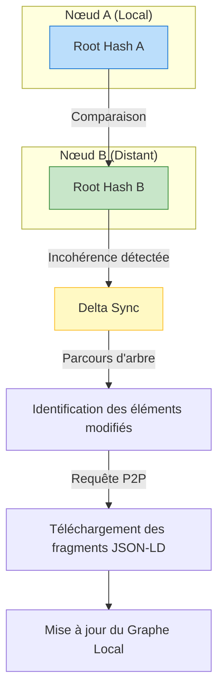

# Module Sync — Synchronisation Différentielle Sémantique

## Présentation

Le module `sync` gère la mise à jour des données entre les nœuds du réseau Raise. Plutôt que de transférer l'intégralité des fichiers JSON-LD (comme `pa.jsonld` qui peut devenir très lourd), ce module identifie et transmet uniquement les **deltas** (les différences) en utilisant la structure des Arbres de Merkle.

C'est l'assurance d'une collaboration en temps réel, même sur des réseaux à bande passante limitée.

## Processus de Synchronisation

## Composants clés

1. **Delta (`delta.rs`)** :

- Contient l'algorithme de comparaison des Arbres de Merkle.
- Capable de descendre dans la hiérarchie des packages Arcadia pour isoler un seul composant modifié parmi des milliers.
- Génère la liste des `IdentifiedObjects` à récupérer.

2. **Mod.rs (Orchestrateur de flux)** :

- Gère les sessions de synchronisation.
- Émet les requêtes `Request-Response` via le module `p2p`.
- Assure que les données reçues sont immédiatement validées par le module `crypto` (vérification du hash) avant d'être injectées dans le `graph_store`.

## Concepts Fondamentaux

### Synchronisation basée sur le contenu

Puisque Raise utilise le _Content Addressing_, si le nœud B possède déjà un sous-système identique (même hash), le transfert est ignoré. Cela optimise drastiquement les échanges lors de la réutilisation de bibliothèques de composants (Library Reuse).

### Résilience au Partitionnement

Si un ingénieur travaille en mode hors-ligne (déconnecté du VPN), le module `sync` détectera automatiquement l'écart de version lors de la reconnexion et rejouera la chaîne de commits pour remettre le modèle à jour.

### Intégrité Multi-Couches

Le synchroniseur respecte l'ordre des couches Arcadia. Il peut être configuré pour prioriser la synchronisation de l'Analyse Opérationnelle (`OA`) avant de traiter les détails de l'Architecture Physique (`PA`), garantissant une cohérence descendante.
