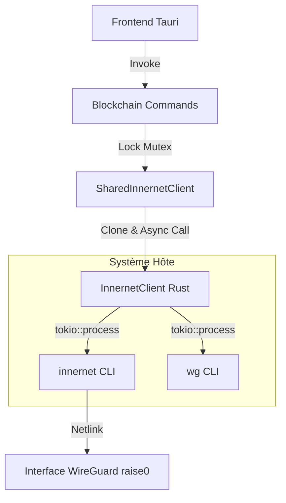

# Module `vpn` - RAISE Core

## 🎯 Objectif

Le module **`vpn`** assure la souveraineté et le cloisonnement des communications de RAISE. Il encapsule la gestion d'un réseau **Mesh P2P** basé sur **Innernet** (surcouche ergonomique à WireGuard), garantissant que le trafic blockchain reste strictement privé.

Contrairement à un VPN classique, ce module permet :

1.  Des communications directes **Peer-to-Peer** (P2P) chiffrées entre instances RAISE.
2.  Une isolation réseau totale sans dépendance à un contrôleur Cloud central.
3.  Une visibilité en temps réel de la topologie du maillage (Mesh).

---

## 🏗️ Architecture Technique

Le `InnernetClient` est conçu comme un orchestrateur de processus asynchrone.



---

## ⚙️ Capacités Implémentées

### 1. Cycle de vie Asynchrone

Toutes les opérations (`connect`, `disconnect`, `get_status`) sont désormais non-bloquantes grâce à `tokio::process`. L'interface utilisateur reste fluide même lors de latences réseau.

### 2. Gestion des Pairs & Invitations

L'implémentation de `add_peer(invitation_code)` permet d'automatiser la commande `innernet install` :

- Intégration automatique d'un nouveau nœud via un jeton d'invitation.
- Validation immédiate de la connectivité après installation.

### 3. Monitoring WireGuard NATIF

Le module ne se contente pas de piloter Innernet ; il interroge directement `wg show` pour extraire des métriques de bas niveau :

- **Handshake** : Temps écoulé depuis le dernier échange sécurisé.
- **Transfert** : Volume précis de données RX/TX par pair.
- **Endpoints** : Identification des adresses IP physiques des pairs.

---

## 📡 Détails des Commandes

| Méthode      | Action Système  | Description                                       |
| ------------ | --------------- | ------------------------------------------------- |
| `connect`    | `innernet up`   | Active l'interface et établit le maillage.        |
| `disconnect` | `innernet down` | Coupe les tunnels et nettoie les routes.          |
| `list_peers` | `innernet list` | Récupère la liste des membres déclarés du réseau. |
| `get_status` | `wg show`       | Analyse les statistiques de trafic en temps réel. |
| `ping_peer`  | `ping -c 1`     | Mesure la latence ICMP à l'intérieur du tunnel.   |

---

## 🔒 Sécurité & Intégration Tauri

Le client est exposé au frontend via un état partagé sécurisé :

```rust
pub type SharedInnernetClient = Mutex<InnernetClient>;

```

Pour éviter les "deadlocks", les commandes Tauri utilisent le pattern **Lock-then-Clone** :

1. Verrouillage du Mutex pour obtenir une copie légère du client.
2. Libération immédiate du verrou.
3. Exécution de la tâche réseau de manière asynchrone.

---

## 🗺️ État d'avancement

- [x] Wrapper CLI asynchrone (`tokio`).
- [x] Parsing robuste de la sortie `wg show`.
- [x] Gestion des invitations (`add_peer`).
- [x] Intégration au State global de RAISE.
- [ ] **Amélioration** : Support des notifications système lors de la perte d'un pair.
- [ ] **Sécurité** : Intégration de `polkit` pour la gestion transparente des privilèges `sudo`.

```


```
